# Flex语法篇

[语法篇-阮大神](https://www.ruanyifeng.com/blog/2015/07/flex-grammar.html)

- Flex（Flexible Box）：弹性布局

<!--more-->

### 一，基本概念

- 采用Flex布局的元素，称为Flex容器（Flex container）。他的所有子元素自动成为容器成员，称为Flex项目（Flex item）

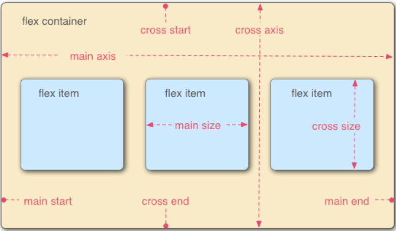

>容器存在默认的两根轴，水平的主轴（main axis），和垂直的交叉轴（cross axis）
>
>项目默认按主轴排列，单个项目占据的主轴控件叫做main size，交叉轴空间叫做cross end

### 二，容器的属性

容器上有六个属性

>flex-direction
>
>flex-wrap
>
>flex-flow
>
>justify-content
>
>align-content

#### 2.1flex-direction

- 决定主轴方向

```css
.box {
	flex-direction: row/row-reverse/column/column-reverse;
	/*分别表示：垂直反方向，垂直方向，默认水平方向，水平反方向，*/
}
```

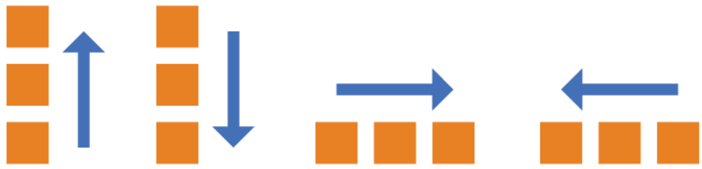

#### 2.2flex-wrap

- 默认情况下，项目都排列在一条轴线上，flex-wrap解决，如果一条轴线排列不下如何换行的问题。

```css
.box {
  flex-wrap: nowrap/wrap/wrap-reverse;
  /*默认不换行，换行，换行第一行在下方*/
}
```

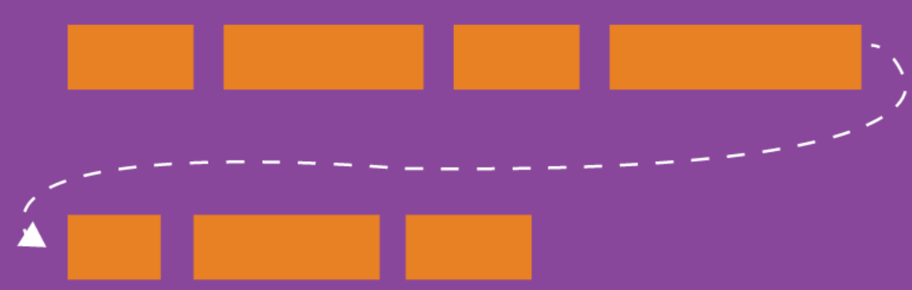

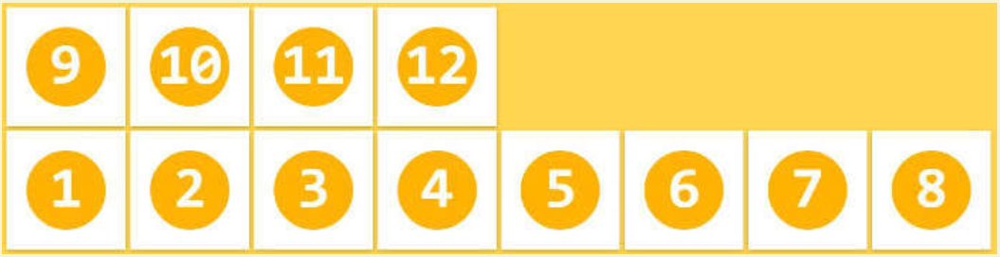

#### 2.3flex-flow

- flex-direction和flex-wrap的简写形式，默认值为`row nowrap`

```css
.box {
  flex-flow: <flex-direction>||<flex-wrap>;
}
```

#### 2.4justify-content

- 定义了项目在主轴上的对齐方式

```css
.box {
  justify-content: flex-start/flex-end/center/space-between/space-around;
  /*默认左对齐，右对齐，居中，两端对齐，项目两侧间隔相等*/
}
```

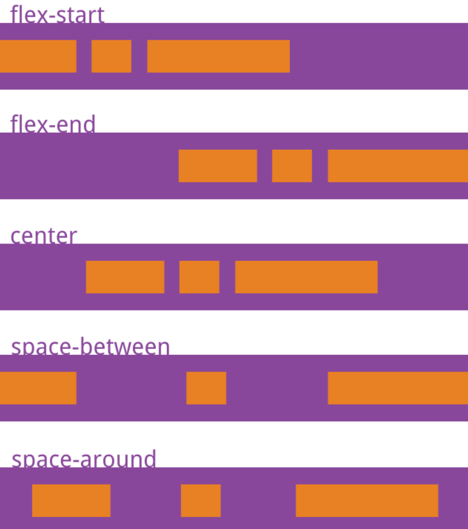

#### 2.5align-items

- 根据交叉轴对齐，假设交叉轴为从上到下

```css
.box {
  align-items: flex-start/flex-end/center/baseline/stretch;
  /*交叉轴起点对齐，终点对齐，中点对齐，项目第一行文字基线对齐，默认交叉轴方向拉伸对齐*/
}
```

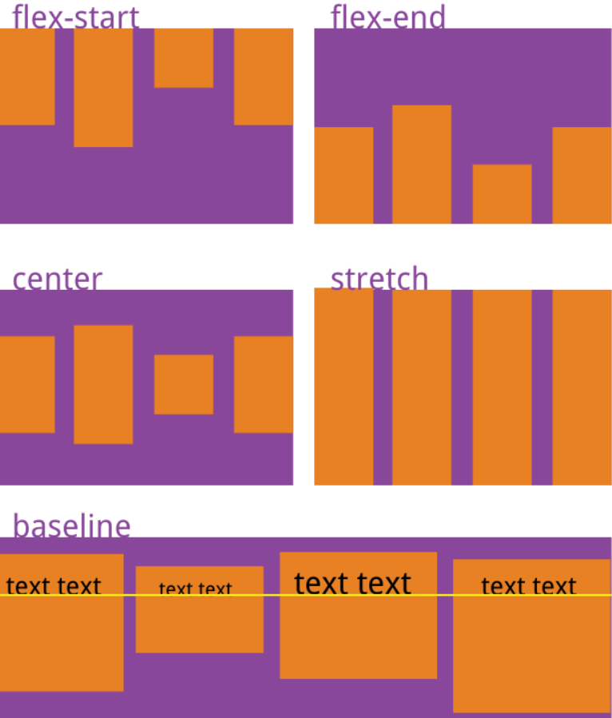

#### 2.6align-content

- 多根主线对齐方式（单主线不起作用）

```css
.box {
  align-content: flex-start/flex-end/center/space-between/space-around/stretch;
  /**/
}
```

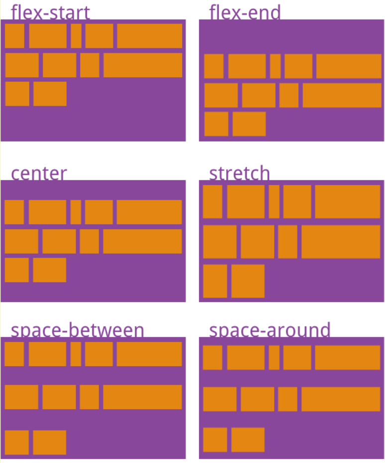

### 三，项目的属性

>order
>
>flex-grow
>
>flex-shrink
>
>flex-basis
>
>flex
>
>align-self

#### 3.1order

- 定义项目的排列顺序，数值越小，排列越靠前，默认为0；

```css
.item {
  order: <integer>;
}
```

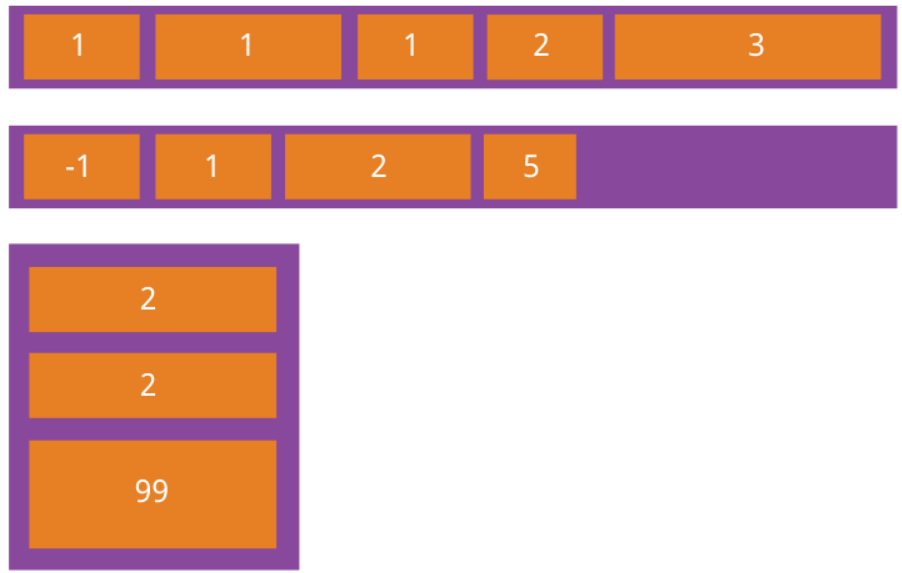

#### 3.2flex-grow

- 定义项目的放大比例，默认为0（即，存在剩余空间也不放大。

```css
.item {
  flex-grow: <number>;
}
```

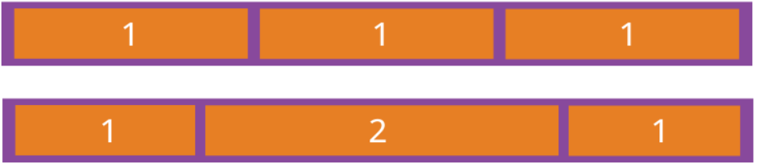

>所有项目flex-grow属性都为1，等分剩余空间
>
>类推

#### 3.3flex-shrink

- 定义项目的缩小比例，默认为1（即，空间如果不足，项目将缩小）

```css
.item {
  flex-shrink: <number>;
}
```

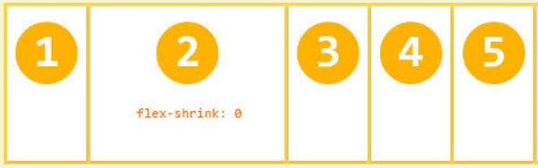

>如果所有项目都为1，等比例缩小
>
>如果有一个为0，其他为1，空间不足时前者不缩小

#### 3.4flex-basis

- 在分配多余空间之前，项目占据的主轴空间（main size）。浏览器也根据这个属性计算主轴是否有多余空间。默认值auto，项目本来大小。

```css
.item {
  flex-basis: <length>|auto;
}
```

- 设置占据的`main size`长度，将占据固定空间

#### 3.5flex

- flex-grow，flex-shrink，flex-basis的简写，默认值为`0 [1 auto]`.

```css
.item {
  flex: none|auto|[ <'flex-grow'> <'flex-shrink'> <'flex-basis'> ]
}
```

>快捷值：auto（1 1 auto），none（0 0 auto）
>
>建议优先使用这个属性
>
>后两个可选。

#### 3.6align-self

- 允许单个项目有和其他项目不一样的对齐方式。可以覆盖`align-items` 默认值为`auto`，表示继承`.box `的`align-items`

```css
.item {
  align-self: auto/flex-start/flex-end/center/baseline/stretch;
}
```

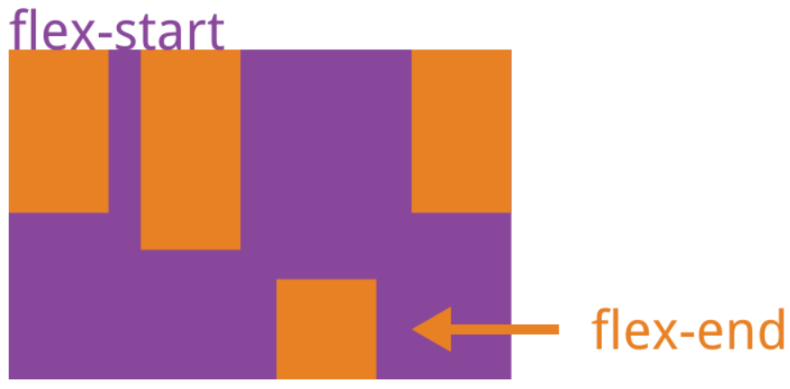


# Flex布局-实例篇

[实例篇-阮大神](http://www.ruanyifeng.com/blog/2015/07/flex-examples.html)

### 一，骰子的布局

的一个面最多放置9个点，HTML模板如下：

```html
<div class="box">
  <span class="item"></span>
</div>
```

>div元素表示 flex容器；span元素表示 flex项目

#### 1.1单项目

首先只有左上角一个点的情况，Flex布局默认左对齐。


```css
.box {
  display: flex;
}
```

 

设置项目对齐方式，实现居中对齐和右对齐

```css
/*左对齐*/
.box {
  display: flex;
  justify-content: center;
}

/*右对齐*/
.box {
  display: flex;
  justify-content: flex-end;
}
```

 

设置交叉轴对齐方式，可以垂直移动主轴

```css
/*交叉轴居中*/
.box {
  display: flex;
  align-items: center;
}

/*交叉轴，主轴居中*/
.box {
  display: flex;
  align-items: center;
  justify-content: center
}
```

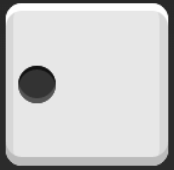 

#### 1.2双项目

当对角分布时

```css
.second-face {
  display: flex;
  justify-content: space-between;
}

.second-face .pip:nth-of-type(2) {
  align-self: flex-end;
}
```

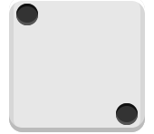 

#### 1.3多项目时

三个对角线

```css
.third-face {
  display: flex;
  justify-content: space-between;
}

.third-face .pip:nth-of-type(2) {
  align-self: center;
}

.third-face .pip:nth-of-type(3) {
  align-self: flex-end;
}
```

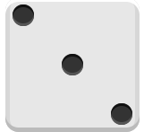 

四角分布/六点分布

```css
.forth-face,
.sixth-face {
  display: flex;
  justify-content: space-between;
}

.forth-face .column,
.sixth-face .column {
  display: flex;
  flex-direction: column;
  justify-content: space-between;
}
```

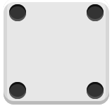 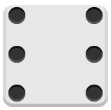

五点分布

```css
.fifth-face {
  display: flex;
  justify-content: space-between;
}

.fifth-face .column {
  display: flex;
  flex-direction: column;
  justify-content: space-between;
}

.fifth-face .column:nth-of-type(2) {
  justify-content: center;
}
```

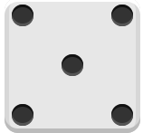

### 二，网格布局

也就是通过**百分比**来布局

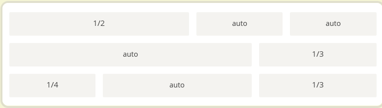

其中某些需要固定百分比，其余平均分配

```html
<!--第三行 -->
<div class="Grid">
  <div class="Grid-cell u-1of4">...</div>
  <div class="Grid-cell">...</div>
  <div class="Grid-cell u-1of3">...</div>
</div>
```

```css
.Grid {
  display: flex;
}

.Grid-cell {
  flex: 1;
}

.Grid-cell.u-full {
  flex: 0 0 100%;
}

.Grid-cell.u-1of2 {
  flex: 0 0 50%;
}

.Grid-cell.u-1of3 {
  flex: 0 0 33.3333%;
}

.Grid-cell.u-1of4 {
  flex: 0 0 25%;
}
```

### 三，圣杯布局

页面从上到下，分为三个部分：头部，主体部分（分为导航，主题，副栏），尾部

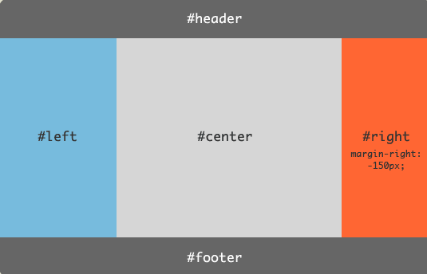

```html
<body class="HolyGrail">
  <header>...header</header>
  <div class="HolyGrail-body">
    <nav class="HolyGrail-nav">...HolyGrail-nav</nav>
    <main class="HolyGrail-content">...HolyGrail-content</main>
    <aside class="HolyGrail-ads">...HolyGrail-ads</aside>
  </div>
  <footer>...footer</footer>
</body>
```

```css
.HolyGrail {
  display: flex;
  min-height: 100vh;		/*可视区的100%*/
  flex-direction: column;
}

header,
footer {
  flex: 1;
}

.HolyGrail-body {
  display: flex;
  flex: 1;
}

.HolyGrail-content {
  flex: 1;						/*充斥所有剩余部分*/
}

.HolyGrail-nav, .HolyGrail-ads {
  /* 两个边栏的宽度设为12em */
  flex: 0 0 12em;
}
```

```css
/*小屏幕，躯干的三栏自动变为垂直叠加*/
@media (max-width: 768px) {
  .HolyGrail-body {
    flex-direction: column;
    flex: 1;
  }
  .HolyGrail-nav,
  .HolyGrail-ads,
  .HolyGrail-content {
    flex: auto;
  }
}
```

### 四，悬挂式布局

图片侧栏的布局

可以灵活使用从上到下的垂直主轴。

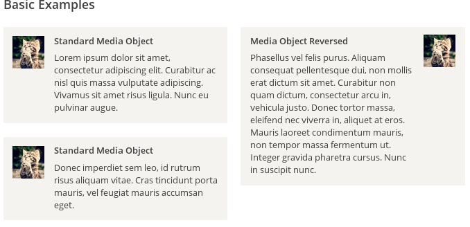

### 五，固定底栏

垂直主轴布局，将主体部分充斥就可以了。

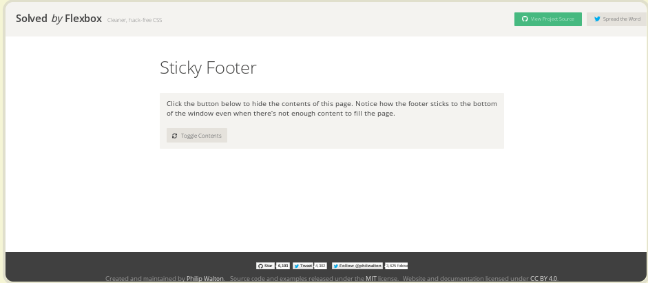

```html
<body class="Site">
  <header>...</header>
  <main class="Site-content">...</main>
  <footer>...</footer>
</body>
```

```css
.Site {
  display: flex;
  min-height: 100vh;
  flex-direction: column;
}

.Site-content {
  flex: 1;
}
```

### 六，流式布局

固定每行项目数，会自动分行

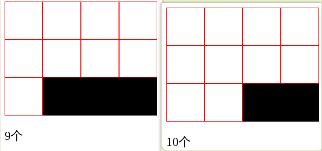

```css
.parent {
  width: 200px;
  height: 150px;
  background-color: black;
  display: flex;
  flex-flow: row wrap;
  align-content: flex-start;/*多行主轴排列方式*/
}

.child {
  box-sizing: border-box;		/*防止边框因素溢出*/
  background-color: white;
  flex: 0 0 25%;						/*固定每行四个*/
  height: 50px;
  border: 1px solid red;
}
```


