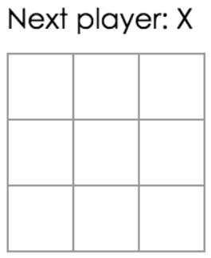
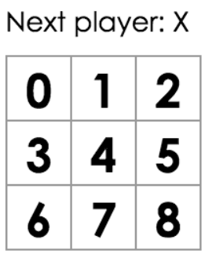
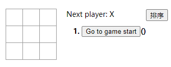
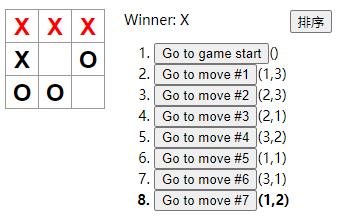
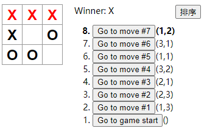
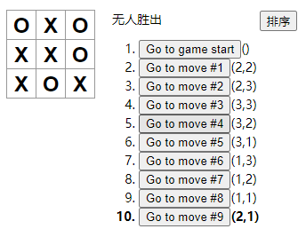

# React

- 本文档为React官网，学习历程，完成第一个React项目--tic-tac-toe

<!--more-->

## 环境搭建

- 这里我们使用官方推荐的Create React App 来完成项目

1. 在项目根目录下打开node （shift + 右键）

2. 输入创建新项目指令

   ```js
   npx create-react-app my-app
   ```

3. 删掉`src/`下的所有文件，创建我们需要的`index.css`,`index,js`

4. 最后将下面三行代码写到`index.js` 文件的顶部

   ```js
   import React from 'react';
   import ReactDOM from 'react-dom';
   import './index.css';
   ```

- 运行测试，执行`npm start`, 会自动弹出浏览器 `http://localhost:3000`.

## 项目概览

- 个人理解：React代码就是有很多层级的组件，通过props传递信息，render()函数返回实现一层一层UI界面和交互效果的。

### 组件

- 组件：React的独立代码片段，就像封装的函数一样

#### 函数组件/class组件

- 最简单的定义组件的方式就是函数组件

```
function Welcome(props) {
    return <h1>Hello, {props.name}</h1>;
}
```

- 使用类来定义

```
class Welcome extends React.Component {
    render() {
        return <h1>Hello, {this.props.name}</h1>
    }
}
```

#### 渲染组件

1. React元素：

   > React元素包含DOM元素和自定义的组件
   >
   > ```
   > const element = <div />;
   > const element2 = <Welcome name="minyue" />;
   > ```
   >
   > - 当React元素为自定义组件时，它会将JSX接受的属性（attributes），子组件（children）转换为单个对象传递给组件，这个对象就是“props”
   > - 组件名称一定要“大写字母开头”，`<Welcome />`（小写将被认为是原生DOM）

2. 渲染

   > 这里要使用到 `ReactDOM.render()` 函数
   >
   > ```
   > ReactDOM.render(
   > 	element,
   >     document.getElementById('root')
   > )
   > ```
   >
   > - 这个函数就是将React元素element，替换了DOM页面元素实现页面上的渲染

#### 提取组件

- 这是React非常重要的一种思想方法，将一个复杂的组件，拆分为多层次的组件

看我们的 `井字棋项目` 先看静态，大体就是三个组件

> 1. Square: 渲染单独的 `<button>` 
> 2. Board: 渲染9个方块
> 3. Game:  渲染含有默认值的键盘
>
> 他们就是在总界面上面，拆分出来的各个组件部分

### 组件间通信

- 组件间的交互效果

  > 1. 父级到子级的信息传递
  >    - 通过props传递
  > 2. 子级到父级的信息传递
  >    - 通过父级传递给子级的回调函数
  > 3. 同级上的信息传递
  >    - 将信息存在父级，通过父级状态提升

#### 父-->子

- 尝试将数据从Board组件传递到Square组件中（也就是将Board9个方格的数据，通过props传递到Square组件显示出来

```
// 改写Board组件的renderSquare方法，传递value到Square中
class Board extends React.Component {
    renderSquare(i) {
        return <Square value={i} />
    }
} 

//修改Square组件中的render函数接受传来的参数修改界面的值
class Square extends React.Component {
    render() {
        return (
            <button className="square">
                {this.props.value}
            </button>
        );
    }
}
```

- 渲染后可以看到每个方格都有一个数组

  

- React 应用中，数据通过 props 的传递，从父组件流向子组件。

#### 平行通信

- 我们需要知道9个Square组件的状态，来判断游戏的胜负

- 这里就用到了多个组件相互通信----状态提升

  > 状态提升：**把子组件的 state 数据提升至其共同的父组件当中保存。之后父组件可以通过 props 将状态数据传递到子组件当中**

```
// 这里我们在Board组件初始化时设置9个空值数组
class Board extends React.Component {
    constructor(props) {
        super(props);
        this.state = {
            squares: Array(9).fill(null),
        };
    }
}

handleClick(i) {
    const squares = this.state.squares.slice();
    squares[i] = 'X';
    this.setState({squares: squares});
}

renderSquare(i) {
    return (<Square
                value={this.state.squares[i]}
                onclick={() => this.handleClick(i)}
            />
    );
}

render() {
   	//界面布局
}
```

- 上面父类向子类传递了一个回调函数`handleClick()`来返回信息

- **注意：**`handleClick()`,不要改变原始数据，创建副本！！！

  > 好处：
  >
  > 1. 撤回，恢复功能很需要
  > 2. 不可变数据，容易跟踪变化
  > 3. react中，不可变性帮助我们创建 <a href="https://zh-hans.reactjs.org/docs/optimizing-performance.html#examples">pure components</a>。我们可以很轻松的确定不可变数据是否发生了改变，从而确定何时对组件进行重新渲染。

当数据提升到父类之后，子类就不需要构造函数（state）了，数据完全由`props`,`回调函数`这个双向通道进行传输

```
class Square extends React.Component {
    render() {
        return (
            <button
                className="square"
                onClick={() => this.props.onClick()}
                >
                {this.props.value}
            </button> 
        );
    }
}

// 不包含state时 使用函数组件更加简单
// 函数组件中 箭头函数简写
// onClick={() => this.props.onClick()} 改成了更短的 onClick={props.onClick}
function Square(props) {
    return (<button className="square" onClick={props.onClick}>
            {props.value}
            </button>
    );
}
```

#### 子-->父

- 上面的回调函数

## 项目完善

- 到目前为止，我们的井字棋程序，超需要加入`轮流落子`，`历史记录回溯`

#### 轮流落子

- 添加`xIsNext: true`属性

#### 判断胜出者

- 添加`status`属性，`calculateWinner()`

- 功能分析：当点击`Square`时，触发回调函数`handleClick(i)`

  > 1. 是否有玩家胜出？
  > 2. 是否当前空格已经填过？
  > 3. 其他情况正常翻转改变！
  >
  > ```
  > // 在初始化state中添加 xIsNext 属性，true代表X，flase代表O 
  > handleClick(i) {
  >     const squares = this.state.squares.slice();
  >     if(calculateWinner(squares) || squares[i]) {
  >         return;
  >     }
  >     squares[i] = this.state.xIsNext ? 'X' : 'O';
  >     this.setState({
  >         squares: squares,
  >         xIsNext: !this.xIsNext,
  >     });
  > }
  > 
  > render() {
  >     const winner = calculateWinner(this.state.squares);
  >     let status;
  >     if (winner) {
  >         status = 'winner:' + winner;
  >     } else {
  >         status = 'Next Player:' + (this.state.xIsNext ? 'X' : 'O');
  >     }
  > }
  > return (
  > 	const status = 'Next player: ' + (this.state.xIsNext ? 'X' : 'O');
  > 
  >     return (
  >       <div>
  >         <div className="status">{status}</div>
  >         <div className="board-row">
  >           {this.renderSquare(0)}
  >           {this.renderSquare(1)}
  >           {this.renderSquare(2)}
  >         </div>
  >         <div className="board-row">
  >           {this.renderSquare(3)}
  >           {this.renderSquare(4)}
  >           {this.renderSquare(5)}
  >         </div>
  >         <div className="board-row">
  >           {this.renderSquare(6)}
  >           {this.renderSquare(7)}
  >           {this.renderSquare(8)}
  >         </div>
  >       </div>
  >     );
  >   }
  > );
  > ```
  >
  > - 将计算函数放在组件外面
  >
  > ```
  > function calculateWinner(squares) {
  >   const lines = [
  >     [0, 1, 2],
  >     [3, 4, 5],
  >     [6, 7, 8],
  >     [0, 3, 6],
  >     [1, 4, 7],
  >     [2, 5, 8],
  >     [0, 4, 8],
  >     [2, 4, 6],
  >   ];
  >   for (let i = 0; i < lines.length; i++) {
  >     const [a, b, c] = lines[i];
  >     if (squares[a] && squares[a] === squares[b] && squares[a] === squares[c]) {
  >       return squares[a];
  >     }
  >   }
  >   return null;
  > }
  > ```


#### 事件旅行

- 不可变对象的优势就体现出来了，我们将历史的`squares`数组保存在`history`数组中

```
history = [
  // 第一步之前
  {
    squares: [
      null, null, null,
      null, null, null,
      null, null, null,
    ]
  },
  // 第一步之后
  {
    squares: [
      null, null, null,
      null, 'X', null,
      null, null, null,
    ]
  },
  // 第二步之后
  {
    squares: [
      null, null, null,
      null, 'X', null,
      null, null, 'O',
    ]
  },
  // ...
]
```

- 考虑，我们应该把`history`放在哪个组件中

  -------保存在顶层组件Game中

##### **再次提升状态！！！**

> 将数据提升到Game中，删除Board 组件中的 state，Game 组件就拥有了对 Board 组件数据的完全控制权（当前和过去）

- Game组件初始化

```
class Game extends React.Component {
    constructor(props) {
        super(props);
        this.state = {
            history: [{
                squares: Array(9).fill(null),
            }],
            xIsNext: true,
        };
    }
    render() {
        return (
        	<div className="game">
            	<div className="game-board">
                	<Board />
                </div>
                <div className="game-info">
                	<div>{/* status */}</div>
                    <ol>{/* TODO */}</ol>
                </div>
            </div>
        
        );
    }
}
```

- 修改`board`组件

  > 1. 删除构造函数constructor()
  >
  > 2. 执行函数handleClick()提升到Game组件
  >
  >    > `this.handleClick(i)` 替换为 `this.props.onClick(i)`
  >
  > 3. 将所有的`state`，换成`props`

```
renderSquare(i) {
    return (
        <Square
            value={this.props.squares[i]}
            onClick={() => this.props.onClick(i)}
            />
    );
}
```

- 修改`handleClick(i)`

```
// 需要把新的历史记录拼接到 history 上
// 使用concat()完成数组拼接  不改变原数组！！
handleClick(i) {
    const history = this.state.history;
    const current = history[history.length - 1];
    const squares = current.squares.slice();
    if (calculateWinner(squares) || squares[i]) {
      return;
    }
    squares[i] = this.state.xIsNext ? 'X' : 'O';
    this.setState({
        history: history.concat([{
            squares: squares,
        }]),
        xIsNext: !this.state.xIsNext,
    })
}
```

- render函数更改

```
// Board组件中的render 渲染状态的提升到Game中
render() {
    const history = this.state.history;
    const current = history[history.length - 1];
    const winner = calculateWinner(current.squares);
    let status;
    if (winner) {
        status = 'Winner: ' + winner;
    } else {
        status = 'Next player: ' + (this.state.xIsNext ? 'X' : 'O');
    }

    return (
        <div className="game">
            <div className="game-board">
                <Board
                    squares={current.squares}
                    onClick={(i) => this.handleClick(i)}
                    />
            </div>
            <div className="game-info">
                <div>{status}</div>
                <ol>{/* TODO */}</ol>
            </div>
        </div>
    );
}
```

##### **展示历史记录**

- 使用`map`方法，把历史记录映射为代表按钮的React元素

  > Game组件，`render`方法中调用`history` 的 `map方法`

  ```
  // map方法返回moves（按钮数组），其中参数(step,move-> 当前元素，编号)
  render() {
      const history = this.state.history;
      const current = history[history.length - 1];
      const winner = calculateWinner(current.squares);
  
      const moves = history.map((step, move) => {
          const desc = move ?
                'Go to move #' + move :
          'Go to game start';
          return (
              <li>
                  <button onClick={() => this.jumpTo(move)}>{desc}</button>
              </li>
          );
      });
  
      let status;
      if (winner) {
          status = 'Winner: ' + winner;
      } else {
          status = 'Next player: ' + (this.state.xIsNext ? 'X' : 'O');
      }
  
      return (
          <div className="game">
              <div className="game-board">
                  <Board
                      squares={current.squares}
                      onClick={(i) => this.handleClick(i)}
                      />
              </div>
              <div className="game-info">
                  <div>{status}</div>
                  <ol>{moves}</ol>
              </div>
          </div>
      );
  }
  ```

- 使用map时，值得注意的`key`

  > 列表需要一个 key 属性，区分不同的列表项
  >
  > - `key` 是 React 中一个特殊的保留属性（还有一个是 `ref`，拥有更高级的特性）。当 React 元素被创建出来的时候，React 会提取出 `key` 属性，然后把 key 直接存储在返回的元素上。虽然 `key` 看起来好像是 `props` 中的一个，但是你不能通过 `this.props.key` 来获取 `key`。React 会通过 `key` 来自动判断哪些组件需要更新。组件是不能访问到它的 `key` 的。
  >
  > - **强烈推荐，每次只要你构建动态列表的时候，都要指定一个合适的 key**

  ```
  //历史步骤不需要重新排序、新增、删除，所以使用步骤的索引作为 key 是安全的
  const moves = history.map((step, move) => {
      const desc = move ?
            'Go to move #' + move :
      'Go to game start';
      return (
          <li key={move}>
              <button onClick={() => this.jumpTo(move)}>{desc}</button>
          </li>
      );
  });
  ```

- 设置 `jumpTo` 方法

  > 1.  Game 的构造函数 `constructor` 中向初始 state 中添加 `stepNumber: 0`
  >    - 表示当前查看哪一步历史记录，默认初始0
  > 2. 当状态 `stepNumber` 是偶数时，我们还要把 `xIsNext` 设为 true：

```
jumpTo(step) {
    this.setState({
        stepNumber: step,
        xIsNext: (step % 2) === 0,
    });
}
```

- `handleClick` 方法

  > 1. 读取 `this.state.history` 换成了读取 `this.state.history.slice(0, this.state.stepNumber + 1)`
  >
  >    > 保证回溯时，更新未来的数据
  >
  > 2. `this.setState` 并传入参数 `stepNumber: history.length`，以更新 `stepNumber`。

  ```
  handleClick(i) {
      const history = this.state.history.slice(0, this.state.stepNumber + 1);
      const current = history[history.length - 1];
      const squares = current.squares.slice();
      if (calculateWinner(squares) || squares[i]) {
          return;
      }
      squares[i] = this.state.xIsNext ? 'X' : 'O';
      this.setState({
          history: history.concat([{
              squares: squares
          }]),
          stepNumber: history.length,
          xIsNext: !this.state.xIsNext,
      });
  }
  ```

- 最后修改render方法

```
render() {
    const history = this.state.history;
    const current = history[this.state.stepNumber];
    const winner = calculateWinner(current.squares);

    // 其他部分没有改变
```

## 项目拓展

1. 在游戏记录列表中显示每一步棋的坐标（列号，行号）

   > - 这里玩的思路就是对history数组调用map函数，每次改变的时候循环遍历渲染一遍列表按钮。
   >
   > - 将9个位置的坐标，用数组的形式存储起来（比较像二维数组）
   >
   > - 在game组件中新增一个clickNum数组存储每一步的按钮值，也就是利用这个按钮值对应每一个坐标数组的索引
   >
   > - 最后将数组转换为坐标形式展示出来

2. 历史记录中加粗显示当前选择的项目

   > 这个只需要一个判断：
   >
   > - 在渲染坐标后，当渲染到当前按钮时，就添加一个css类样式就行

3. 使用两个循环来渲染格子，而不是代码写死

   > 两层for循环：
   >
   > - 外层行
   > - 内层列
   > - 每次将内层渲染的三个squares数组push到预定义的outerDiv数组中
   > - 注意，因为是遍历动态添加的列表，所以添加的button都要加key值

4. 添加一个可以升序或者降序的按钮

   > 简单的设定一个state变量desc，构造一个点击事件就行了
   >
   > - 只是倒序列表需要加属性`reversed`

5. 当有人获胜时，高亮显示3点一线

   > - 在state中设定了两个属性winner，winNum分别存放获胜者是谁，获胜者的棋子位置
   >
   > 在square组件中设定，获取对应winNum（存储着获胜者的棋子位置），对对应位置的按钮添加css类样式

6. 当无人获胜，显示平局信息

   > 声明一个变量，由calculateWinner函数返回的winResult做判断，如果winResult非null则输出获胜者，如果null并且步数小于8输出下一步的棋手，如果等于9输出平局

## 效果图

  

  

**完整代码：**<a href="https://github.com/minyue-hcm/my_work/tree/master/tic_tac_toe">github链接</a>


