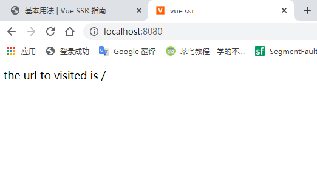
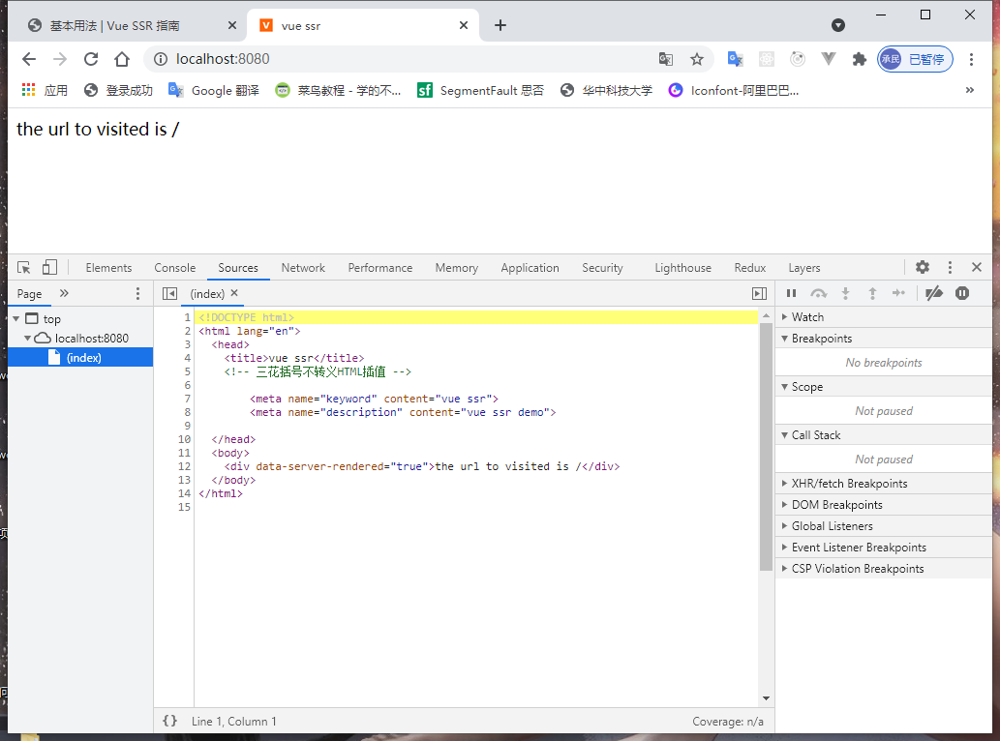

## 前言

为什么要使用服务端渲染呢？传统的客户端
（SPA单页应用程序）有什么不足？

- 更好的SEO：

  服务端渲染是，首屏的html由服务端生成直接发送给浏览器，浏览器直接对“有内容的html”进行解析，而不是含有各种引用的html。google和并对同步js有很好的索引能力

- 更快的内容到达时间：同构的思想，使得无需等待所有的js都完成下载才显示页面；拿到服务端的html直接显示，浏览器端同构加载其他的异步代码作为完善。

这篇博文也是学习官方指南做的相应笔记，，，

开始吧！

<!--more-->

## 基本用法

使用 `vue-server-renderer` 这个库

```
npm install vue vue-server-renderer --save
```

### 渲染一个Vue实例

```js
// 1. make an instance
const Vue = require('vue');
const app = new Vue({
  template: `<div>hello {{name}}</div>`,
  data: {
    name: 'minyue',
  },
});

// 2. make a renderer
const renderer = require('vue-server-renderer').createRenderer();

// 3. render the Vue instance as HTML
renderer
  .renderToString(app)
  .then((html) => {
    console.log(html);
    //   <div data-server-rendered="true">hello minyue</div>
  })
  .catch((err) => {
    console.log(err);
  });
```


### 集成服务器

使用express框架

```
npm install express --save
```

```js
const Vue = require('vue')
const server = require('express')()
const renderer = require('vue-server-renderer').createRenderer()

server.get('*', (req, res) => {
  const app = new Vue({
    data: {
      url: req.url
    },
    template: `<div>访问的 URL 是： {{ url }}</div>`
  })

  renderer.renderToString(app, (err, html) => {
    if (err) {
      res.status(500).end('Internal Server Error')
      return
    }
    res.end(`
      <!DOCTYPE html>
      <html lang="en">
        <head><title>Hello</title></head>
        <body>${html}</body>
      </html>
    `)
  })
})

server.listen(8080)
```



### 使用页面模板

简化上面的页面模板，可以直接在创建renderer 时提供一个模板

例如`index.template.html`

```html
<!DOCTYPE html>
<html lang="en">
  <head><title>Hello</title></head>
  <body>
    <!--vue-ssr-outlet-->
  </body>
</html>
```

其中body标签内部就是vue模板渲染的地方

#### 文件读取模块

```js
const renderer = require('vue-server-renderer').createRenderer({
  template: require('fs').readFileSync('./index.template.html', 'utf-8')
})

renderer.renderToString(app, (err, html) => {
  console.log(html) // html 将是注入应用程序内容的完整页面
})
```

#### 模板插值

```html
<html>
  <head>
    <!-- 使用双花括号(double-mustache)进行 HTML 转义插值(HTML-escaped interpolation) -->
    <title>{{ title }}</title>

    <!-- 使用三花括号(triple-mustache)进行 HTML 不转义插值(non-HTML-escaped interpolation) -->
    {{{ meta }}}
  </head>
  <body>
    <!--vue-ssr-outlet-->
  </body>
</html>
```

我们可以通过传入一个"渲染上下文对象"，作为 `renderToString` 函数的第二个参数，来提供插值数据：

```js
const context = {
  title: 'hello',
  meta: `
    <meta ...>
    <meta ...>
  `
}

renderer.renderToString(app, context, (err, html) => {
  // 页面 title 将会是 "Hello"
  // meta 标签也会注入
})
```

#### 完整示例

```js
const Vue = require('vue');
const server = require('express')();
const template = require('fs').readFileSync('./index.template.html', 'utf-8');

const renderer = require('vue-server-renderer').createRenderer({
  template,
});

const context = {
  title: 'vue ssr',
  metas: `
        <meta name="keyword" content="vue ssr">
        <meta name="description" content="vue ssr demo">
    `,
};

server.get('*', (req, res) => {
  const app = new Vue({
    data: {
      url: req.url,
    },
    template: `<div>the url to visited is {{url}}</div>`,
  });
  renderer.renderToString(app, context, (err, html) => {
    console.log(html);
    if (err) {
      res.status(500).end('Internal Server Error');
      return;
    }
    res.end(html);
  });
});

server.listen(8080);
```

 

## 编写通用代码

下面是进入服务端渲染前，需要注意的点

### 服务器上的数据响应

注意在应用程序数据上，我们希望每一个请求应该都是全新的，独立的实例，不会有**交叉请求造成的状态污染**

所以实例渲染过程需要数据的确定性，也将在服务器“预取”数据，意味着，开始渲染时，我们的应用程序已经解析其状态。数据进行响应式的过程在服务端是多余的，默认情况下禁用。

### 组件生命周期函数

学习vue生命周期时就发现，服务端渲染只有两个生命周期函数会被调用 `beforeCreate` 和 `created` 

其他只在客户端执行

所以，应该避免在 `beforeCreate` 和 `created` 中产生全局副作用的代码。例如，设置定时器timer，纯客户端里面，组件在 `beforeDestroy` 或 `destroyed` 生命周期时将其销毁。但是SSR期间并不会

### API

服务端api和客户端不尽相同

### 自定义指令

**不是很明白**

大多数自定义指令直接操作 DOM，因此会在服务器端渲染 (SSR) 过程中导致错误。有两种方法可以解决这个问题：

1. 推荐使用组件作为抽象机制，并运行在「虚拟 DOM 层级(Virtual-DOM level)」（例如，使用渲染函数(render function)）。
2. 如果你有一个自定义指令，但是不是很容易替换为组件，则可以在创建服务器 renderer 时，使用 [`directives`](https://ssr.vuejs.org/zh/api/#directives) 选项所提供"服务器端版本(server-side version)"。

## 源码结构

### 避免状态单例

在纯客户端代码中，每次都是在新的上下文对代码取值，但是，Node.js是一个长期运作的进程，如果创建一个单例对象，它会在每个传入的请求间共享。

容易导致交叉请求污染

所以，我们不应该直接创建应用程序实例，应该暴露一个工厂函数

```js
// app.js
const Vue = require('vue')

module.exports = function createApp (context) {
  return new Vue({
    data: {
      url: context.url
    },
    template: `<div>访问的 URL 是： {{ url }}</div>`
  })
}
```

服务器代码

```js
// server.js
const createApp = require('./app')

server.get('*', (req, res) => {
  const context = { url: req.url }
  const app = createApp(context)

  renderer.renderToString(app, (err, html) => {
    // 处理错误……
    res.end(html)
  })
})
```

同样的规则也在router，store等

### 构建步骤

对于客户端应用程序和服务器应用程序，我们都要使用 webpack 打包 - 服务器需要「服务器 bundle」然后用于服务器端渲染(SSR)，而「客户端 bundle」会发送给浏览器，用于混合静态标记。


> **app.js**：是应用程序的通用入口。
>
> - 在纯客户端中，我们将在这个文件中创建Vue根实例，并挂载到DOM上
> - 在服务端渲染，责任转移到纯客户端entry文件中。app.js简单的export一个`createApp`函数
>
> ```js
> import Vue from 'vue'
> import App from './App.vue'
> 
> // 导出一个工厂函数，用于创建新的
> // 应用程序、router 和 store 实例
> export function createApp () {
>   const app = new Vue({
>     // 根实例简单的渲染应用程序组件。
>     render: h => h(App)
>   })
>   return { app }
> }
> ```
>
> **entry-client.js**
>
> 客户端entry需要创建应用程序，并挂载到DOM中
>
> ```js
> import { createApp } from './app'
> 
> // 客户端特定引导逻辑……
> 
> const { app } = createApp()
> 
> // 这里假定 App.vue 模板中根元素具有 `id="app"`
> app.$mount('#app')
> ```
>
> **entry-server.js**
>
> 创建和返回应用程序实例，每次渲染都会重复执行
>
> 承载服务端路由，数据预取逻辑的编写
>
> ```js
> import { createApp } from './app'
> 
> export default context => {
>   const { app } = createApp()
>   return app
> }
> ```

## 路由和代码分割

### 使用vue-router的路由

需要给每一个请求新的router实例，

**router.js**

导出一个工厂函数`createRouter`

```js
// router.js
import Vue from 'vue'
import Router from 'vue-router'

Vue.use(Router)

export function createRouter () {
  return new Router({
    mode: 'history',
    routes: [
      // ...
    ]
  })
}
```

**app.js**

```js
import Vue from 'vue'
import App from './App.vue'
import { createRouter } from './router'

export function createApp () {
  // 创建 router 实例
  const router = createRouter()

  const app = new Vue({
    // 注入 router 到根 Vue 实例
    router,
    render: h => h(App)
  })

  // 返回 app 和 router
  return { app, router }
}
```

**entry-server.js**

实现服务器端路由逻辑

```js
// entry-server.js
import { createApp } from './app'

export default context => {
  // 因为有可能会是异步路由钩子函数或组件，所以我们将返回一个 Promise，
    // 以便服务器能够等待所有的内容在渲染前，
    // 就已经准备就绪。
  return new Promise((resolve, reject) => {
    const { app, router } = createApp()

    // 设置服务器端 router 的位置
    router.push(context.url)

    // 等到 router 将可能的异步组件和钩子函数解析完
    router.onReady(() => {
      const matchedComponents = router.getMatchedComponents()
      // 匹配不到的路由，执行 reject 函数，并返回 404
      if (!matchedComponents.length) {
        return reject({ code: 404 })
      }

      // Promise 应该 resolve 应用程序实例，以便它可以渲染
      resolve(app)
    }, reject)
  })
}
```

**server.js**

```js
// server端
const serverApp = express();
const template = fs.readFileSync('./src/index.ssr.html', 'utf-8');
const bundle = require('./dist/vue-ssr-server-bundle.json');
const renderer = require('vue-server-renderer').createBundleRenderer(bundle, {
  template,
});
serverApp.get('*', (req, res) => {
  const context = { url: req.url };
  renderer.renderToString(context, (err, html) => {
    console.log(html, err);
    if (err) {
      if (err.code === 404) {
        res.status(404).end('Page not found');
      } else {
        res.status(500).end('Internal Server Error');
      }
    } else {
      res.end(html);
    }
  });
});
```

官网上服务端用法写的是引入打包后的`entry-server.js`的函数用promise的链式调用异步返回app实例，作为renderer的参数

这里，webpack打包使用的`VueSSRServerPlugin` 这个官方提供的插件，将整个`server.bundle.js` 包装在一个`json` 文件中

```json
{
  "entry": "server.bundle.js",
  "files": {
    //...
  },
  "maps": {}
}
```

**注释：**

> files中字符串的形式打包了项目运行的所有依赖模块代码，其中entr指向的文件代码段为项目的执行入口脚本

### 代码分割

应用程序代码分割，懒加载，有助于减少浏览器初始渲染下载的bundle资源体积，优化TTI

适当使用异步组件

```js
// 这里进行修改……
import Foo from './Foo.vue'

// 改为这样：
const Foo = () => import('./Foo.vue')
```

这样就需要对客户端增加`router.onReady` ,因为路由器必须提前解析路由配置中的异步组件，才能正确调用组件中可能存在的路由钩子函数

```js
// entry-client.js

import { createApp } from './app'

const { app, router } = createApp()

router.onReady(() => {
  app.$mount('#app')
})
```

## 数据预取和状态

ssr期间， 我们本质上是渲染我们应用程序"快照"，所有，如果应用程序依赖于一些异步数据，**在渲染过程前，需要先预取和解析好这些数据**

另一个问题在客户端：mount到客户端前，需要获取与服务端应用程序完全相同的数据，否则，**客户端与服务端状态不同，混合失败**！

### 数据预取存储容器

为解决上面的问题获取的数据需要在视图组件外，即专门的状态容器。

1. 首先，服务端可以在渲染前预取数据，并填充到store中。
2. 在快照HTML中序列化和内联预置状态，这样可以在mount到客户端前，直接从store获取到内联预置状态


