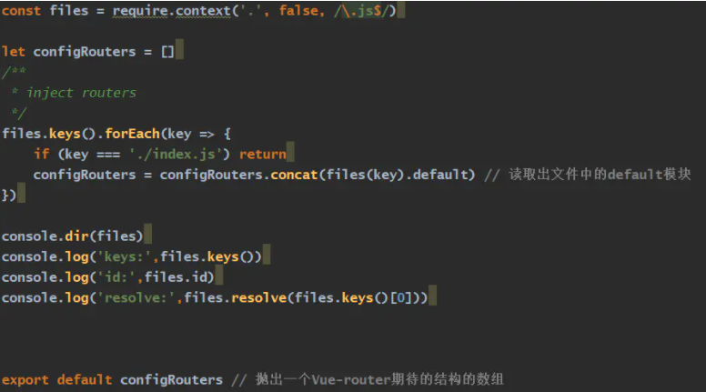
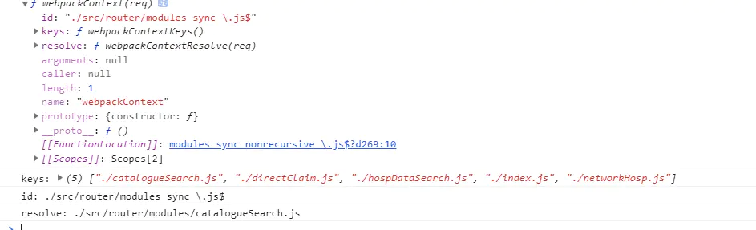
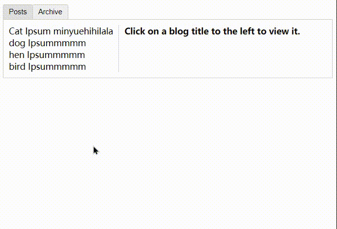

## 前言

>前面跟着官方文档学习了基础部分
>
>下面深入学习Vue进阶内容

<!--more-->

## 深入了解组件

### 组件注册

前面说到组件注册有两种：**全局注册和局部注册**，下面深入了解

#### 组件名

1. **组件名大小写**

- 全部使用kebab-case

```js
Vue.component('my-component-name', { /* ... */ })
```

使用必须 `<my-component-name>`

- 使用pascalCase

```js
Vue.component('MyComponentName', { /* ... */ })
```

引用时两种方式都可以 `<my-component-name>` 和 `<MyComponentName>`

**注意**：DOM中（非模板）只有前者可以！！！

#### 全局注册

前面基础篇中提到，全局注册可以在后面的任何Vue根实例中使用，所有子组件，各自组件内部都可以使用

```js
Vue.component('component-a', { /* ... */ })
Vue.component('component-b', { /* ... */ })
Vue.component('component-c', { /* ... */ })

new Vue({ el: '#app' })
```

```html
<div id="app">
  <component-a></component-a>
  <component-b></component-b>
  <component-c></component-c>
</div>
```

#### 局部注册

大家可以发现，不管你是否使用全局注册的组件，他都会在你写的组件作用域中，webpack打包时会增加无意义的内容

这个时候，**局部组件**，通过Vue的`components`property来声明根实例需要使用到的组件。

对应组件通过js对象的形式声明

```js
var ComponentA = { /* ... */ }
var ComponentB = { /* ... */ }
var ComponentC = { /* ... */ }
```

```js
new Vue({
  el: '#app',
  components: {
    'component-a': ComponentA,
    'component-b': ComponentB
  }
})
```

##### 子组件间不能相互调用

如果希望在ComponentA中使用ComponentB

```js
var ComponentA = { /* ... */ }

var ComponentB = {
  components: {
    'component-a': ComponentA
  },
  // ...
}
```

或者webpack文件管理

```js
import ComponentA from './ComponentA.vue'

export default {
  components: {
    ComponentA
  },
  // ...
}
```

#### 模块系统

##### 在模块系统中局部注册

推荐创建一个component目录，将每个组件放置在各自的文件中。

使用时就ES model 的方式 import相应模块

**示例**

```js
import ComponentA from './ComponentA'
import ComponentC from './ComponentC'

export default {
  components: {
    ComponentA,
    ComponentC
  },
  // ...
}
```

现在 `ComponentA` 和 `ComponentC` 都可以在 `ComponentB` 的模板中使用了。

##### 基础组件的自动化全局部署

对于一些相对通用的组件称为**基础组件**建议设置为**全局组件**

使用webpack或（Vue CLI3+）可以直接使用`require.context` 注册非常常用的基础组件

**示例**：应用在入口文件`src/main.js`

```js
import Vue from 'vue'
import upperFirst from 'lodash/upperFirst'
import camelCase from 'lodash/camelCase'

const requireComponent = require.context(
  // 其组件目录的相对路径
  './components',
  // 是否查询其子目录
  false,
  // 匹配基础组件文件名的正则表达式
  /Base[A-Z]\w+\.(vue|js)$/
)

requireComponent.keys().forEach(fileName => {
  // 获取组件配置
  const componentConfig = requireComponent(fileName)

  // 获取组件的 PascalCase 命名
  const componentName = upperFirst(
    camelCase(
      // 获取和目录深度无关的文件名
      fileName
        .split('/')
        .pop()
        .replace(/\.\w+$/, '')
    )
  )

  // 全局注册组件
  Vue.component(
    componentName,
    // 如果这个组件选项是通过 `export default` 导出的，
    // 那么就会优先使用 `.default`，
    // 否则回退到使用模块的根。
    componentConfig.default || componentConfig
  )
})
```

**全局注册的行为必须在根 Vue 实例 (通过 `new Vue`) 创建之前发生**

**解析**

>require.context("相对路径", boolean, /正则/)
>
>- 传入三个参数，返回一个函数
>
>返回的函数有三个属性
>
>- resolve {function}-接受一个参数request,request为”相对路径“下面匹配文件的相对路径，返回这个匹配文件相对整个工程的相对路径
>- keys{function}--返回匹配成功模块的名字组成的数据
>- id{string}--执行环境的id

**示例**

 

 

可以看出来

>- files(key) 自身作为函数，参数为匹配文件的相对路径，**返回对应模块**
>- id：就是返回了`匹配的文件夹的相对于工程的相对路径`,`是否遍历子目录`,`匹配正则组成的字符串`
>- keys()：返回匹配的文件名数组
>
>- resolve()：传参类似files，返回完整路径

## prop

### prop大小写

HTML中`attribute` 是大小写不敏感的

```js
Vue.component('blog-post', {
  // 在 JavaScript 中是 camelCase 的
  props: ['postTitle'],
  template: '<h3>{{ postTitle }}</h3>'
})
```

camelCase 的 prop 名需要使用其等价的 kebab-case 命名

```html
<!-- 在 HTML 中是 kebab-case 的 -->
<blog-post post-title="hello!"></blog-post>
```

- 在字符串模板中没有限制

### prop类型

```js
props: {
  title: String,
  likes: Number,
  isPublished: Boolean,
  commentIds: Array,
  author: Object,
  callback: Function,
  contactsPromise: Promise // or any other constructor
}
```

当然验证信息也可以是需求的对象

```js
Vue.component('my-component', {
  props: {
    // 基础的类型检查 (`null` 和 `undefined` 会通过任何类型验证)
    propA: Number,
    // 多个可能的类型
    propB: [String, Number],
    // 必填的字符串
    propC: {
      type: String,
      required: true
    },
    // 带有默认值的数字
    propD: {
      type: Number,
      default: 100
    },
    // 带有默认值的对象
    propE: {
      type: Object,
      // 对象或数组默认值必须从一个工厂函数获取
      default: function () {
        return { message: 'hello' }
      }
    },
    // 自定义验证函数
    propF: {
      validator: function (value) {
        // 这个值必须匹配下列字符串中的一个
        return ['success', 'warning', 'danger'].indexOf(value) !== -1
      }
    }
  }
})
```

**注意**

>- 默认值为对象需要从一个工厂函数返回
>- 自定义验证函数，返回值boolean
>- 注意那些 prop 会在一个组件实例创建**之前**进行验证，所以实例的 property (如 `data`、`computed` 等) 在 `default` 或 `validator` 函数中是不可用的。

#### 类型检查

`type` 可以是下列原生构造函数中的一个：

- `String`
- `Number`
- `Boolean`
- `Array`
- `Object`
- `Date`
- `Function`
- `Symbol`

也可以是自定义构造函数，并且通过原型链`instanceof` 查找方式确认

**例如**

```js
function Person (firstName, lastName) {
  this.firstName = firstName
  this.lastName = lastName
}

Vue.component('blog-post', {
  props: {
    author: Person
  }
})
```

来验证`author ` prop值是否通过`new Person`创建

### 传递静态或动态prop

#### 传递字符串

- 静态

```html
<blog-post title="My journey with Vue"></blog-post>
```

- 动态

```html
<!-- 动态赋予一个变量的值 -->
<blog-post v-bind:title="post.title"></blog-post>

<!-- 动态赋予一个复杂表达式的值 -->
<blog-post
  v-bind:title="post.title + ' by ' + post.author.name"
></blog-post>
```

#### 传递数字

```html
<!-- 即便 `42` 是静态的，我们仍然需要 `v-bind` 来告诉 Vue -->
<!-- 这是一个 JavaScript 表达式而不是一个字符串。-->
<blog-post v-bind:likes="42"></blog-post>

<!-- 用一个变量进行动态赋值。-->
<blog-post v-bind:likes="post.likes"></blog-post>
```

**注意**：静态属性默认是string类型

#### 传递boolean

```html
<!-- 包含该 prop 没有值的情况在内，都意味着 `true`。-->
<blog-post is-published></blog-post>

<!-- 即便 `false` 是静态的，我们仍然需要 `v-bind` 来告诉 Vue -->
<!-- 这是一个 JavaScript 表达式而不是一个字符串。-->
<blog-post v-bind:is-published="false"></blog-post>

<!-- 用一个变量进行动态赋值。-->
<blog-post v-bind:is-published="post.isPublished"></blog-post>
```

**注意**：静态属性有两种方式

#### 传递数组

```html
<!-- 即便数组是静态的，我们仍然需要 `v-bind` 来告诉 Vue -->
<!-- 这是一个 JavaScript 表达式而不是一个字符串。-->
<blog-post v-bind:comment-ids="[234, 266, 273]"></blog-post>

<!-- 用一个变量进行动态赋值。-->
<blog-post v-bind:comment-ids="post.commentIds"></blog-post>
```

同样注意静态形式

#### 传递对象

类似数组

### 单向数据流

最好不要在子组件中尝试更改prop

1. prop用来传递一个初始值；子组件想把它作为本地数据使用---最好定义一个本地data

```js
props: ['initialCounter'],
data: function () {
  return {
    counter: this.initialCounter
  }
}
```

2. prop作为原始值传入但需要进行转换--使用计算属性

```js
props: ['size'],
computed: {
  normalizedSize: function () {
    return this.size.trim().toLowerCase()
  }
}
```

Vue在数据管理上一定要清楚，子组件最好只是使用数据，UI组件；数据变更最好在根实例中实现

### 非Prop的Attribute

当prop传递给一个组件，但是这个组件没有在``props` 中定义。常见于组件库中

当然组件可以接受任意的attribute，这些attribute会被添加到这个组件的根元素上

#### 替换/合并已有Attribute

**实例**

 `<bootstrap-date-input>` 的模板是这样的：

```html
<input type="date" class="form-control">
```

这时我们想给我们的日期选择器插件定值一个主题

```html
<bootstrap-date-input
  data-date-picker="activated"
  class="date-picker-theme-dark"
></bootstrap-date-input>
```

这时有两个class attribute，，，

对于绝大多数来说是替换，外来的（`date-picker-theme-dark`），替换掉（`form-control`）

如果传入 `type="text"` 就会替换掉 `type="date"`

**但是**：对于style和class**会智能合并**

最终的值：`class="form-control date-picker-theme-dark"`。

#### 禁用Attribute继承

如果你不想组件根元素继承attribute，设置`inheritAttrs: false`。

```js
Vue.component('my-component', {
  inheritAttrs: false,
  // ...
})
```

配合实例的 `$attr` property 使用，它包含了传递给组件的attribute 名和 attribute 值，例如：

```js
{
  required: true,
  placeholder: 'Enter your username'
}
```

有了 `inheritAttrs: false` 和 `$attrs`，你就可以手动决定这些 attribute 会被赋予哪个元素

```js
Vue.component('base-input', {
  inheritAttrs: false,
  props: ['label', 'value'],
  template: `
    <label>
      {{ label }}
      <input
        v-bind="$attrs"
        v-bind:value="value"
        v-on:input="$emit('input', $event.target.value)"
      >
    </label>
  `
})
```

```html
<base-input
  v-model="username"
  required
  placeholder="Enter your username"
></base-input>
```

**注意**

>- v-bind="$attrs"  定向绑定
>
>- 双向绑定复习v-model

## 自定义事件

### 事件名

不同于组件和prop，事件名不存在大小写自动转换

触发事件名字===监听绑定事件名

```js
this.$emit('myEvent')
```

```html
<!-- 没有效果 -->
<my-component v-on:my-event="doSomething"></my-component>
```

还注意到v-on事件监听在DOM模板中---大小写转换

 `v-on:myEvent` 将会变成 `v-on:myevent`——导致 `myEvent` 不可能被监听到。

推荐使用**kebab-case 的事件名**。

#### 自定义组件v-model

复习

组件上的`v-model`默认利用`value`和`input`事件，使用`model`选项可以避免一些像单选()，复选()等输入控件`value`使用不同目的的冲突

```js
Vue.component('base-checkbox', {
  model: {
    prop: 'checked',
    event: 'change'
  },
  props: {
    checked: Boolean
  },
  template: `
    <input
      type="checkbox"
      v-bind:checked="checked"
      v-on:change="$emit('change', $event.target.checked)"
    >
  `
})
```

>- model: 
>  - 声明prop名字（并且需要在props中声明）
>  - 声明事件名（触发事件名一致）
>- input元素中表明
>  - `type="checkbox"`
>  - `v-bind:checked="checked"`
>  - `v-on:change="$emit('change', $event.target.checked)"`

**示例**

```html
<base-checkbox v-model="lovingVue"></base-checkbox>
```

这里lovingVue值会传入`checked` 

input change事件触发-->触发change，并返回值--->返回值更新lovingVue

#### 将原生事件绑定到组件

可以使用 `v-on` 的 `.native` 修饰符：

```html
<base-input v-on:focus.native="onFocus"></base-input>
```

需要考虑一个前面prop一样的问题，根元素上绑定事件，，，如果你想绑定input事件，但根元素不是input元素，子元素才是。。。

想到定向绑定事件！

同样先禁止attribute继承

Vue提供 `$listeners` property，它是一个对象，里面包含了作用在这个组件上的所有监听器

```js
{
  focus: function (event) { /* ... */ }
  input: function (value) { /* ... */ },
}
```

**示例：**配合v-model

创建一个计算属性融合一下更加方便

```js
Vue.component('base-input', {
  inheritAttrs: false,
  props: ['label', 'value'],
  computed: {
    inputListeners: function () {
      var vm = this
      // `Object.assign` 将所有的对象合并为一个新对象
      return Object.assign({},
        // 我们从父级添加所有的监听器
        this.$listeners,
        // 然后我们添加自定义监听器，
        // 或覆写一些监听器的行为
        {
          // 这里确保组件配合 `v-model` 的工作
          input: function (event) {
            vm.$emit('input', event.target.value)
          }
        }
      )
    }
  },
  template: `
    <label>
      {{ label }}
      <input
        v-bind="$attrs"
        v-bind:value="value"
        v-on="inputListeners"
      >
    </label>
  `
})
```

现在`<base-input>` 组件是一个**完全透明的包裹器**了，也就是说它可以完全像一个普通的 `<input>` 元素一样使用了：所有跟它相同的 attribute 和监听器都可以工作，不必再使用 `.native` 监听器。

#### `.sync` 修饰符

`2.3`以后变成一个编译时的语法糖，它会被扩展为自动更新父组件属性的`v-on` 监听器

```html
<comp :foo.sync="bar"></comp>
```

扩展为：

```html
<comp :foo="bar" @update:foo="bar=$event"></comp>
```

当子组件要更新`foo`值时，需要显示触发一个更新事件

```js
this.$emit('update:foo', newValue)
```

**注意**

>- **.sync后面只能是要绑定的property名**，而不能是表达式

**示例**：弹窗关闭


## 插槽

Vue实现的内容分配的api,`<slot>`承载分发内容的出口；类似react中`prop.children`

### 插槽内容

1. 字符串
2. HTML等模板代码
3. 甚至其他组件

```html
<navigation-link url="/profile">
  <!-- 添加一个图标的组件 -->
  <font-awesome-icon name="user"></font-awesome-icon>
  Your Profile
</navigation-link>
```

**注意：**

>如果`<navigation-link>` 的 `template` 中**没有**包含一个 `<slot>` 元素，则内容都会被抛弃

### 编译作用域

> 父级模板里的所有内容都是在父级作用域中编译的；子模板里的所有内容都是在子作用域中编译的。

```html
<navigation-link url="/profile">
  Clicking here will send you to: {{ url }}
  <!--这里的 `url` 会是 undefined-->
</navigation-link>
```

- 当然可以使用props在组件内部接收url这个property

### 后备内容

也就是slot插槽的默认内容

```html
<button type="submit">
  <slot>Submit</slot>
</button>
```

在父级组件中使用 `<submit-button>` 并且不提供任何插槽内容时：

```html
<button type="submit">
  Submit
</button>
```

将渲染后备内容

当然提供内容时，覆盖后备内容

### 具名插槽

>废弃了slot属性和slot-scope属性，代替的是v-slot

**示例**

```html
<div class="container">
  <header>
    <slot name="header"></slot>
  </header>
  <main>
    <slot></slot>
  </main>
  <footer>
    <slot name="footer"></slot>
  </footer>
</div>
```

- 不带name的会有隐含`name="default"`
- 同样，任何没有被带有`v-slot`的`template`包裹的内容都视为默认插槽内容

```html
<base-layout>
  <template v-slot:header>
    <h1>Here might be a page title</h1>
  </template>

  <p>A paragraph for the main content.</p>
  <p>And another one.</p>

  <template v-slot:footer>
    <p>Here's some contact info</p>
  </template>
</base-layout>
```

渲染为：

```html
<div class="container">
  <header>
    <h1>Here might be a page title</h1>
  </header>
  <main>
    <p>A paragraph for the main content.</p>
    <p>And another one.</p>
  </main>
  <footer>
    <p>Here's some contact info</p>
  </footer>
</div>
```

**注意**：`v-slot`一般只能添加到`<template>`上，一个例外下节分析

#### 缩写

把参数之前的所有内容 (`v-slot:`) 替换为字符 `#`。例如 `v-slot:header` 可以被重写为 `#header`

```html
<base-layout>
  <template #header>
    <h1>Here might be a page title</h1>
  </template>

  <p>A paragraph for the main content.</p>
  <p>And another one.</p>

  <template #footer>
    <p>Here's some contact info</p>
  </template>
</base-layout>
```

**注意** 你希望使用缩写的话，你必须始终以明确插槽名取而代之：

```html
<current-user #default="{ user }">
  {{ user.firstName }}
</current-user>
```


### 作用域插槽

当我们想让插槽内容可以访问子组件中才有的数据。

**例如**有如下模板的 `<current-user>` 组件：

```html
<span>
  <slot>{{ user.lastName }}</slot>
</span>
```

想换掉备用内容

```html
<current-user>
  {{ user.firstName }}
</current-user>
```

但是会报错，因为user是子作用域中的东西，`<current-user>`组件内容是父组件作用域

**引入插槽prop**：在`<slot>`元素上绑定`user`属性；并且在`v-slot`属性赋值内容全局prop名

```html
<span>
  <slot v-bind:user="user">
    {{ user.lastName }}
  </slot>
</span>
```

```html
<current-user>
  <template v-slot:default="slotProps">
    {{ slotProps.user.firstName }}
  </template>
</current-user>
```

#### 独占默认插槽的缩写语法

当提供的内容**只有默认插槽**时，组件的标签可以当做插槽模板使用；**`v-slot` 直接用在组件上**

```html
<current-user v-slot:default="slotProps">
  {{ slotProps.user.firstName }}
</current-user>
```

default可以省略

```html
<current-user v-slot="slotProps">
  {{ slotProps.user.firstName }}
</current-user>
```

当然缩写语法不可以和具名插槽混用，同时出现需要使用完整的基于 `<template>` 的语法：

```html
<current-user>
  <template v-slot:default="slotProps">
    {{ slotProps.user.firstName }}
  </template>

  <template v-slot:other="otherSlotProps">
    ...
  </template>
</current-user>
```

#### 解构插槽prop

作用域插槽内部工作原理是将插槽内容，包裹在一个拥有单一参数的函数里

```js
function (slotProps) {
  // 插槽内容
}
```

表示prop名可以是js表达式，可以使用对象结构的语法

```html
<current-user v-slot="{ user }">
  {{ user.firstName }}
</current-user>
```

重命名

```hrml
<current-user v-slot="{ user: person }">
  {{ person.firstName }}
</current-user>
```

自定义prop的后备内容

```html
<current-user v-slot="{ user = { firstName: 'Guest' } }">
  {{ user.firstName }}
</current-user>
```

### 动态插槽名

动态指令参数可以用在 `v-slot` 上，来定义动态的插槽名：

```html
<base-layout>
  <template v-slot:[dynamicSlotName]>
    ...
  </template>
</base-layout>
```

## 动态组件&异步组件

### 动态组件上使用`keep-alive`

前面我们使用`is` 属性来切换不同的组件

```html
<component v-bind:is="currentTabComponent"></component>
```

当然切换组件后，不能保存原来组件的状态，会触发重复渲染

给动态标签添加`keep-alive`实现状态缓存

**示例**：多标签界面



1. 视图结构

>- tab-button
>  - border上的细节注意
>  - cursor，hover，active细节注意
>- tab大盒子
>  - flex布局
>  - 左sidebar
>    - 单行文本
>    - max-width设置
>    - cursor，hover，active细节
>  - 右container
>    - `<h>`
>    - `<p>`:复习v-html技巧

2. 逻辑层

>- 根实例
>  - 数据
>    - currentTab：用于active和动态组件切换
>    - tabs：用于循环渲染
>    - 计算属性：动态组件切换
>  - 子组件
>    - tab-posts
>    - tab-archive
>- tab-posts
>  - 数据
>    - posts数组
>      - id：key
>      - title
>      - content：`<p>`：v-html
>    - selectedPost：active，右container显示
>  - template：注意单一原则
>- tab-archive
>  - template

**注意**

>- ul li使用时
>  1. 一定要样式中margin，padding自定义
>  2. list-style-type: none;取消`::marker`
>
>- 单行文字css实现
>
>```css
>white-space: nowrap;
>text-overflow: ellipsis;
>overflow: hidden;
>```
>
>- h标签上内外边距丑
>
>```css
>.selected-post > :first-child {
>  margin-top: 0;
>  padding-top: 0;
>}
>```

### 异步组件

Vue允许以一个工厂函数的方式定义组件，工厂函数只有当组件需要被渲染的时候才会触发，并且把结果缓存供未来重渲染

**例子**

```js
Vue.component('async-example', function (resolve, reject) {
  setTimeout(function () {
    // 向 `resolve` 回调传递组件定义
    resolve({
      template: '<div>I am async!</div>'
    })
  }, 1000)
})
```

>上面示例，工厂函数调用，会收到`resolve`回调，这个回调函数从服务器得到组件定义（这里用setTimeout演示）

- 将异步组件和`webpack code-splitting`结合

```js
Vue.component('async-webpack-example', function (resolve) {
  // 这个特殊的 `require` 语法将会告诉 webpack
  // 自动将你的构建代码切割成多个包，这些包
  // 会通过 Ajax 请求加载
  require(['./my-async-component'], resolve)
})
```

> [require](https://www.runoob.com/w3cnote/requirejs-tutorial-2.html)

- 也可以返回一个Promise

```js
Vue.component(
  'async-webpack-example',
  // 这个动态导入会返回一个 `Promise` 对象。
  () => import('./my-async-component')
)
```

局部组件也可以直接提供一个返回Promise的函数

```js
new Vue({
  // ...
  components: {
    'my-component': () => import('./my-async-component')
  }
})
```

>[import动态导入](https://developer.mozilla.org/zh-CN/docs/Web/JavaScript/Reference/Statements/import#%E7%A4%BA%E4%BE%8B)

#### 处理加载状态

异步组件工厂函数也可以返回一个如下格式的对象

```js
const AsyncComponent = () => ({
  // 需要加载的组件 (应该是一个 `Promise` 对象)
  component: import('./MyComponent.vue'),
  // 异步组件加载时使用的组件
  loading: LoadingComponent,
  // 加载失败时使用的组件
  error: ErrorComponent,
  // 展示加载时组件的延时时间。默认值是 200 (毫秒)
  delay: 200,
  // 如果提供了超时时间且组件加载也超时了，
  // 则使用加载失败时使用的组件。默认值是：`Infinity`
  timeout: 3000
})
```

## 处理边界问题

### 访问元素&组件

大多数情况，最好不要触达另一个组件实例内部或手动操作DOM元素。

#### 访问根实例

每一个`new Vue`实例的子组件，都可以通过`$root` 来访问根实例

所有子组件都可以将这个实例作为全局store访问使用

```js
// Vue 根实例
new Vue({
  data: {
    foo: 1
  },
  computed: {
    bar: function () { /* ... */ }
  },
  methods: {
    baz: function () { /* ... */ }
  }
})

// 获取根组件的数据
this.$root.foo

// 写入根组件的数据
this.$root.foo = 2

// 访问根组件的计算属性
this.$root.bar

// 调用根组件的方法
this.$root.baz()
```

**注意**

>对于一些小应用，可以这行管理数据
>
>大型应用：Vuex管理

#### 访问父级组件实例

和`$root`类似，`$parent` 可以用来从子组件中访问父组件的实例


