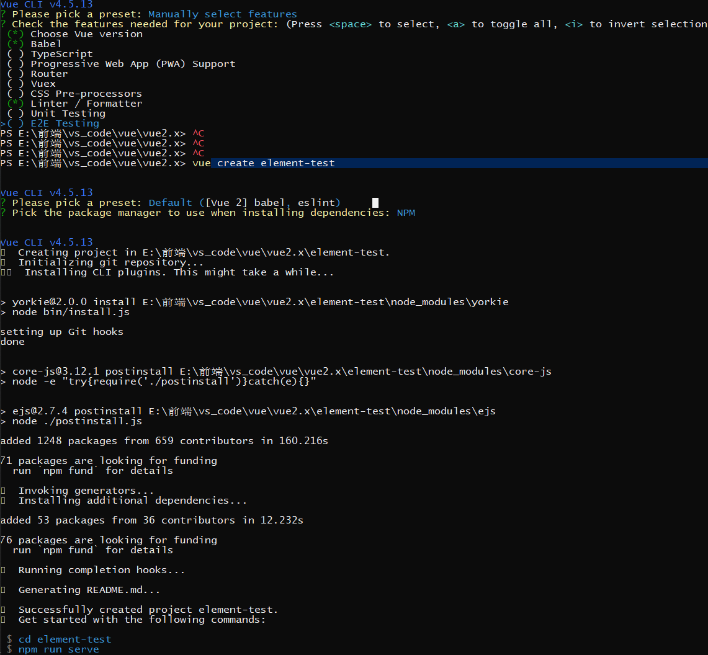
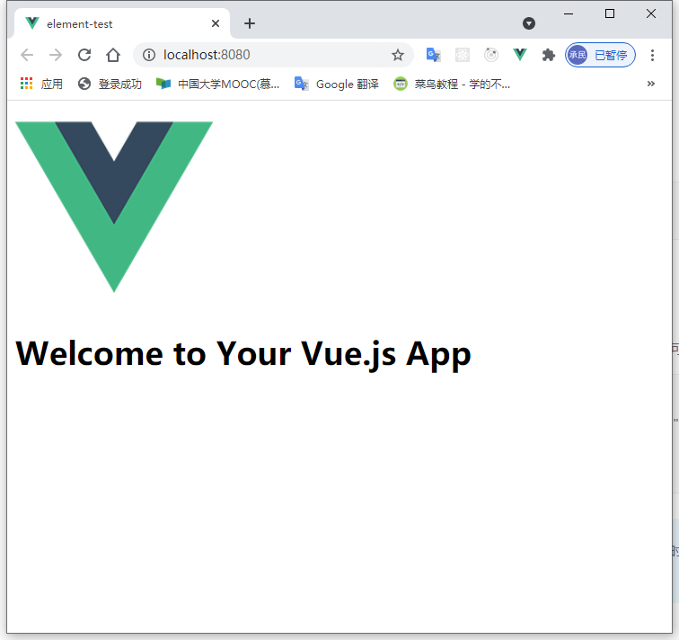
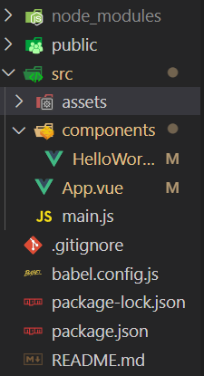
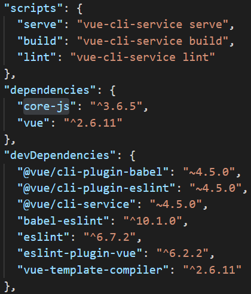
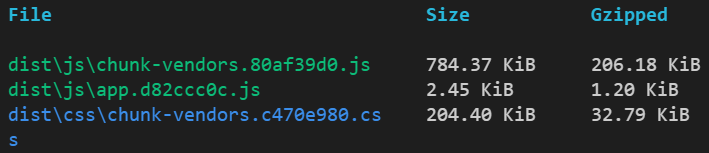
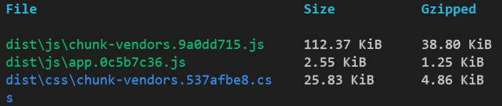

## 前言

终于学完Vue2.x的基本语法知识，下面开启实战项目的学习

管理大型Vue项目，不能像之前写demo一样在html文件中

- 现在开始使用Vue-CLI官当脚手架工具（横向对比create-react-app）
- 使用Vuex来全局管理数据（横向对比redux）
- 使用Vue-router对前端路由进行管理（横向对比react-router）

下面开始吧！

<!--more-->

## Vue-CLI

[官网地址](https://cli.vuejs.org/zh/guide/)

首先**全局**安装vue/cli，是的我们可以全局使用`vue` 命令

```
npm install -g @vue/cli
# OR
yarn global add @vue/cli
```

### 构建项目

承接后面对Element UI的学习，这里搭建一个test项目

```
vue create element-test
```

使用`default vue2.x`配置项



进入项目，编译构建，开启本地服务器

```
npm run serve
```



> 这里删除了项目中多余的元素和样式

> default配置的Vue项目很简单，只有一些babel和Vue2.x对应的依赖

  

## Element-UI入门

### 项目引入

构建完，正式进入element ui学习前，先安装element-ui

#### npm安装

```
npm i element-ui -S
```

引入element-ui

```js
import ElementUI from 'element-ui'

Vue.use(ElementUI)
```

> **注意**在main.js全局下引入

在App.vue中引入node_modules中的文件

```
import 'element-ui/lib/theme-chalk/index.css'
```

现在就可以使用了

```vue
<template>
  <div id="app">
    <HelloWorld msg="Welcome to Your Vue.js App"/>
    <el-button @click="show">click</el-button>
  </div>
</template>

<script>
import HelloWorld from './components/HelloWorld.vue'
import 'element-ui/lib/theme-chalk/index.css'

export default {
  name: 'App',
  components: {
    HelloWorld
  },
  methods: {
    show: function() {
      this.$message.success('toast from element-ui')
    }
  }
}
</script>

<style>

</style>
```

##### 按需加载

对项目进行打包，会发现venders库多达784kb



如何按需加载呢？

**安装插件babel-plugin-component**

```
npm install babel-plugin-component -D
```

**修改babel.config.js**

```js
module.exports = {
  presets: ["@vue/cli-plugin-babel/preset"],
  plugins: [
    [
      "component",
      {
        libraryName: "element-ui",
        styleLibraryName: "theme-chalk",
      },
    ],
  ],
};

```

现在重新按需引入

```js
import { Button, Message } from "element-ui";

Vue.component(Button.name, Button);
Vue.prototype.$message = Message;
```

正常运行，打包编译结果



#### 插件安装

使用vue提供的

```
vue add element
```

快速集成

