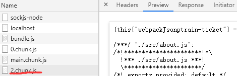

# hook

<!--more-->

## 一，项目搭建

### 1.1创建项目

- 使用`create-react-app`官方的脚手架工具

```
npx create-react-app train-ticket
```

>npm:就是一个npm的命令
>
>- 方便调用项目内部安装的模块
>- 避免全局安装的模块

### 1.2编译脚本

- 在package.json文件中有

  > 依赖文件`dependencies`
  >
  > - 除了react，react-dom外，就是react-script和一些测试的模块，可以看出主要功能都是react-script完成的。
  >
  > 脚本文件`script`
  >
  > 1. start：指引到react-script中对应start.js，starts.js中后会调用webpack.config.dev.js，实现本地服务环境的搭建等
  > 2. build：指引到react-script中对应build.js完成编译过程
  > 3. test：测试
  > 4. eject：将react-script中的代码功能下放到具体项目实践中，提高项目灵活性

### 1.3eject具体用法

```
npm run eject
```

- package.json中会增加很多的依赖，这个过程是不可逆的，后面多页面应用会用到修改

## 二，React新特性

### 2.1Context实现跨层级组件数据传递

- 相当于全局变量一样，可以跨组件传递数据的组件树

>1. 引入createContext函数
>
>- 用这个函数声明想全局使用的变量
>
>```
>// 这里也可以设定属性的默认值
>const BatteryContext = createContext(90);
>const OnlineContext = createContext();
>```
>
>2. 从provider到consumer
>
>- 在父代的顶层state中，value属性初始化想要传递的数据
>- 多数据使用嵌套模式
>
>```
><BatteryContext.Provider value={battery}>
>  <OnlineContext.Provider value={online}>
>    <button
>      type="button"
>      onClick={() => this.setState({ battery: battery - 1 })}
>    >
>    Press
>    </button>
>    <button
>      type="button"
>      onClick={() => this.setState({ online: !online })}
>    >
>    Switch
>    </button>
>    <Middle />				//中间组件
>  </OnlineContext.Provider>
></BatteryContext.Provider>
>```
>
>```
>class Leaf extends Component {
>  render() {
>    return (
>      <BatteryContext.Consumer>
>        {(battery) => (
>          <OnlineContext.Consumer>
>            {(online) => (
>              <h1>
>                Battery: {battery}, Online: {String(online)}
>              </h1>
>            )}
>          </OnlineContext.Consumer>
>        )}
>      </BatteryContext.Consumer>
>    );
>  }
>}
>```
>
>- consumer中也是嵌套使用  变量作为传入参数的箭头函数方式使用，最终返回的是JSX语法块。

### 2.2静态属性contextType

- 这样是全局性质的值传递，影响react组件的组件化管理，所以，一般很少使用，当只是用一个数据时，我们使用一个简单方法。

>类中定义contextType变量来获取对应预声明变量的值
>
>this.context 调用这个变量
>
>```
>static contextType = BatteryContext;
>// 这样就可以直接使用this.context来获取指定的数据。
>class Leaf extends Component {
>  static contextType = BatteryContext;
>  render() {
>  const battery = this.context;
>  return <h1>battery:{battery}</h1>;
>}
>}
>```

### 2.3lazy和suspense实现延迟加载

- react-loadable同样实现懒加载

>```
>// (1) 首先,要从react中引入 lazy 和 suspence
>// (2) lazy中异步导入，Suspence加载对应获取到的异步组件，回调函数就是加载过渡内容
>import React, { Component, lazy, Suspense } from "react";
>import "./App.css";
>
>const About = lazy(() => import("./about"));
>
>class App extends Component {
>  render() {
>    return (
>      <div>
>        <Suspense fallback={<div>loading</div>}>
>          <About></About>
>        </Suspense>
>      </div>
>    );
>  }
>}
>```

 

- 提高名称的辨识度，我们可以借助webpack中的注释

这样2.chunk.js  就换成了更加有辨识度的about.chunk.js

```
const About = lazy(() => import(/* webpackChunkName:"about" */ "./about"));
```

### 2.4错误边界

- 如果上面lazy导入的文件不存在，页面就会立即报错，并且这种错误是不可以捕获的。
- 这样我们就要考虑react ErrorBoundary

>实际上是使用了生命周期函数中的componentDidCatch方法
>
>或者。另外一个静态方法，getDerivedStateFromError函数，一旦出现错误可以返回一个新的state数据并合并到原来的state
>
>```
>componentDidCatch() {
>    this.setState({
>      hasError: true,
>    });
>}
>
>static getDerivedStateFromError() {
>	return {
>		hasError: true,
>	}
>}
>```
>
>- 效果相同开发者界面都会显示error

- 如何在发生错误后，触发重渲染？

>我们演示使用外部按钮，实现重渲染

```
let About = lazy(() => import(/* webpackChunkName:"about" */ "./about"));

class App extends Component {
  state = {
    load: false,
    error: false,
  };
  // 手动触发异步组件的加载
  load = () => {
    this.setState({ load: true });
  };
  // 加载失败后，点击重试
  retry = () => {
    this.setState({ error: false });
  };
  // ErrorBoundary 的关键，无需再实现 componentDidCatch
  static getDerivedStateFromError(e) {
    return { error: e };
  }
  render() {
    const { load, error } = this.state;

    // 显然错误页
    if (error) {
      return (
        <div>
          <p>{error.message}</p>
          <button onClick={this.retry}>retry</button>
        </div>
      );
    }

    return (
      <div>
        <button type="button" onClick={this.load}>
          load
        </button>
        <Suspense fallback={<div>loading</div>}>{load && <About />}</Suspense>
      </div>
    );
  }
}
```

>我们还会发现一个问题，重试没有作用，总是失败，
>
>- 因为，lazy中封装的promise只会执行一次，无论怎么获取它的结果，依然是失败的

```
{
  retry = () => {
    About = lazy(() => import('./about.js'));
    this.setState({error: false});
  }
}
```

>关键在于重新渲染这个about组件

### 2.5Memo实现指定组件渲染

- react有一个特点，组件渲染，render中包含的其他组件也会无条件渲染，即使没有数据变化。
- react给我们提供了一个生命周期函数`shouldComponentUpdate(nextProps, nextState) {}` 通过比较`this.props和nextProps；this.state和nextState`数据是否变化，返回true/false，来决定组件是否更新
- 当然react给我们提供了更加方便的使用方法。

>对于class组件来说：pureComponent
>
>- 只做浅比较，对句柄来比较，复杂数据类型，没有多级比较
>
>对于无状态组件来说：memo
>
>- 用memo()来包裹生成新的组件

```
const Foo = memo(function Foo(props) {
  console.log("Foo render");
  return <div>{props.person.age}</div>;
});
```

- 对于复杂数据类型，无状态组件，可以通过对memo传入第二个函数参数`areEqual`

```
const Foo = memo(function Foo(props) {
  console.log("Foo render" + props.person.age);
  return <div>{props.person.age}</div>;
}, areEqual);

function areEqual(prevProps, nextProps) {
  return prevProps.person.age === nextProps.person.age;
}
```

**一定要用setState来改变数据**

## 三，React Hooks

**类组件的不足**

- 状态逻辑难复用

  - 缺少复用机制
  - 渲染属性和告诫组件导致层级冗余

  ```
  1. “render prop”  React组件之间使用一个值为函数的prop共享
  //想要实现鼠标移动后面跟着cat， <Cat>组件使用<mouse>组件的数据 
  //render方法中的函数传给有数据的<mouse>，告诉他需要渲染声明内容。让mouse组件变得有复用性
  //要注意mouse组件不能和PureComponent一起用，因为每次传入的prop肯定不一样，PureComponent没有意义    要让prop为静态，可以利用浅比较传入一个定义了的实例方法
  
  class Cat extends React.Component {
    render() {
      const mouse = this.props.mouse;
      return (
        
      );
    }
  }
  
  class Mouse extends React.Component {
    constructor(props) {
      super(props);
      this.handleMouseMove = this.handleMouseMove.bind(this);
      this.state = { x: 0, y: 0 };
    }
  
    handleMouseMove(event) {
      this.setState({
        x: event.clientX,
        y: event.clientY
      });
    }
  
    render() {
      return (
        <div style={{ height: '100vh' }} onMouseMove={this.handleMouseMove}>
  
          {/*
            使用 `render`prop 动态决定要渲染的内容，
            而不是给出一个 <Mouse> 渲染结果的静态表示
          */}
          {this.props.render(this.state)}
        </div>
      );
    }
  }
  
  class MouseTracker extends React.Component {
    render() {
      return (
        <div>
          <h1>移动鼠标!</h1>
          <Mouse render={mouse => (
            <Cat mouse={mouse} />
          )}/>
        </div>
      );
    }
  }
  
  2. HOC高阶组件  参数为组件，返回值为新组件的函数
  // 例如Redux中的 connect
  const WrapperedFoo = resizable(Foo);
  <WrapperedFoo/>;
  ```

- 类组件难以维护

  - 生命周期函数混杂不相干逻辑
  - 相干逻辑分散在不同生命周期

- this指向困扰

**Hooks优势**

- 函数组件不存在this问题
- 方便复用状态逻辑
- 副作用关注点分离

>副作用：数据获取，设置订阅或者手动直接更改 React 组件中的 DOM 都属于副作用。
>
>副作用的时机：Mount之后，Update之后，Unmount之前

### 3.1useState使用

- 设置修改组件的state，Hooks提供了新的手段`useState`

```
// 引入useState  参数为默认值
function App() {
	const [count, setCount] = useState(0);
  return (
  	<button
      type="button"
      onClick={()=>{setCount(count + 1)}}
    >
    Click ({count})
    </button>
  );
}
export default App;
```

- 注意问题

>- 使用useState时，时借助了js的单线程特性，判断当前的useState调用当前的变量而不会混乱。
>- 当有多个变量时，必须**顺序调用**，**调用数量匹配**否则会出现错误

新版都自动集成了eslint-plugin-react-hooks  更加友好的错误信息

- 转换逻辑时 利用默认值函数只调用一次提升性能

```
function App(props) {
	const [count, setCount] = useState(() => {
		return props.defaultCount || 0;
	})
}
```

- setCount函数句柄是稳定的！！

### 3.2Effect Hooks

- 处理副作用的时机之前都是三个生命周期函数处理的
  - componentDidMount
  - componentDidUpdate
  - componentWillUnmount

- 现在我们使用useEffect完成相应操作

```
function App(props) {
  const [count, setCount] = useState(0);
  const [size, setSize] = useState({
    width: document.documentElement.clientWidth,
    height: document.documentElement.clientHeight,
  });

  const onResize = () => {
    setSize({
      width: document.documentElement.clientWidth,
      height: document.documentElement.clientHeight,
    });
  };

  useEffect(() => {
    console.log("count:", count);
  }, [count]);

  useEffect(() => {
    document.title = count;
  });

  useEffect(() => {
    window.addEventListener("resize", onResize, false);

    return () => {
      window.removeEventListener("resize", onResize, false);
    };
  }, []);

	const onClick = () => {
    console.log("click");
  };
  
  useEffect(() => {
    document.querySelector("#size").addEventListener("click", onClick, false);

    return () => {
      document
        .querySelector("#size")
        .removeEventListener("click", onClick, false);
    };
  });

  return (
    <div>
      <button
        type="button"
        onClick={() => {
          setCount(count + 1);
        }}
      >
        Click ({count})
      </button>
      {count % 2 ? (
        <span id="size">
          size: {size.width}x{size.height}
        </span>
      ) : (
        <p id="size">
          size: {size.width}x{size.height}
        </p>
      )}
    </div>
  );
}
```

>- useEffect有两个参数
> 1. 前一个参数：处理副作用函数
> 2. 后一个参数（可选）：变化数组（多次执行），常量数组（只执行一次）。
>- 多个副作用功能分开多个useEffect管理更加方便
>- remove操作，当事件移除时才会解绑
>- 当组件return jsx之后才执行useEffect

**注意**

>- 异步处理函数中的数据都是前一次的句柄
>- 很奇怪的是：onResize事件中回调函数中永远保存着原始大小的句柄。（向下还原算两次事件触发，最大化算一次时间触发）
>- 函数作用域内的数据都是同步的最新数据

**类属性**声明state和constructor中声明没什么区别

### 3.3Context Hooks

- **类组件**中可以使用`Count.Provider` `Count.Consumer`来对一到多个变量的调用；使用`static contextType = CountContext`对一个变量进行传递
- **函数组件** 就是要使用到这里的`useContext()`而且没有个数限制。

```
import React, { Component, useState, createContext, useContext } from "react";
const CountContext = createContext();

class Foo extends Component {
  render() {
    return (
      <CountContext.Consumer>
        {(count) => <h1>{count}</h1>}
      </CountContext.Consumer>
    );
  }
}
class Bar extends Component {
  static contextType = CountContext;
  render() {
    const count = this.context;
    return <h1>{count}</h1>;
  }
}
function Counter() {
  const count = useContext(CountContext);
  return <h1>{count}</h1>;
}
function App(props) {
  const [count, setCount] = useState(0);

  return (
    <div>
      <button
        type="button"
        onClick={() => {
          setCount(count + 1);
        }}
      >
        Click ({count})
      </button>
      <CountContext.Provider value={count}>
        <Foo />
        <Bar />
        <Counter />
      </CountContext.Provider>
    </div>
  );
}
```

### 3.4useMemo和callBack

- 函数组件中定义**一段函数是否执行**，memo是对组件而言

- 不像useEffect在下一次渲染的时候触发，useMemo是渲染过程中执行，参与本次渲染数据变化。

```
useMemo(()=>{},[])  //前：要处理的函数段返回值，后：依赖项

//对内置函数包装时使用useCallback
useCallback(()=>{},[])  //返回一个函数体
```

```
import React, { useMemo, useState, memo, useCallback } from "react";

const Counter = memo(function Counter(props) {
  console.log("Counter render");
  const { count } = props;
  props.onClick();
  return <h1>{count}</h1>;
});

function App(props) {
  const [count, setCount] = useState(0);
  const double = useMemo(() => {
    return count * 2;
  }, [count === 4]);
  
  const onClick = useCallback(() => {
    console.log("click" + clickCount);
  }, []);
  //让onClick句柄不变化，只会返回一次！！！
  
  return (
    <div>
      <button
        type="button"
        onClick={() => {
          setCount(count + 1);
        }}
      >
        Click ({count}), double: ({double})
      </button>

      <Counter count={double} onClick={onClick} />
    </div>
  );
}
```

- 我们不能阻止useCallback生成新的函数消耗性能，但是可以控制不让他返回（依赖项）
- 作用在于，优化因传入组件的值的过度变化而导致组件过度渲染

### 4.5 Ref Hooks

- 具有实例化对象的class组件中，可以使用createRef()来连接操作DOM。
- 函数组件中没有实例化对象所以，使用新的API `useRef()`

1. 获取DOM

>- 获取函数组件时，要把函数组件转换为class组件才能被ref获取。
>
>- 常见用法是调用获取组件中的方法
>
>```
>//想要获取Counter组件中的speak()方法
>class Counter extends PureComponent {
>  speak() {
>    console.log(`now counter is: ${this.props.count}`);
>  }
>  render() {
>    const { props } = this;
>    return <h1 onClick={props.onClick}>{props.count}</h1>;
>  }
>}
> 
><Counter ref={counterRef} count={double} onClick={onClick} />
>
>//对应组件中声明，调用
>const counterRef = useRef();
>
>const onClick = useCallback(() => {
>	console.log("click");
>	setCountadd((countadd) => countadd + 1);
>	counterRef.current.speak();
>}, []);
>```
>
>

2. 渲染周期之间共享数据

>- 因为每次渲染组件后，组件中的变量都会变化
>- 要想在渲染周期之间共享数据（state/useRef）
>- 但是state操作会触发渲染，会很麻烦
>
>```
>//声明  每次周期渲染it都是共享不变的
>const it = useRef();
>
>//调用
>useEffect(() => {
>  it.current = setInterval(() => {
>  	setCount((count) => count + 1);
>  }, 1000);
>}, []);
>useEffect(() => {
>  if (count > 10) {
> 		clearInterval(it.current);
>  }
>});
>```

### 4.6自定义Hooks

- 以`use---` 作为组件名的React函数组件，和普通函数组件的区别就是输入输出参数不一样。
- 自定义Hooks函数多用在封装功能，方便复用，内部可以使用Hooks所有钩子函数。

```
// 举例：想要封装复用查询好友在线状态的功能

function useFriendStatus(friendID) {
  const [isOnline, setIsOnline] = useState(null);

  // ...

  return isOnline;
}
```

```
//使用订阅好友状态的自定义hook函数

// (1)显示好友状态
function FriendStatus(props) {
  const isOnline = useFriendStatus(props.friend.id);

  if (isOnline === null) {
    return 'Loading...';
  }
  return isOnline ? 'Online' : 'Offline';
}

// (2)生成好友状态列表
function FriendListItem(props) {
  const isOnline = useFriendStatus(props.friend.id);

  return (
    <li style={{ color: isOnline ? 'green' : 'black' }}>
      {props.friend.name}
    </li>
  );
}
```

### 4.7使用Hook的注意点

1. ##### 只在最顶层使用 Hook

   - 不要在循环或嵌套函数中使用Hook
   - 确保 Hook 在每一次渲染中都按照同样的顺序被调用

2. 生命周期方法对应到Hook

   - constructer

     函数组件不需要构造函数，使用`useState()`初始化state,初始值复杂表达式时可以传入一个箭头函数return这个表达式（这个函数只会在首次组件搭载时运行，优化性能）

   - shouldComponentUpdate()

     也就是`useMemo()` `useCallback()`

   - render

     就是函数组件本身

   - `componentDidMount`, `componentDidUpdate`, `componentWillUnmount`

     useEffect()副作用函数

## 四，PWA

### 4.1服务工作线程：Service Worker

- 一个服务器和浏览器之间的中间人角色，注册了service worker的网站可以拦截当前网络所有的请求，进行判断。


>基于web worker 独立与js主线程的独立线程。
>
>增加离线缓存功能，可以让开发者控制管理缓存的内容和版本
>
>本质上充当代理服务器的身份
>
>由事件驱动，具有生命周期

1. 如何给浏览器添加service worker

```js
//页面中添加script脚本
//navigator浏览器对象
//register对象表示哪个脚本挂载到哪个页面，挂在结果返回一个promise
navigator.serviceWorker
	.register("sw.js",{
  	scope: '/',
	})
	.then(
  	(registration) => {
  		console.log(registration);
		},
  	(error) => {
      console.log(error);
   	}
	);
```

**注意**：只能在http协议下运行service worker，不能在file协议（也就是文件打开的方式）下。

2. 下面编写我们的service worker

```js
//在这里（sw.js）我们不能访问DOM，也不能使用一些Window之类的对象。这是一个全新的上下文。
//可以使用self，全局作用域对象
//监听self对象的事件，下面三个生命周期函数
self.addEventListener("install", (event) => {
  console.log("install", event);
});
self.addEventListener("activate", (event) => {
  console.log("activate", event);
});
self.addEventListener("fetch", (event) => {
  console.log("fetch", event);
});

//这样sw文件修改后，只会运行第一步install，处于等待状态
//激活有两种方式，一种直接激活，一种条件延迟激活。
//将下面的激活函数加载到对应生命周期函数中就可以。
event.waitUntil(self.skipWaiting());
event.waitUntil(
	new Promise((resolve) => {
    setTimeout(resolve, 5000);
  })
);

//fetch: 可以捕获网络资源请求eg： css文件
```

**补充**：promise：异步逻辑

```js
//回调函数的方式：读取xml文件/解析文件内容
readFile(filename, (err,content) => {
  parseXML(content, (err, xml) => {
    //...
  })
})
//使用promise
readFile(filename).then(content => parseXML(content))
	.then(xml => {})			//处理xml
	.catch(error => {})		//错误捕获

//使用同步的语法写 返回一个promise
async function readXML(filename) {
  const content = await readFile(filename);
  const xml = await parseXML(content);
  return xml; 
}
```

**补充**：fetch


### 4.2资源缓存系统--Cache API

让离线变成可能

学会如何创建缓存，清理缓存，调用缓存。

```JS
//前面的sw.js

//创建缓存版本
const CACHE_NAME = 'cache-v1';

self.addEventListener("install", (event) => {
  console.log("install", event);
  event.waitUntil(caches.open(CACHE_NAME).then(cache => {
   	cache.addAll([			//资源的路径  这个资源列表应该自动生成
      '/',
      './index.css'
    ]);
  }));
  //这里应该拉取缓存必要的资源
});
self.addEventListener("activate", (event) => {
  console.log("activate", event);
  event.waitUntil();
  //清除上一代不必要的缓存
  event.waitUntil(caches.keys().then(cacheNames => {
    return Promise.all(cacheNames.map(cacheName => {
      if (cacheName !== CACHE_NAME) {
        return caches.delete(cacheName);
      }
    }));
  }));
});
self.addEventListener("fetch", (event) => {
  console.log("fetch", event);
  event.respondWith(caches.open(CACHE_NAME).then(cache => {
    return cache.match(event.request).then(response => {
      if (response) {
        return response;
      }
      return fetch(event.request).then(response => {
        cache.put(event.request, response.clone());
        return response;
      })
    })
  }))
  //捕获请求后，查询并返回缓存中的资源
});
```

### 4.3Notifiction API 通知

1.授权（只能发生在页面中）

2.设置通知（页面和sw中不一样）

```js
//查看网页许可 返回"default" "denied"  "granted"
Notification.permission
//请求授权	会有弹框 允许或拒绝
Notification.requestPermission()

//许可后，发送弹窗	
//第一个参数是弹窗标题，第二个是一个对象option（如：body）
new Notification("通知的title"，{body: 'this is a notification'})

//但是在service worker下没有requestPermission
//所以首先要在页面上获取授权，然后切换到sw下
//并且只能使用self.regestration,showNotification("title", {})
```


