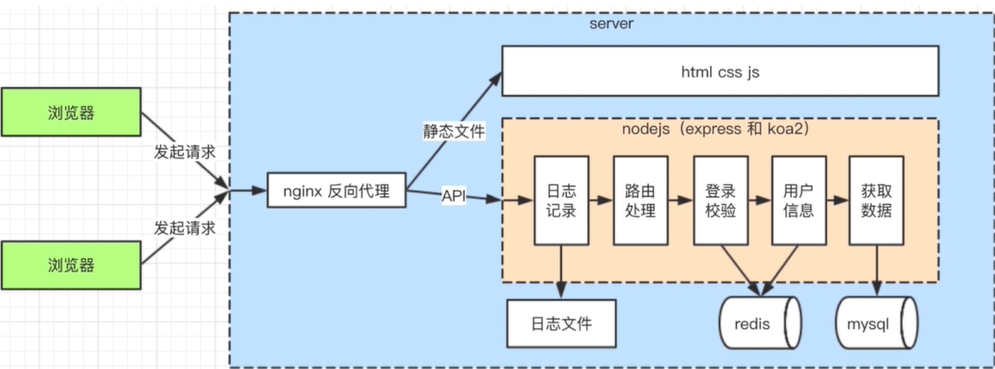

---

title: node基础
date: 2021-03-04 18:07:41
categories: 前端
tags:
- node
---

### 1.node是什么？

- 和浏览器一样，都是js的运行环境。基于V8引擎。
- 优势：I/O操作非阻塞的原生功能；运行与单进程中，无需为每个请求创建新的线程。

**服务端开发和前端开发区别**

1. 服务稳定性
   - PM2进程守护
2. 考虑内存和cpu
   - 使用stream写日志，使用redis存session
3. 日志记录
   - 前端日志的发起方，不关心后续；
   - server端要记录日志，存储，分析
4. 安全
   - 比如，越权操作，数据库攻击
   - 登录验证，预防XSS，和sql注入
5. 集群和服务拆分
   - 承担大流量

<!--more-->

### 2.模块导入导出

- 使用commonJS模块导出方式

```js
//导入
const model = require("route");
//导出  以module.exports为准
exports.modelName = modelName;
Module.exports = {};
```

### 3.事件触发器

- 使用events模块，该模块公开`on`, `emit` 分别用于触发事件，添加回调函数。

```js
const EventEmitter = require("events");
const eventEmitter = new EventEmitter();
eventEmitter.on("sum", (a, b)=>{
  console.log(`和为：${a+b}`);
})
eventEmitter.emit("sum", 1, 9);
```

[其他事件api]: http://nodejs.cn/api/events.html

### 4.HTTP服务器

- 域名映射ip：localhost（127.0.0.1）

**创建web服务器**

```js
//1.引用系统模块
const http = require('https');
//2.创建web服务器
const app = http.createServer((req, res) => {
  res.statusCode = 200
  res.setHeader('Content-Type', 'text/plain')
  res.end('你好世界\n')
})
//3.监听3000端口
app.listen(3000, () => {
  console.log(`服务器运行在 http://${hostname}:${port}/`)
});
```


