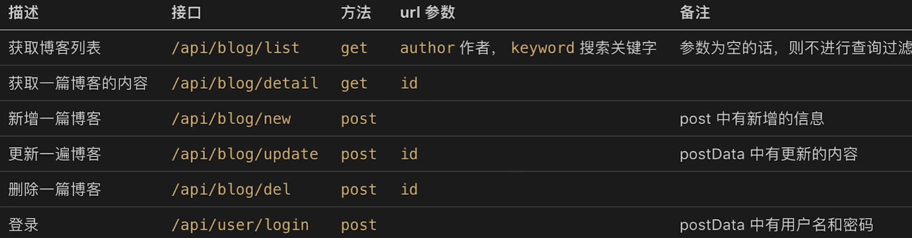
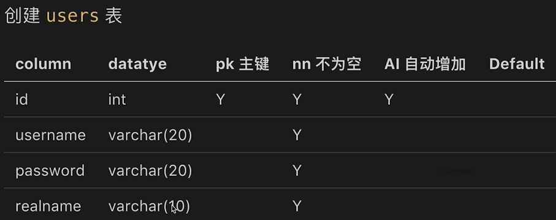
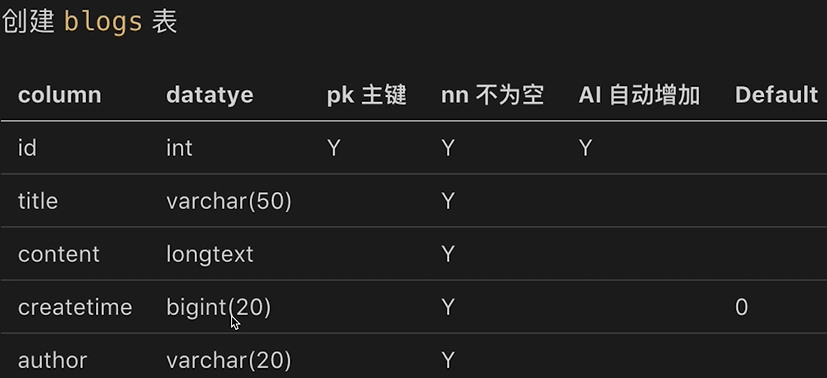

写在前面：本文学习server端开发思想。

#### **服务端开发和前端开发区别**

1. 服务稳定性
   - PM2进程守护
2. 考虑内存和cpu
   - 使用stream写日志，使用redis存session
3. 日志记录
   - 前端日志的发起方，不关心后续；
   - server端要记录日志，存储，分析
4. 安全
   - 比如，越权操作，数据库攻击
   - 登录验证，预防XSS，和sql注入
5. 集群和服务拆分
   - 承担大流量

<!--more-->

### 一，原生node开发

#### 接口设计

- 首先了解一下http模块


```js
//1.引入http模块
//2.利用createServer()新建http服务
//3.监听端口
const http = require("http");
const serverHandle = require("../app");
const PORT = 8000;

const server = http.createServer(serverHandle);

server.listen(PORT, () => {
  console.log("ok");
});
```

>获取参数：
>
>1. `const method = req.method;`
>2. `const url = req.url;`
>3. `const path = url.split("?")[0];`
>4. `const query = querystring.parse(url.split("?")[1]);` 引入`querystring`模块解析参数，返回对象

- 项目搭建

>1. 添加nodemon模块，帮助我们更新，重启程序。
>2. cross-env模块，判断dev环境或pro环境 `env: process.env.NODE_ENV,`

- 项目分层设计

>1. `bin/index.js`：负责`createServer`逻辑
>2. `app.js`:关于http的基本设置`serverHeader`(设置返回格式JSON，解析url，解析cookie，解析session，设置user路由，未命中设置404)
>3. `router`:由第二层引用的路由API，返回正确的格式（分为blog和user）
>4. `controller`:处理管理数据，获取数据库数据，返回数据



#### 数据存储

- 建库  nodeServer
- 建表





> 相关操作

```sql
-- show databases;
-- use nodeserver;
-- select version();
-- 插入操作
-- insert into users (username, `password`, realname) values ('gbh', '1234', '郭炳辉');
-- insert into blogs (title, createtime,content,author) values ('标题B','1616476983615','内容B','许龄月')
-- 查询
-- select * from users;
-- select id, username from users;
-- select * from users where username='minyue' or `password`='1234';
-- select * from users where password like '%1%' order by id desc;
-- 更新
-- 保护机制
-- SET SQL_SAFE_UPDATES=0;
-- update users set realname='李沁' where username='gbh';
-- 删除
-- delete from users where username='gbh';
-- 软删除  增加一个state数据列，1表示数据存在，0表示数据删除
-- update users set state='0' where username='gbh';
-- select * from users where state='1';
```

- node操作mysql

```js
const mysql = require('mysql');

//创建连接对象
const con = mysql.createConnection({
  host:'localhost',
  user:'root',
  password:'123456',
  port:'3306',
  database:'nodeserver',
})
//连接
con.connect();
//设定操作
const sql = `insert into blogs (title, createtime,content,author) values ('标题B','1616476983615','内容B','许龄月'`;
con.query(sql, (err, result)=>{
  if(err) {
    console.error(err);
  }
  console.log(result);
})
//关闭连接
con.end();
```

#### 登录功能

1. cookie

   - 存储在浏览器的一段字符串（最大5kb）
   - 跨域不共享，浏览器给每一个域名都分配一个cookie
   - 格式（如：k1=v1；k2=v2）来存储结构化数据
   - 每次发送http请求，浏览器会将请求域的cookie一起发送给server
   - server可以修改cookie并返回浏览器
   - 浏览器可以通过js修改cookie（有限制）

2. 客户端查看cookie的方法
   - chrome调试工具中请求头会带有cookie；server端如果修改cookie会在响应头中带有set-cookie
   - Application->Storage中查看
   - document.cookie(可查看，可累加修改cookie)
3. 

- 客户端不能轻易，修改server端对cookie的设定。

- httpOnly是用来限制js修改cookie的（而不是浏览器，东西存在浏览器，别人想改也办法呀）


