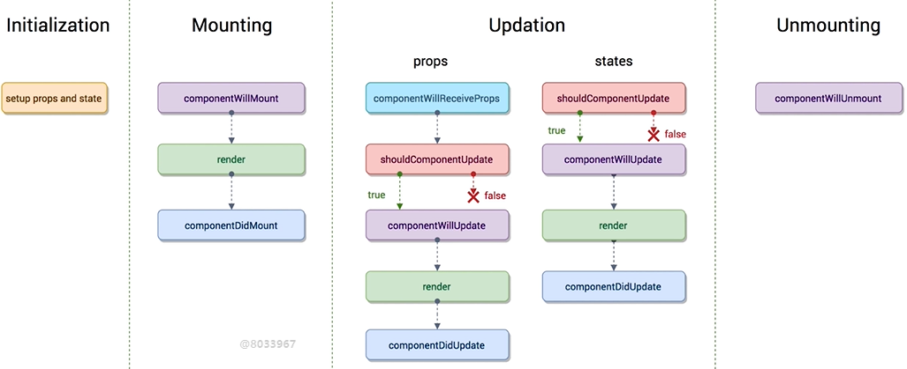
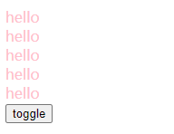
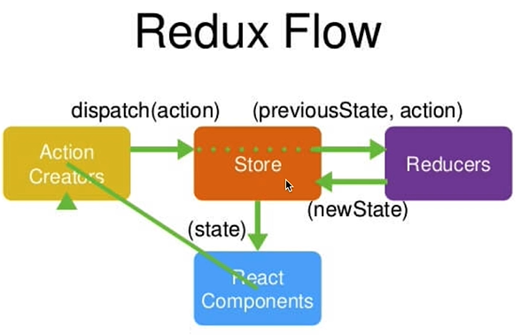
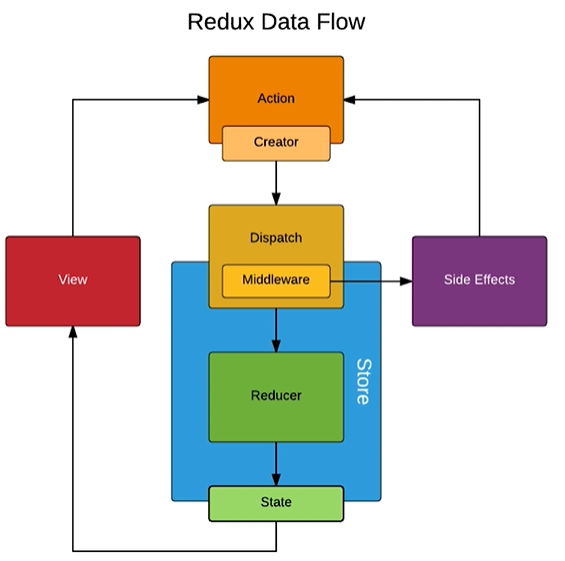

## 深入理解`create-react-app`

- 这是一个官方文档提供的新手使用的脚手架

<!--more-->

### 新建工程

```
npx create-react-app my-app
```

- 在目标文件夹下打开shell命令行工具，写入上述语句，就可以在当前目录下新建一个react工程文件

### 工程目录解析

- 新建工程目录如下



> 1. `package-lock.josn`:项目依赖的安装包版本号
>
> 2. `package.json`:node的包文件，可以让项目变为一个包,也安装了react，供`.js`文件引用
>
> 3. `gitignore`:不想传到git仓库的文件可以放在这里
>
> 4. src:
>
>    - index.js：程序的运行入口
>
>      ```
>      import React from 'react';
>      import ReactDOM from 'react-dom';
>      import './index.css';
>      import App from '.App';
>      //import reportWebVitals from './reportWebVitals';
>      //reportWebVitals();
>      //上面两个是一对用于PWA，增强web app功能
>      //还可以用相同的引入格式，引入其他文件
>      ```
>
>    - index.css：文件样式
>
>    - App.js: 
>
>      ```
>      improt './App.css';		//头部，等引入文件
>      ...
>      export default App;		//引出文件，提供给别的.js文件引用
>      ```
>
>    - App.test.js: 自动化测试文件（函数式编程）
>
> 5. public:
>
>    - index.html:
>    - favicon.ico
>    - manifest.json:定义快捷方式的图标（和pwa相配）
>
> 6. node_modules:第三方的包，

## 基础部分

### 定义组件

##### Component基类

```js
improt { Component } from 'react';
//等价于,下面两句语句
//import React from 'react';
//const Component = React.Component;
```

- 定义组件需要继承React.Component

```
import React from "react";
class App extends React.Component {
  render() {
    return <div>hello</div>;
  }
}
export default App;
```

##### 主文件下

1. 引用`import ReactDOM from 'react-dom';`

- ReactDOM用法

- 他是一个第三方组件，调用`render方法`将我们定义的组件挂载到html页面中

```
ReactDOM.render(<App />, document.getElementById("root"));
```

2. 引入`import React from 'react';`

- React中包含`JSX`语法

  > `<App />`：标签式语法
  >
  > `render(){}`: 函数中的标签也是JSX语法

##### 补充：简单jsx语法

1. 支持.js文件中写类似H5的标签语法

   > - 大写字母开头，一般都是JSX语法定义的自定义组件
   > - 小写字母开头，一般是H5标签

2. jsx语法规定：外层必须要有一个div包裹内部的平级标签

   > 当然可以引入react中的`Fragment` 来代替外层div标签
   >
   > ```
   > import React, { Component, Fragment } from 'react';
   > //render return内部就可以
   > <Fragment>
   > 	....
   > </Fragment>
   > ```

### TodoList

1. 如何实现组件化开发？

2. 如何实现向子组件传递参数？

3. 如何反馈父组件/调用父组件的函数？

4. 如何理清函数的this指向问题？

   > - 箭头函数this指向，箭头函数定义的作用于下
   > - 不同函数的this指向，函数由那个对象调用

5. 如何解决map，list中key的添加？

6. react中特殊属性？

   >1. label标签中`for id`的使用区别
   >   - 由于for关键词的冲突，改用`htmlFor="..."`
   >   - 对应input标签，仍然是`id="...."`
   >2. 防止转义的属性
   >   - `dangerouslySetInnerHTML={{__html: item}}`
   >   - item内容中的html标签内容非自动转义

7. 如何优化代码结构？

   >- 结构化赋值`{content}=this.props`等价于`{this.props.content}`
   >- 样式文件引入放在后面
   >- 组件初始化的时候就将函数`this` 指向改好
   >- JSX体积过大，尽量拆分代码，用函数替换
   >- `this.setState` 改变状态时，使用`prevState`代替`this.state`;使用箭头函数的写法（加括号，简写return；不加括号写函数体）
   >- 使用列表时，注意key值（唯一性），（放在最外层）

### react的思考

1. 声明式开发
2. 可以和其他框架并存
3. 组件化
4. 单向数据流
5. 视图层框架
6. 函数式编程

## 高级部分

### PropTypes与DefaultProps

- 做组件接受属性时的强校验

1. 引入PropTypes

   ```
   import PropTypes from 'prop-types'
   ```

2. 对属性进行强校验

   ```
   //PropTypes可以限制传值的类型
   //限制对象中没有对应属性时，就不会校验也不会报错
   TodoItem.propTypes = {
   	content: PropTypes.string,
   	deleteItem: PropTypes.func,
   	index: PropTypes.number
   }
   ```

3. 强制传值

   ```
   // isRequired强制传值，如果没有就会报错
   test: PropTypes.string.isRequired,
   ```

4. 默认值

   ```
   // defalultProps 设置传值属性的默认值
   TodoItem.defaultProps = {
   	test: 'hello world',
   }
   ```

- 其他用法

1. PropTypes/.oneOfType([ ])

   ```
   //一个对象可以是几种类型中的任意一种
   optionalUnion: PropTypes.oneOfType([
   	PropsTypes.string,
   	PropsTypes.number,
   	PropsTypes.instanceof(Message),
   ])
   ```

2. PropTypes.element

   ```
   // 确保传递给组件的children只包含一个元素
   MyComponent.propTypes = {
     children: PropTypes.element.isRequired
   };
   ```

3. PropTypes.arrayOf(PropTypes.number)

   ```
   // 指定一个数组由某种类型的元素组成
   optionalArrayOf: PropTypes.arrayOf(PropTypes.number),
   ```

### props,state,render之间的关系

- 当组件state和props发生变化时，render函数就会被重新执行
- 当父组件的render函数被执行时，子组件的render也会被重新执行

### 虚拟DOM

- 一般的生成修改DOM的流程

  >1. state数据
  >2. JSX模板
  >3. 数据 + 模板 生成真实的DOM，并显示出来
  >4. state发生变化
  >5. 数据 + 模板 生成新的DOM替换原始的DOM

缺陷：生成了两次DOM，替换了一次DOM十分耗性能

- 改进方案

  >1. state数据
  >2. JSX模板
  >3. 数据 + 模板 生成真实的DOM，并显示出来
  >4. state发生变化
  >5. 数据 + 模板 生成新的DOM，不直接替换，而是和原始的比对，找差异
  >6. 找到对应的差异部分，用新的DOM差异部分替换

缺点：性能提升不明显

- **虚拟DOM**

  >1. state数据
  >
  >2. JSX模板
  >
  >3. 生成虚拟DOM（虚拟DOM就是一个**JS对象**）
  >
  >4. 数据 + 模板 生成真实的DOM，并显示出来
  >
  >   eg:`['div', {id: 'abc'}, ['span', {}, 'hello world']]`
  >
  >5. state发生改变
  >
  >6. 数据 + 模板 生成新的虚拟DOM（**极大性能的 提升**）
  >
  >   eg:`['div', {id: 'abc'}, ['span', {}, 'hello minyue']]`
  >
  >7. 比较原始虚拟DOM和新生成的虚拟DOM，找到区别（**极大提升性能**）
  >
  >8. 直接操作DOM,改变对应不同点

- **JSX代码转换为真实DOM的历程**

```
JSX -> createElement -> 虚拟DOM（JS对象） -> 渲染为真实DOM

// 下面两种写法等价
return <div> {index} </div>

return React.createElement('div', {}, 'index');
```

- **虚拟DOM的优点**

  >1. 性能提升了
  >2. 跨段应用得以实现，React Native（虚拟DOM可以被转换为原生的组件，在移动端使用）

- 虚拟DOM是如何比对的呢---**diff算法**

  >1. 从头开始，同级比对
  >   - 如果某一级的内容出现差异，就直接替换下面所有内容
  >2. key值的重要性
  >   - 虚拟DOM比对时，对列表数据就可以只比较数据的 key值是否对应相等，提升比对性能
  >3. 补充
  >   - setState方法的异步设定的意义也在于，减少虚拟DOM比对的频繁性，提升性能

### ref使用

在input组件中`onChange` 属性调用的`handleInputChange(e)`输入参数使用`e.target` 就能获取对应inputDOM元素

- 在react中是怎么获取DOM元素的呢？

没错就是使用`ref` 

```
// 在input框架中添加属性ref
ref={(input) => {this.input = input}
// 之后我们就可以在handleInputChange函数中
this.input.value	//代替原来的e.target
```

- **使用注意点**

在ref使用时会和setState函数产生矛盾，因为setState函数是异步的，所以就有可能获取到的DOM元素是状态还没有改变前的内容，那么有什么解决办法呢？

```
// 使用异步函数setState的回调函数，来获取DOM
// 回调函数中，确保setState已经执行
this.setState((prevState) => ({
	list: [...prevState, prevState.inputValue],
	inputValue: ''
}), () => {
	console.log(this.ul.querySelectorAll('div').length);
})
```

- 当然，React面向数据的操作，建议我们少直接操作DOM！！

### 生命周期函数

- 生命周期函数是指，某一时刻组件会自动调用执行的函数

  > render  当数据发生变化时，会自动执行
  >
  > constructor 初始化时自动执行的函数
  >



**分模块解释**

>1. Initialization 初始化
>  - constructor中的props和state
>2. Mounting 挂载
>  - componentWillMount 
>  - render 页面第一次挂载
>  - componentDidMount
>3. Updation 更新
>  - props
>    - componentWillReceiveProps（对子组件有用）
>      1. 子组件接受父组件的props 
>      2. 组件非第一次存在父组件，才会执行
>    - shouldComponentUpdate（是否更新）
>      1. 需要返回一个布尔值
>      2. true才会执行后面的步骤
>    - componentWillUpdate（编译前执行）
>    - render
>    - componentDidUpdate（编译后执行）
>  - states  没有第一步
>
>- 每一个组件都有自己的生命周期函数！！

### 生命周期函数使用场景

- render不可缺少
  - 由于组件都是继承于`Component` ，其中都内置了其余的生命周期函数，但唯一没有`render`


#### 提升性能

> 之前我们需要的提升性能的点：
>
> 1. 函数作用域绑定在constructor中完成
> 2. 列表key值的绑定，diff算法
> 3. setState异步函数

- **shouldComponentUpdate使用**

  - 我们都知道，父组件render函数改变时，会连带子组件的render函数也重新渲染，但是当我们没有提交改变内容时，我们不需要子组件渲染，如何解决？
  - 使用这个生命周期函数，停止渲染

  ```
  shouldComponentUpdate(nextProps, nextState) {
  	if(nextProps.content !== this.props.content) {
  		return true;
  	} else {
  		return false;
  	}
  }
  ```


#### 发送ajax请求

>在网页不重载的情况下，改变网页内容，ajax请求只用一次，获取到数据留用就行了，所以找一个有且执行一次的生命周期函数
>
>- componentWillMount，constructor等有些些不便的原因（其他端产生冲突）

1. 首先，在react中发送ajax请求需要安装第三方插件

```
npm install axios
//安装之后重新打开项目
npm start
```

2. 在页面中引入axios组件

```
import axios from "axios";
```

3. **componentDidMount()**中添加请求

```
componentDidMount() {
	axios.get('/api/todolist')
		.then(()=>alert('success'))
		.catch(()=>alert('error'));
}
```

- 显然没有这个接口，返回弹窗error，在network中可以看到确实发送了请求，返回`404`

### 使用fiddler实现本地数据mock

- 前后端分离的开发，让前端人员要自己模拟后端数据，这里我们使用fiddler工具

>- 新建一个.json文件，放入数据
>- 刷新react项目页面，可以找到请求的链接
>
>- 双击该请求，在右方详情页中选择AutoResponder,然后勾选前两个复选框Enable rules和Unmatched requests passthrough,点击Add Rule，在Rule Editor的第二个input框中复制本地文件链接，点击save，勾选下方的If request中新建的rule

```
//简单的使用：将数据默认显示在list中
componentDidMount() {
	axios
		.get("/api/todolist")
		.then((res)=>{
			this.setState(()=>({list:[...res.list]}));
		})
		.catch(()=>alert("error"));
}
```

  

### React实现CSS过渡效果

- 这里过渡效果以交替呈现的示例就引入`.css` 文件

  > 写入两个类一个描述透明度`.show,`一个描述`.hide`
  >
  > ```css
  > .show {
  >   opacity: 1;
  >   transition: all 1s ease-in;
  > }
  > .hide {
  >   opacity: 0;
  >   transition: all 1s ease-in;
  > }
  > ```

- 在`js`文件中

  >1. state中创建一个布尔变量属性
  >2. 按钮，对state的布尔值改变
  >3. 对应className就根据state变量改变样式类

### React使用CSS动画效果

- 动画效果就是引入动画模块`@keyframes`，`animation`属性
- **值得注意的地方**：加上`forwards`(保留最后一帧动画效果)

```css
.show {
  animation: show-item 2s ease-in forwards;
}
.hide {
  animation: hide-item 2s ease-in forwards;
}

//show-item 同下
//....
@keyframes hide-item {
  0% {
    opacity: 1;
    color: blue;
  }
  50% {
    opacity: 0.5;
    color: yellow;
  }
  100% {
    opacity: 0;
    color: pink;
  }
}
```

### 使用React-transition-group

- 进入github，搜索<a href="https://reactcommunity.org/react-transition-group/">React-transition-group</a>

1. 安装这个模块

   ```
   npm install react-transition-group --save
   ```

2. 引入这个模块

   ```
   import { CSSTransition } from 'react-transition-group';
   ```

3. 使用`<CSSTransition> </CSSTransition>`包裹需要样式的"html元素"

   - 他帮助我们完成样式的更改添加

   - 注意他的属性！！！

     >-  in={this.state.show}: 动画执行的标志
     >-  timeout={1000}：动画执行时长
     >- classNames="fade"：类名前缀
     >- unmountOnExit：exit后动画元素删除
     >- appear={true}： 首次渲染时也添加动画

   ```
   <CSSTransition
   	in={this.state.show}
   	timeout={1000}
     classNames="fade"
     unmountOnExit
     appear={true}
   	>
   	<div>hello</div>
   </CSSTransition>
   ```
   
```css
   //对应CSS文件
   //存在enter和exit就可以了
   //如果appear={true}，就加上.fade-appear等类
   .fade-enter,
   .fade-appear {
     opacity: 0;
   }
   .fade-enter-active,
   .fade-appear-active {
     opacity: 1;
     transition: opacity 1s ease-in;
   }
   .fade-enter-done,
   .fade-appear-done {
     opacity: 1;
   }
   .fade-exit {
     opacity: 1;
   }
   .fade-exit-active {
     opacity: 0;
     transition: opacity 1s ease-in;
   }
   .fade-exit-done {
     opacity: 0;
   }
```

- 另外，一些**钩子函数**
  
  >**也是添加在属性中**
     >
     >钩子：和生命周期函数一样的，特定时间发生！！
     >
     >1. onEnter
     >   - 进入的第一时刻
     >2. onEntering
     >   - 进入的动画时间
     >3. onEntered
     >   - 进入结束时
     >
     >```
     >//进入结束后出发的函数
     >onEntered={(er)=>{el.style.color='blue'}}
     >```
     >
     >- 同样对于exit
  
4. **TransitionGroup**

- 对于一组一组的添加动画效果时，需要配合`TransitionGroup` 使用

  >- 下面以点击按钮，添加item的一组效果
  >
  >1. 这里就要把show改为list
  >2. 点击按钮，函数操作改为在原有list末尾添加一个元素
  >3. 样式部分`<TransitionGroup>`放在list遍历外部，`<CSSTransition>`放在对应小组件的外层

 

## Redux入门

- 和react配套使用的数据层框架
- 使用redux，我们将数据都存放在Store中，当一个组件改变了Stroe中的数据，其他组件就会自动感知数据的变化做出反应

### Redux工作流



- 举例把这个流程理解成图书馆的流程

1. react component：借书的人
2. action creaters：询问管理员要借哪一本书
3. store：图书管理员
4. reducers：图书管理员的记录资料

### Antd页面布局

- <a href="https://ant.design/components/overview-cn/">官网地址</a>

1. 安装

   ```
   //使用npm
   $ npm install antd --save
   ```

2. 简单使用

   >- 引用样式和你所需要的组件
   >
   >  ```js
   > import "antd/dist/antd.css";
   > import { Input, Button, List } from "antd";
   >  ```
   >
   >- 根据文档中的使用代码方法使用就可以了

### redux中的store

1. 安装redux核心库

```
npm install redux
```

2. 在项目src目录下创建store文件夹

   - index.js(存储仓库，图书管理员)

   ```
   //引入创建库的函数
   //引入reducer
   
   import { createStore } from 'redux';
   import reducer from './reducer';
   
   const store = createStore(reducer);
   export default store;
   ```

   - reducter.js(图书记录本)

   ```
   //返回一个函数
   //state:图书馆书籍信息,有一个默认值
   //action:一个个借书操作
   
   const defaultState = {
   	inputValue = '',
   	list: []
   }
   export default (state = defaultState, action) = {
   	return state;
   }
   ```

3. 在容器组件中引入store

   ```
   //文件目录下的index.js文件可以默认不写
   
   import store from './store';
   ```

4. 引用数据 `getStore()`

   ```
   //返回一个存有数据的对象
   
   this.state = store.getStore()
   ```

5. 发送action `store.dispatch(action)`

   ```
   //写一个实例函数
   
   handleInputChange(e) {
   	const action = {
   		type: 'change_input_value',
   		value: e.target.value,
   	}
   	store.dispatch(action)
   }
   ```

6. reducer处理程序

   ```
   //reducer的函数中处理对应的action
   //reducer需要深拷贝state
   //store中的数据，由返回的newState在index.js
   中替换旧state时，才被修改
   if(action === 'change_input_value') {
   	const newState = JSON.parse(JSON.stringify(state));
   	newState.inputValue = action.value;
   	return newState;
   }
   ```

7. 容器组件中同步store数据的修改

   ```
   //constructor中监视store的改变
   store.subscribe(this.handleStore);
   
   //函数功能：替换state
   handleStore() {
   	this.setState(store.getStore());
   }
   ```

- **其他功能类似**

### 代码优化

1. **actionTypes.js**

   - 集中管理各个action名称（避免书写错误带来的麻烦）

   ```
   //store目录下新建一个actionTpes.js
   
   export const CHANGE_INPUT_VALUE = 'change_input_value'
   .....
   
   //使用时，引入
   import { CHANGE_INPUT_VALUE } from 'src'
   ```

2. **actionCreater.js**

   - 集中管理action

   ```react
   //对每一个action对象，都进行这样的封装，返回一个对象
   export const getInputChangeAction = (value) => ({
   	type: CHANGE_INPUT_VALUE,
   	value
   });
   
   //使用时
   
   import { getInputChangeAction } from 'src';
   
   handleInputChange(e) {
   	const action = getInputChangeAction(e.target.value);
   	store.dispatch(action);
   }
   ```

### redux总结

1. store是惟一的，也只有index.js中才能改变store中的数据

2. reducer是一个纯函数，（给定输入，一定有固定输出，而且不会产生副作用）

3. 核心API

   | API             | 作用              |
   | --------------- | ----------------- |
   | createStore     | index.js创建仓库  |
   | store.dispatch  | 传递action        |
   | store.getState  | 获取store数据对象 |
   | store.subscribe | 捕捉store改变     |

## Redux进阶

### UI组件/容器组件/无状态组件

- 一个负责逻辑，一个负责渲染
- 无状态组件就是函数组件，性能更好

>将渲染部分（render函数内部）独立出来一个分支
>
>**TodoListUI.js**

```react
//引入样式文件和react文件
import { Input, Button, List } from "antd";
import React from "react";

//仅仅只负责渲染我们可以使用无状态组件（无需创建类）
//箭头函数输入props，就使用props代替this.props
const TodoListUI = (props) => {
	return (
		.....//JSX语法	
	);
};

//对应render函数
render() {
	return(
		<TodoListUI
       inputValue={this.state.inputValue}
       list={this.state.list}
       handleInputChange={this.handleInputChange}
       handleClickBtn={this.handleClickBtn}
       handleDeleteItem={this.handleDeleteItem}
     />
	);
}
```

### redux-thunk 中间件实现ajax请求

- 之前我们使用ajax请求，是将代码放在componentDidMount函数中
- 但是当异步操作变多时，函数中的代码就会变得多到难以调试

>我们引入这个中间件来时我们

1. 首先下载这个中间件包

   ```
   npm install redux-thunk;
   ```

2. 解决和redux并行使用的问题

   ```react
   //在github中 redux-devtools文档中
   //引入thunk包，compose等api
   //
   
   import { createStore, applyMiddleware, compose } from "redux";
   import thunk from "redux-thunk";
   
   const composeEnhancers = window.__REDUX_DEVTOOLS_EXTENSION_COMPOSE__
     ? window.__REDUX_DEVTOOLS_EXTENSION_COMPOSE__({})
     : compose;
   const enhancer = composeEnhancers(applyMiddleware(thunk));
   
   const store = createStore(reducer, enhancer);
   export default store;
   ```

3. actionCreater中实现异步函数调用

   ```react
   //返回的getTodoList()是一个函数
   //并且这个函数接受了前面传来的dispatch
   
   export const initListAction = (data) => ({
     type: INIT_LIST_ACTION,
     data,
   });
   export const getTodoList = () => {
     return (dispatch) => {
       axios.get("/api/todolist").then((res) => {
         const data = res.data;
         const action = initListAction(data);
         dispatch(action);
       });
     };
   };
   ```

4. componentDidMount

   ````react
   //因为有redux-thunk存在，action可以是一个函数
   //在第5句中自动执行该函数（并且引入dispatch参数）
   
   componentDidMount() {
     const action = getTodoList();
     store.dispatch(action);
   }
   ````

### redux-saga中间件异步操作

1. 安装

   ```
   $ npm install redux-saga
   ```

2. store目录下新建一个`sagas.js`

   ```
   function* mySaga() {
     //...
   }
   export default mySaga;
   ```

3. index.js文件中引入中间件

   ```react
   //和thunk很像，仿照官方文档
   
   import { createStore, applyMiddleware, compose } from "redux";
   import reducer from "./reducer";
   import createSagaMiddleware from "redux-saga";
   import mySaga from "./sagas";
   
   // create the saga middleware
   const sagaMiddleware = createSagaMiddleware();
   
   const composeEnhancers = window.__REDUX_DEVTOOLS_EXTENSION_COMPOSE__
     ? window.__REDUX_DEVTOOLS_EXTENSION_COMPOSE__({})
     : compose;
   const enhancer = composeEnhancers(applyMiddleware(sagaMiddleware));
   
   const store = createStore(reducer, enhancer);
   sagaMiddleware.run(mySaga);
   
   export default store;
   ```

4. componentDidMount

   ````react
   //和原生用法类似
   const action = getInitList();
   store.dispatch(action);
   ````

5. actionCreater

   ```react
   //创建对应的action对象
   //但注意这个action的处理程序不在reducer，而在sagas.js中
   
   export const getInitList = () => ({
     type: GET_INIT_LIST,
   });
   ```

6. sagas.js文件

   ```react
   // 参照官方文档
   
   import { takeEvery, put } from "redux-saga/effects";
   import { GET_INIT_LIST } from "./actionType";
   import axios from "axios";
   import { initListAction } from "./actionCreater";
   function* getInitList() {
     try {
       const res = yield axios.get("/api/todolist");
       const action = initListAction(res.data);
       yield put(action);
     } catch (e) {
       console.log("404");
     }
   }
   //generator函数 书写形式
   //takeEvery可以捕获每一次的action类型
   //下面函数功能：一旦接受到GET_INIT_LIST类型的action时
   //就会执行fetchUser方法
   function* mySaga() {
     yield takeEvery(GET_INIT_LIST, getInitList);
   }
   
   export default mySaga;
   ```

- 将异步处理程序迁移到`sagas.js`文件中处理

### redux中间件

- 在action和store中间，对store的dispatch方法的升级
- thunk中间件，action可以是一个函数 并接收一个dispath函数，dispatch会让其异步执行；当然如果不是函数就按原逻辑执行
- redux-log：对dispatch每次派发的时候进行console.log()，即打印日志
- redux-saga：单独对异步逻辑拆分出来放在一个文件管理

 

>**流程分析**
>
>1. thunk 中间件
>
>   >dispatch一个action
>   >action可以是一个函数 并接收一个dispath函数
>   >可以在action的函数中进行异步操作
>   >接受到数据后再dispatch一个action 此action必须是一个对象包含type和数据
>   >reducer拦截到action的type和数据返回新的state
>
>2. saga 中间件
>
>   >dispatch一个action
>   >action只能是对象 并且type必须是reducer没有的
>   >sagas.js拦截此type并执行另一个函数进行异步操作
>   >接受到数据后再dispatch一个action 并且type必须是reducer存在的
>   >reducer拦截到action的type和数据返回新的state
>
>3. 原生
>
>   >在componentDidMount生命周期函数里 执行异步操作 接受到数据后dispatch一个action
>   >此action必须是一个对象包含type和数据
>   >reducer拦截到action的type和数据返回新的state

### react-redux

1. 安装

   ```
   npm install react-redux
   ```

2. **Provider**

   - 第一个核心API

   ```
   // 在index.js中引入
   import { provider } from 'react-redux';
   import store from './store';
   ....
   
   //provider将自己有的属性提供给内部所有组件
   //将store引入内部的组件中
   //注意，jsx语法块用括号包裹
   const App = (
	<Provider store={store}>
   		<TodoList />
   	</Provider>
   )
   ReactDOM.render(App, document.getElementById("root"));
   ```
   
3. **connect**

   - 第二个核心API

   ```
   //TodoList.js实现连接关系
   // (1)数据获取的连接
   const mapStateToProps = (state) => {
   	return {
   		inputValue: state.inputValue,
   	}
   }
   // (2)改变数据方法的连接
   const mapDsipatchToProps = (dispatch) => {
   	return {
   		handleInputChange(e) {
   			const action = {
           type: "change_input_value",
           value: e.target.value,
         };
         dispatch(action);
   		}
   	}
   }
   
   export default connect(mapStateToProps, mapDsipatchToProps)(TodoList);
   ```

   - 这样不管是读，还是写都可以直接通过

     `this.props.inputValue`

     `this.props.handleInputChange`

     来调用

>我们可以发现 ，<TodoList>组件就是一个UI组件，connect函数引用了UI组件，加上对store的调用相当于返回了一个容器组件

4. 优化代码

   >1. actioncreater.js :
   >
   >   ```
   >   export const ....一个个函数
   >   ```
   >
   >2. actionTypes.js :
   >
   >   ```
   >   export const 宏定义赋值
   >   ```
   >
   >3. UI组件用函数组件（无状态组件代替）
   >
   >4. 结构化赋值
   >
   >   ```
   >   const {
   >     inputValue,
   >     handleInputChange,
   >     handleClickBtn,
   >     list,
   >     handleDeleteItem,
   >   } = props;
   >   ```


