## 前言

>鹅厂实习要用vue，害当初还考虑选框架react or vue？
>
>全都要 ！呜呜呜

<!--more-->

## 1.初识

#### 1.安装vue devtool

- 使用手动安装的方式

https://github.com/vuejs/vue-devtools#vue-devtools

#### 2.项目中引入vue

- 使用script标签引入   

  CDN     注意开发板本和生产版本

  ```
  
  ```

- 使用npm引入

- 使用构建工具CLI

https://cn.vuejs.org/v2/guide/installation.html#%E7%9B%B4%E6%8E%A5%E7%94%A8-lt-script-gt-%E5%BC%95%E5%85%A5

#### 3.数据和方法

初始化VUE对象时，**el**和**data**两个重要的[属性](https://cn.vuejs.org/v2/api/#%E5%AE%9E%E4%BE%8B-property)，还有一些相对应的实例方法（**watch**）

- data数据

  - 是一个对象，每一个属性就是挂载到对应el上的变量数据

  - data引用在定义的时候就确定了，浅地址不可变

- 方法

  - 也有一些实例方法，比如watch

#### 4.生命周期

在Vue实例被创建都会经过一系列初始化过程，数据监听，模板编译，将实例挂载到DOM并在数据变化时更新DOM。对应每一个阶段，vue封装了对应的钩子函数。

```js
new Vue({
  data: {
    a: 1
  },
  created: function () {
    // `this` 指向 vm 实例
    console.log('a is: ' + this.a)
  }
})
// => "a is: 1"
```

>- beforeCreate：实例初始化之后，数据观测和事件配置前被调用
>
>- created：实例创建完成后被调用，完成了数据观测，属性和方法的运算，事件回调；但$el不可用
>
>- beforeMount：在组件开始挂载前被调用（render函数首次被调用）
>
>- mounted：实例被挂载后调用，el被新创建的vm.$el替换。注意mounted不会保证所有子组件也都一起被挂载
>
>  如果希望等到整个视图都渲染，可以使用vm.$nextTick
>
>  ```js
>  mounted: function () {
>    this.$nextTick(function () {
>      // Code that will run only after the
>      // entire view has been rendered
>    })
>  }
>  ```
>
>- beforeUpdate：发生在虚拟DOM打补丁前，适合在更新前访问之前的DOM，比如clearTimeout()/clearInterval()
>
>- updated：DOM已经更新，可以执行关于新DOM 的操作，应该避免在这个期间更改状态，可以用计算属性或watch取代；同样不能保证所有子组件都更新，使用vm.$nextTick()
>
>- activated：被keep-alive缓存组件激活时使用
>
>- deactivated：被keep-alive缓存组件停用时使用
>
>- beforeDestroy：实例销毁前调用：实例依然可用
>
>- destroyed：实例销毁后调用，子实例也会被销毁
>
>- errorCaptured：捕获一个子孙组件错误时被调用，返回false阻止该错误继续向上传播`(err: Error, vm: Component, info: string) => ?boolean`

- 生命周期函数和回调中不要使用箭头函数（没有this）


## 2.模板语法

#### 1.插值

##### 文本（js表达式）

数据绑定最常见的就是双大括号语法

```html
<span>Message: {{ msg }}</span>
```

文本数据不会更新：使用v-once指令

```html
<span v-once>这个将不会改变: {{ msg }}</span>
```

>模板表达式都被放在沙盒中，只能访问[全局变量的一个白名单](https://github.com/vuejs/vue/blob/v2.6.10/src/core/instance/proxy.js#L9)，如 `Math` 和 `Date` 。你不应该在模板表达式中试图访问用户定义的全局变量。

##### 原始HTML

双大括号会将数据解释为不同文本，输出真正的HTML需要使用v-html指令

```html
<p>Using mustaches: {{ rawHtml }}</p>
<p>Using v-html directive: <span v-html="rawHtml"></span></p>
```

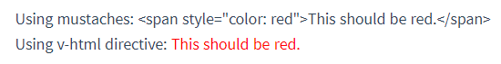

>xss攻击！小心使用

##### 属性

对于html的属性当然也不能使用双大括号来做数据绑定，我们要使用v-bind绑定指定属性和数据变量

```html
<div v-bind:id="dynamicId"></div>
```

对于boolean类型的attribute（他们只要存在就意味着true） ，当值为null，undefined，false时直接消失

```html
<button v-bind:disabled="isButtonDisabled">Button</button>
```

#### 2.指令

v-前缀的特殊attribute，当表达式的值变化时，响应式的作用于DOM

```html
<p v-if="seen">现在你看到我了</p>
```

##### 参数

就像上面html属性插值，响应式的更新html attribute

```html
<a v-bind:href="url">...</a>
```

```html
<a v-on:click="doSomething">...</a>
```

##### 动态参数

```html
<a v-bind:[attributeName]="url"> ... </a>
```

```html
<a v-on:[eventName]="doSomething"> ... </a>
```

- **约束**

动态参数预期会求出一个字符串，异常情况为null，这个特殊的null可以被显示的用于移除绑定。

动态参数表达式语法约束：空格和引号无效

```html
<!-- 这会触发一个编译警告 -->
<a v-bind:['foo' + bar]="value"> ... </a>
```

定义data时需要用小写而不是驼峰！！！

```html
<!--
在 DOM 中使用模板时这段代码会被转换为 `v-bind:[someattr]`。
除非在实例中有一个名为“someattr”的 property，否则代码不会工作。
-->
<a v-bind:[someAttr]="value"> ... </a>
```

##### 修饰符

对于一个指令应该以特殊方式绑定

```html
<form v-on:submit.prevent="onSubmit">...</form>
```

##### 缩写

- v-bind缩写

```html
<!-- 完整语法 -->
<a v-bind:href="url">...</a>

<!-- 缩写 -->
<a :href="url">...</a>

<!-- 动态参数的缩写 (2.6.0+) -->
<a :[key]="url"> ... </a>
```

- v-on缩写

```html
<!-- 完整语法 -->
<a v-on:click="doSomething">...</a>

<!-- 缩写 -->
<a @click="doSomething">...</a>

<!-- 动态参数的缩写 (2.6.0+) -->
<a @[event]="doSomething"> ... </a>
```

## 3.计算属性和侦听器

#### 计算属性

模板内表达式非常方便，但是模板中逻辑过重会使模板难以维护

例`{{ message.split('').reverse().join('') }}`

对于这个反转字符串的逻辑，如果要多次使用，这样表达非常麻烦，应当使用**计算属性**

**例子**

```html
<div id="example">
  <p>Original message: "{{ message }}"</p>
  <p>Computed reversed message: "{{ reversedMessage }}"</p>
</div>
```

```js
var vm = new Vue({
  el: '#example',
  data: {
    message: 'Hello'
  },
  computed: {
    // 计算属性的 getter
    reversedMessage: function () {
      // `this` 指向 vm 实例
      return this.message.split('').reverse().join('')
    }
  }
})
```

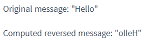 

- 在comuted中声明一个函数返回值为数据（声明了数据的getter()）
- 计算属性没有副作用，完全取决于this.message

##### 计算属性缓存vs方法

可以发现，计算属性好像可以用methods来模拟，有什么区别呢？

计算属性就像react hook的依赖一样，只有当依赖变化时才会执行，否则直接返回之前计算的结果！

```js
//下面这个计算属性不会更新
computed: {
  now: function () {
    return Date.now()
  }
}
```

##### 计算属性vs侦听属性

vue提供更通用的观察和响应vue实例上的数据变动：侦听属性，但是很容易滥用watch

**例子**

```html
<div id="demo">{{ fullName }}</div>
```

```js
var vm = new Vue({
  el: '#demo',
  data: {
    firstName: 'Foo',
    lastName: 'Bar',
    fullName: 'Foo Bar'
  },
  watch: {
    firstName: function (val) {
      this.fullName = val + ' ' + this.lastName
    },
    lastName: function (val) {
      this.fullName = this.firstName + ' ' + val
    }
  }
})
```

```js
var vm = new Vue({
  el: '#demo',
  data: {
    firstName: 'Foo',
    lastName: 'Bar'
  },
  computed: {
    fullName: function () {
      return this.firstName + ' ' + this.lastName
    }
  }
})
```

使用watch做变量监听在这个应用场景下显得多余。

##### 计算属性的setter

默认情况下计算属性只有getter，

```js
computed: {
  fullName: {
    // getter
    get: function () {
      return this.firstName + ' ' + this.lastName
    },
    // setter
    set: function (newValue) {
      var names = newValue.split(' ')
      this.firstName = names[0]
      this.lastName = names[names.length - 1]
    }
  }
}
```

在运行`vm.fullname="chengmin He"`setter会被调用并对`vm.firstName` 和 `vm.lastName`进行更新

#### 侦听器

当数据变化执行异步或开销较大操作时，使用watch

**例子：**question改变异步请求返回answer

```html
<div id="watch-example">
  <p>
    Ask a yes/no question:
    <input v-model="question">
  </p>
  <p>{{ answer }}</p>
</div>
```

> input框双向绑定

```html
<script src="https://cdn.jsdelivr.net/npm/axios@0.12.0/dist/axios.min.js"></script>
<script src="https://cdn.jsdelivr.net/npm/lodash@4.13.1/lodash.min.js"></script>
<script>
var watchExampleVM = new Vue({
  el: '#watch-example',
  data: {
    question: '',
    answer: 'I cannot give you an answer until you ask a question!'
  },
  watch: {
    // 如果 question 发生改变，这个函数就会运行    
    question: function (newQuestion, oldQuestion) {
      this.answer = 'Waiting for you to stop typing...'
      this.debouncedGetAnswer()
    }
  },
  created: function () {
    // `_.debounce` 是一个通过 Lodash 限制操作频率的函数。
    // 在这个例子中，我们希望限制访问 yesno.wtf/api 的频率
    // AJAX 请求直到用户输入完毕才会发出。想要了解更多关于
    // `_.debounce` 函数 (及其近亲 `_.throttle`) 的知识，
    // 请参考：https://lodash.com/docs#debounce
    this.debouncedGetAnswer = _.debounce(this.getAnswer, 500)
  },
  methods: {
    getAnswer: function () {
      if (this.question.indexOf('?') === -1) {
        this.answer = 'Questions usually contain a question mark. ;-)'
        return
      }
      this.answer = 'Thinking...'
      var vm = this
      axios.get('https://yesno.wtf/api')
        .then(function (response) {
          vm.answer = _.capitalize(response.data.answer)
        })
        .catch(function (error) {
          vm.answer = 'Error! Could not reach the API. ' + error
        })
    }
  }
})
</script>
```

> - 使用防抖：节省异步查询开销
>
> - 在created中绑定函数（这个时候可以使用data和methods的内容了）
> - 绑定函数和methods区别（methods中的方法只有被触发，比如当做回调函数时才能使用，自定义绑定函数调用灵活）

## 4.Class和Style绑定

#### 绑定HTML Class

##### 对象语法

给`v-bind:class=""`传入class对象

1. 显式对象

```html
<div
  class="static"
  v-bind:class="{ active: isActive, 'text-danger': hasError }"
></div>
```

```js
data: {
  isActive: true,
  hasError: false
}
```

最终被渲染为`<div class="static active"></div>`

2. 隐式对象

```HTML
<div v-bind:class="classObject"></div>
```

```js
data: {
  classObject: {
    active: true,
    'text-danger': false
  }
}
```

> 注意：使用 `-`或者空格等不能直接出现在js对象属性名的中

- 隐式对象可以是灵活的计算属性

```js
computed: {
	classObject: function() {
    return {
      active: this.isActive && !this.error,
      'text-danger': this.error && this.error.type === 'fatal'
    }
  }
}
```

> fatal是一种error类型：不可恢复

##### 数组语法

应用一个class列表

```html
<div v-bind:class="[activeClass, errorClass]"></div>
```

```js
data: {
  activeClass: 'active',
  errorClass: 'text-danger'
}
```

渲染为：`<div class="active text-danger"></div>`

- 如果需要条件切换渲染列表，使用三元表达式或对象语法

```html
<div v-bind:class="[isActive ? activeClass : '', errorClass]"></div>
```

```html
<div v-bind:class="[{ active: isActive }, errorClass]"></div>
```

##### 组件上

当一个自定义组件上使用class property时，这些class会被添加到根元素上。已存在的class不会被覆盖

```js
Vue.component('my-component', {
  template: '<p class="foo bar">Hi</p>'
})
```

```html
<my-component class="baz boo"></my-component>
```

渲染为：`<p class="foo bar baz boo">Hi</p>`

当然前面数据绑定形式的class也是一样的

#### 绑定内联样式

同样存在对象语法和数组语法

> 注意：对象语法中使用峰驼命名或者短横线连接（需要加引号）

```html
<div v-bind:style="{ color: activeColor, fontSize: fontSize + 'px' }
```

```js
data: {
  activeColor: 'red',
  fontSize: 30
}
```

通常直接绑定一个样式对象

```html
<div v-bind:style="styleObject"></div>
```

```js
data: {
  styleObject: {
    color: 'red',
    fontSize: '13px'
  }
}
```

同样也可以结合计算属性返回对象

##### 自动添加前缀：

vue会自动侦听并添加（比如：transform）

##### 多重值

2.3.0+可以对style绑定的属性提供多个值

```html
<div :style="{ display: ['-webkit-box', '-ms-flexbox', 'flex'] }"></div>
```

这样写只会渲染数组中最后一个被浏览器识别的值。上面如果支持flexbox，只会渲染`display:flex`

## 5.条件渲染

#### v-if

```html
<h1 v-if="awesome">Vue is awesome!</h1>
<h1 v-else>Oh no 😢</h1>
```

- 使用template

```html
<template v-if="ok">
  <h1>Title</h1>
  <p>Paragraph 1</p>
  <p>Paragraph 2</p>
</template>
```

- v-else：必须紧跟

- v-else-if：可以连续使用

```html
<div v-if="type === 'A'">
  A
</div>
<div v-else-if="type === 'B'">
  B
</div>
<div v-else-if="type === 'C'">
  C
</div>
<div v-else>
  Not A/B/C
</div>
```

##### key可以管理复用元素

**例子**：用户在不同登录方式切换

```html
<template v-if="loginType === 'username'">
  <label>Username</label>
  <input placeholder="Enter your username">
</template>
<template v-else>
  <label>Email</label>
  <input placeholder="Enter your email address">
</template>
```

上面代码中替换的只是他们的`placeholder`，不会清除用户已输入内容

当然可设置特定key值避免复用

```html
<template v-if="loginType === 'username'">
  <label>Username</label>
  <input placeholder="Enter your username" key="username-input">
</template>
<template v-else>
  <label>Email</label>
  <input placeholder="Enter your email address" key="email-input">
</template>
```

每次切换都会重新渲染，label元素还是会高效利用

#### v-show

- 不支持`<template>`,`v-else`
- 初始渲染开销大，只是简单基于CSS进行切换

## 6.列表渲染

#### v-for把一个数组对应为一组元素

v-for使用`item in items` 的语法

```html
<ul id="example-1">
  <li v-for="item in items" :key="item.message">
    {{ item.message }}
  </li>
</ul>
```

```js
var example1 = new Vue({
  el: '#example-1',
  data: {
    items: [
      { message: 'Foo' },
      { message: 'Bar' }
    ]
  }
})
```

- 其中不只item还可以获取对应index`(item, index) in items`

#### v-for中使用对象

用法类似，`(value, name, index) in object`对应值，键名，索引

>底层使用`Object.keys()`的结果遍历

#### 维护状态

##### 默认

vue使用v-for渲染列表，默认使用”就地更新“

如果数据项顺序改变，不会移动DOM匹配数据项顺序，而是更新每一个元素

只适用于**不依赖**子组件状态或临时DOM状态（表单输入）的列表渲染

##### key

跟踪每一个节点的身份--使用key

```html
<div v-for="item in items" v-bind:key="item.id">
  <!-- 内容 -->
</div>
```

尽量添加key值，并且不要使用对象数组等非基本类型作为key

> 主要用于vnodes的比较
>
> 不使用key会尽可能就地修改/复用相同类型元素
>
> 可以使用于强制替换元素而不是重复使用
>
> - 完整触发组件生命周期
> - **触发过渡**
>
> ```html
> <transition>
>   <span :key="text">{{ text }}</span>
> </transition>
> ```

#### 数组更新检测

##### 变更方法

vue将被侦听的数组的变更方法进行包裹，调用会触发视图更新

> push(),pop(),shift(),unshift(),splice(),sort(),reverse()

##### 替换数组

比如`filter(),concat(),slice()`用新数组替换旧数组

```js
example1.items = example1.items.filter(function (item) {
  return item.message.match(/Foo/)
})
```

vue会使DOM元素得到最大范围的重用，用一个含有相同元素的数组替换元素数组非常高效

**[注意](https://cn.vuejs.org/v2/guide/reactivity.html#%E6%A3%80%E6%B5%8B%E5%8F%98%E5%8C%96%E7%9A%84%E6%B3%A8%E6%84%8F%E4%BA%8B%E9%A1%B9)**

>改变对象的属性，而这个属性没有事先在data 中定义，不会被vue监听
>
>- 因为vue2通过Object.definedProperty来劫持data上的数据，对每个属性设置对应的setter/getter.
>
>对于数组而言，vue本身做了处理，性能角度放弃对数组每一项添加监听（使用**索引**修改，修改**长度**时）

```js
Vue.set(vm.items, indexOfItem, newValue);
vm.$set(vm.items, indexOfItem, newValue);
vm.items.splice(newLength);

vm.$set(vm.userProfile, 'age', 27);
vm.userProfile = Object.assign({}, vm.userProfile, {
  age: 27,
  favoriteColor: 'Vue Green'
})
```

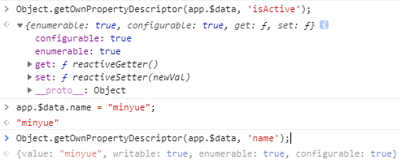 

- 当然vue3使用**proxy**代替Object.definedProperty，，，后面再聊~~

#### 显示过滤./排序后的结果

不改变元数据，可以创建一个计算属性

```html
<li v-for="n in evenNumbers">{{ n }}</li>
```

```js
data: {
  numbers: [ 1, 2, 3, 4, 5 ]
},
computed: {
  evenNumbers: function () {
    return this.numbers.filter(function (number) {
      return number % 2 === 0
    })
  }
}
```

- 在嵌套for循环时，使用methods代替

```html
<ul v-for="set in sets">
  <li v-for="n in even(set)">{{ n }}</li>
</ul>
```

```js
data: {
  sets: [[ 1, 2, 3, 4, 5 ], [6, 7, 8, 9, 10]]
},
methods: {
  even: function (numbers) {
    return numbers.filter(function (number) {
      return number % 2 === 0
    })
  }
}
```

#### 在v-for里面使用值范围

接受整数

```js
<div>
  <span v-for="n in 10">{{ n }} </span>
</div>
```

结果：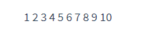

#### 在`<template>`上使用v-for

用来循环渲染一段包含多个元素的内容

```html
<ul>
  <template v-for="item in items">
    <li>{{ item.msg }}</li>
    <li class="divider" role="presentation"></li>
  </template>
</ul>
```

#### v-for同v-if

不推荐在同一元素上使用两者，前者优先级高

- 想要部分渲染时有用

```html
<li v-for="todo in todos" v-if="!todo.isComplete">
  {{ todo }}
</li>
```

- 有条件的跳出循环

可以把v-if放在外层元素或`<template>`上

```html
<ul v-if="todos.length">
  <li v-for="todo in todos">
    {{ todo }}
  </li>
</ul>
<p v-else>No todos left!</p>
```

#### 组件上使用v-for

必须加**key**

```html
<my-component v-for="item in items" :key="item.id"></my-component>
```

组件迭代数据需要使用prop手动传递，组件有自己独立的作用域

```html
<my-component
  v-for="(item, index) in items"
  v-bind:item="item"
  v-bind:index="index"
  v-bind:key="item.id"
></my-component>
```

提高组件复用性

**例子：实现简单的todolist**

```html
<div id="todo-list-example">
  <form v-on:submit.prevent="addNewTodo">
    <label for="new-todo">Add a todo</label>
    <input
      v-model="newTodoText"
      id="new-todo"
      placeholder="E.g. Feed the cat"
    >
    <button>Add</button>
  </form>
  <ul>
    <li
      is="todo-item"
      v-for="(todo, index) in todos"
      v-bind:key="todo.id"
      v-bind:title="todo.title"
      v-on:remove="todos.splice(index, 1)"
    ></li>
  </ul>
</div>
```

**注意**`is="todo-item"`:DOM模板解析要求ul中不应该存在自定义组件`<todo-item>`

```js
Vue.component('todo-item', {
  template: `
    <li>
    {{ title }}
    <button v-on:click="$emit('remove')">Remove</button>
    </li>
  `,
  props: ['title']
})

new Vue({
  el: '#todo-list-example',
  data: {
    newTodoText: '',
    todos: [
      {
        id: 1,
        title: 'Do the dishes',
      },
      {
        id: 2,
        title: 'Take out the trash',
      },
      {
        id: 3,
        title: 'Mow the lawn'
      }
    ],
    nextTodoId: 4
  },
  methods: {
    addNewTodo: function () {
      this.todos.push({
        id: this.nextTodoId++,
        title: this.newTodoText
      })
      this.newTodoText = ''
    }
  }
})
```

**注意：**

> 要把子组件放在父组件前面，不然首次解析不会识别`li`
>
> id设置为了保证全局唯一性，一直加一！！！

## 7事件处理

v-on监听DOM事件

**为什么在HTML中监听事件？**

> vue事件处理方法和表达式都严格绑定在当前视图的ViewModel上
>
> 使用 `v-on` 有几个好处：
>
> 1. 扫一眼 HTML 模板便能轻松定位在 JavaScript 代码里对应的方法。
> 2. 因为你无须在 JavaScript 里手动绑定事件，你的 ViewModel 代码可以是非常纯粹的逻辑，和 DOM 完全解耦，更易于测试。
> 3. 当一个 ViewModel 被销毁时，所有的事件处理器都会自动被删除。你无须担心如何清理它们。

#### 触发一些js代码

```html
<div id="example-1">
  <button v-on:click="counter += 1">Add 1</button>
  <p>The button above has been clicked {{ counter }} times.</p>
</div>
```

```js
var example1 = new Vue({
  el: '#example-1',
  data: {
    counter: 0
  }
})
```

#### 事件处理方法

事件处理逻辑复杂时

默认传入参数event（指向DOM原生事件）

```html
<div id="example-2">
  <!-- `greet` 是在下面定义的方法名 -->
  <button v-on:click="greet">Greet</button>
</div>
```

```js
var example2 = new Vue({
  el: '#example-2',
  data: {
    name: 'Vue.js'
  },
  // 在 `methods` 对象中定义方法
  methods: {
    greet: function (event) {
      // `this` 在方法里指向当前 Vue 实例
      alert('Hello ' + this.name + '!')
      // `event` 是原生 DOM 事件
      if (event) {
        alert(event.target.tagName)
      }
    }
  }
})


```

**注意**

>// 也可以用 JavaScript 直接调用方法
>example2.greet() // => 'Hello Vue.js!'

#### 内联js语句调用方法

除了直接绑定到一个方法，也可以在内联 JavaScript 语句中调用方法：

```html
<div id="example-3">
  <button v-on:click="say('hi')">Say hi</button>
  <button v-on:click="say('what')">Say what</button>
</div>
```

```js
new Vue({
  el: '#example-3',
  methods: {
    say: function (message) {
      alert(message)
    }
  }
})
```

**注意**

>内联方法需要使用到原生DOM（event）时
>
>用特殊变量$event传入方法

```html
<button v-on:click="warn('Form cannot be submitted yet.', $event)">
  Submit
</button>
```

```js
methods: {
  warn: function (message, event) {
    // 现在我们可以访问原生事件对象
    if (event) {
      event.preventDefault()
    }
    alert(message)
  }
}
```

#### 事件修饰符

事件处理程序中调用`event.preventDefault()` 或 `event.stopPropagation()` 是非常常见的需求。

**理念：**方法只有纯粹的数据逻辑，而不是去处理DOM事件细节

- `.stop`
- `.prevent`
- `.capture`
- `.self`
- `.once`
- `.passive`

```html
<!-- 阻止单击事件继续传播 -->
<a v-on:click.stop="doThis"></a>

<!-- 提交事件不再重载页面 -->
<form v-on:submit.prevent="onSubmit"></form>

<!-- 修饰符可以串联 -->
<a v-on:click.stop.prevent="doThat"></a>

<!-- 只有修饰符 -->
<form v-on:submit.prevent></form>

<!-- 添加事件监听器时使用事件捕获模式 -->
<!-- 即内部元素触发的事件先在此处理，然后才交由内部元素进行处理 -->
<div v-on:click.capture="doThis">...</div>

<!-- 只当在 event.target 是当前元素自身时触发处理函数 -->
<!-- 即事件不是从内部元素触发的 -->
<div v-on:click.self="doThat">...</div>

<!-- 点击事件将只会触发一次 -->
<!-- 不像其它只能对原生的 DOM 事件起作用的修饰符，.once 修饰符还能被用到自定义的组件事件上。 -->
<a v-on:click.once="doThis"></a>

<!-- 滚动事件的默认行为 (即滚动行为) 将会立即触发 -->
<!-- 而不会等待 `onScroll` 完成  -->
<!-- 这其中包含 `event.preventDefault()` 的情况 -->

<div v-on:scroll.passive="onScroll">...</div>
```

**注意**

>使用时顺序很重要
>
>- 用 `v-on:click.prevent.self` 会阻止**所有的点击**
>
>
>- 而 `v-on:click.self.prevent` 只会阻止对元素自身的点击
>
>  `.prevent`修饰符在前，修饰的是**元素的`v-on`事件**，所以它会阻止`所有的点击`，自身点击和事件冒泡；
>   `.prevent`修饰符在后，修饰的是**元素的`v-on`事件在被`.self`修饰后的事件**，所以它只能阻止`对元素自身的点击`，无法阻止事件冒泡。
>
>`.passive` 修饰符尤其能够提升移动端的性能。
>
>- 不要和`.prevent` 一起使用，因为 `.prevent` 将会被忽略， `.passive` 会告诉浏览器你不想阻止默认行为
>
>- passive=true等于提前告诉了浏览器，touchstart和touchmove不会阻止默认事件，手刚开始触摸，浏览器就可以立刻给与响应

#### 按键修饰符

在监听键盘事件时，需要检查详细的按键

```html
<!-- 只有在 `key` 是 `Enter` 时调用 `vm.submit()` -->
<input v-on:keyup.enter="submit">
```

html中使用短横线写法绑定

```html
<input v-on:keyup.page-down="onPageDown">
```

上面实例，处理函数只会在`$event.key` 等于 `PageDown` 时被调用。

##### 按键码

`keyCode` 的事件用法[已经被废弃了](https://developer.mozilla.org/en-US/docs/Web/API/KeyboardEvent/keyCode)并可能不会被最新的浏览器支持。

```html
<input v-on:keyup.13="submit">
```

vue提供常用的按键码别名

- `.enter`
- `.tab`
- `.delete` (捕获“删除”和“退格”键)
- `.esc`
- `.space`
- `.up`
- `.down`
- `.left`
- `.right`

可以全局 `config.keyCodes` 对象[自定义按键修饰符别名](https://cn.vuejs.org/v2/api/#keyCodes)：

```js
// 可以使用 `v-on:keyup.f1`
Vue.config.keyCodes.f1 = 112
```

#### 系统修饰符

- `.ctrl`
- `.alt`
- `.shift`
- `.meta`

>meta:Mac上对应command键；windows对应win键

```html
<!-- Alt + C -->
<input v-on:keyup.alt.67="clear">

<!-- Ctrl + Click -->
<div v-on:click.ctrl="doSomething">Do something</div>
```

**注意：**鼠标事件和键盘事件顺序

##### `.exact` 修饰符

精确的系统修饰符组合触发

```html
<!-- 即使 Alt 或 Shift 被一同按下时也会触发 -->
<button v-on:click.ctrl="onClick">A</button>

<!-- 有且只有 Ctrl 被按下的时候才触发 -->
<button v-on:click.ctrl.exact="onCtrlClick">A</button>

<!-- 没有任何系统修饰符被按下的时候才触发 -->
<button v-on:click.exact="onClick">A</button>
```

##### 鼠标修饰符

- `.left`
- `.right`
- `.middle`

这些修饰符会限制处理函数仅响应特定的鼠标按钮。

## 8表单输入绑定

#### 基本使用

v-model在 `<input>`、`<textarea>` 及 `<select>` 元素上创建双向数据绑定

本质就是一个语法糖：负责监听用户的输入事件以更新数据

**注意**

> `v-model` 会忽略所有表单元素的 `value`、`checked`、`selected` attribute 的初始值而总是将 Vue 实例的数据作为数据来源。你应该通过 JavaScript 在组件的 `data` 选项中声明初始值。

v-model对不同输入元素使用不同的property并抛出不同的事件

- text和textarea使用`value` 和`input`事件
- checkbox和radio使用`checked` 和 `change`事件
- select 将 `value` 作为prop并将`change`作为事件

**注意**

>对于需要使用[输入法](https://zh.wikipedia.org/wiki/输入法) (如中文、日文、韩文等) 的语言，你会发现 `v-model` 不会在输入法组合文字过程中得到更新。如果你也想处理这个过程，请使用 `input` 事件。

```html
<div id="app">
  <input
    v-model="message"
    placeholder="edit me"
    @input="setValue($event.target)"
    />
  <p>Message is: {{ message }}</p>
</div>
```

```js
new Vue({
  el: "#app",
  data: {
    message: "true",
  },
  methods: {
    setValue: function (val) {
      console.log(val.value);
      this.message = val.value;
    },
  },
});
```

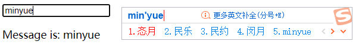

##### 单行文本、多行文本

用法上面类似

**注意**

>文本区域插值 (`<textarea>{{text}}</textarea>`) 并不会生效，应用 `v-model` 来代替。

##### 复选框

单个复选框，绑定到布尔值

```html
<input type="checkbox" id="checkbox" v-model="checked">
<label for="checkbox">{{ checked }}</label>
```

多个复选框，绑定到同一数组

```html
<input type="checkbox" id="jack" value="Jack" v-model="checkedNames">
<label for="jack">Jack</label>
<input type="checkbox" id="john" value="John" v-model="checkedNames">
<label for="john">John</label>
<input type="checkbox" id="mike" value="Mike" v-model="checkedNames">
<label for="mike">Mike</label>
<br>
<span>Checked names: {{ checkedNames }}</span>
```

v-model绑定的数组存放选中的元素对应的  `value`

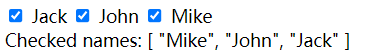 

##### 单选按钮

v-model绑定对应的 `value` 字符串

```html
<input type="radio" id="one" value="One" v-model="picked">
<label for="one">One</label>
<br>
<input type="radio" id="two" value="Two" v-model="picked">
<label for="two">Two</label>
<br>
<span>Picked: {{ picked }}</span>
```

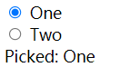 

##### 选择框

单选框：字符串；多选框：数组

```html
<select v-model="selected">
  <option disabled value="">请选择</option>
  <option>A</option>
  <option>B</option>
  <option>C</option>
</select>
<span>Selected: {{ selected }}</span>
```

```html
<select v-model="selected" multiple style="width: 50px;">
  <option>A</option>
  <option>B</option>
  <option>C</option>
</select>
<br>
<span>Selected: {{ selected }}</span>
```

**注意**

>如果 `v-model` 表达式的初始值未能匹配任何选项，`<select>` 元素将被渲染为“未选中”状态。在 iOS 中，这会使用户无法选择第一个选项。因为这样的情况下，iOS 不会触发 change 事件。因此，更推荐像上面这样提供一个值为空的禁用选项。

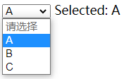 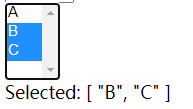 

- **用v-for动态渲染**

```html
<select v-model="selected">
  <option v-for="option in options" v-bind:value="option.value">
    {{ option.text }}
  </option>
</select>
<span>Selected: {{ selected }}</span>
```

```js
options: [
  { text: 'One', value: 'A' },
  { text: 'Two', value: 'B' },
  { text: 'Three', value: 'C' }
]
```

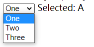 

#### 值绑定

前面说到的v-model都是绑定静态的字符串（复选框也有boolean）

但有时我们想把值绑定到Vue实例的动态property上，v-bind实现

**复选框**

```HTML
<input
  id="minyue"
  type="checkbox"
  v-model="toggle"
  true-value="yes"
  false-value="no"
  />
<label for="minyue">{{toggle}} minyue</label>
```

```js
// 当选中时
vm.toggle === 'yes'
// 当没有选中时
vm.toggle === 'no'
```

 

**单选按钮**

```html
<input type="radio" v-model="pick" v-bind:value="a">
```

```js
// 当选中时
vm.pick === vm.a
```

**选择框**

- 自定义绑定值，不局限于字符串

```html
<select v-model="valuemutiselect" multiple style="width: 50px">
  <option v-bind:value="{ a: 123 }">A</option>
  <option v-bind:value="{ b: 123 }">B</option>
  <option v-bind:value="{ c: 123 }">C</option>
</select>
<br />
<span>Selected: {{ valuemutiselect }}</span>
```

```js
valuemutiselect: [{ a: 123 }, { b: 123 }, { c: 123 }],
```

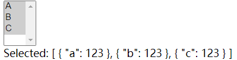 

#### 修饰符

##### .lazy

默认情况下，`v-model`在每次**input事件**触发后将输入框的值与数据同步，添加`lazy修饰符`，转变为在**change事件**之后进行同步

```html
<!-- 在“change”时而非“input”时更新 即：光标离开 -->
<input v-model.lazy="msg">
```

##### .number

自动将输入值类型转换为number

```html
<input v-model.number="age" type="number">
```

**注意**

>html输入元素的值总会返回字符串。
>
>不添加修饰符，值无法被`parseFloat()` 解析，则会返回原始的值。

1. 不加number修饰符

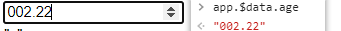 

2. 添加

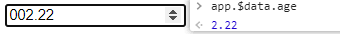 

##### .trim

自动过滤用户输入的首尾空白字符

```html
<input v-model.trim="msg">
```

#### 在组件上使用v-model

later~~


## 9组件基础

#### 基本示例

**vue组件**

```js
// 定义一个名为 button-counter 的新组件
Vue.component('button-counter', {
  data: function () {
    return {
      count: 0
    }
  },
  template: '<button v-on:click="count++">You clicked me {{ count }} times.</button>'
})
```

组件是可以复用的Vue实例

**Vue根元素**

```html
<div id="components-demo">
  <button-counter></button-counter>
</div>
```

```js
new Vue({ el: '#components-demo' })
```

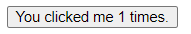 

#### 组件复用

```html
<div id="components-demo">
  <button-counter></button-counter>
  <button-counter></button-counter>
  <button-counter></button-counter>
</div>
```

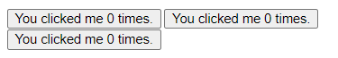 

每个组件都会维护自己的 `count` ,都是独立的实例

##### data必须是一个函数

```js
data: function () {
  return {
    count: 0
  }
}
```

为了组件复用性考虑，每一个实例可以维护

如果Vue没有这个规则，点击一个按钮全部改变

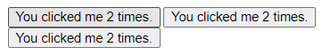 

#### 组件的组织

通常一个应用会以一颗嵌套的组件树的形式组织

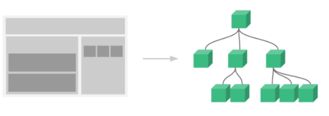 

组件可以在模板中使用，首先需要注册以便Vue能识别。

**全局注册**

```js
Vue.component('my-component-name', {
  // ... options ...
})
```

全局注册组件可以被用在其**后面**任何通过`new Vue`创建的Vue根实例和其组件树中所有子组件的模块中

**局部注册**

later~~


#### 通过prop向子组件传递数据

通过props选项包含该组件可接受的prop列表

```js
Vue.component('blog-post', {
  props: ['title'],
  template: '<h3>{{ title }}</h3>'
})
```

```html
<blog-post title="My journey with Vue"></blog-post>
<blog-post title="Blogging with Vue"></blog-post>
<blog-post title="Why Vue is so fun"></blog-post>
```

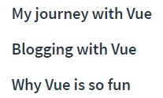 

**示例**：数据存在根组件`data`里

```js
new Vue({
  el: '#blog-post-demo',
  data: {
    posts: [
      { id: 1, title: 'My journey with Vue' },
      { id: 2, title: 'Blogging with Vue' },
      { id: 3, title: 'Why Vue is so fun' }
    ]
  }
})
```

```html
<blog-post
  v-for="post in posts"
  v-bind:key="post.id"
  v-bind:title="post.title"
></blog-post>
```

通过v-bind动态传递prop，适合运用在从一个API获取博文列表时

#### 单一根元素

模板不可能只有一个title，肯定还有正文等

```html
<h3>{{ title }}</h3>
<div v-html="content"></div>
```

但是，vue会报错，**每个组件必须只有一个根元素**

```html
<div class="blog-post">
  <h3>{{ title }}</h3>
  <div v-html="content"></div>
</div>
```

这时使用`post.title`和 `post.content`单一传prop而不是分为多个props

#### 监听子组件事件

##### 事件抛出一个值

类似react中子组件怎么向父组件反馈通信--监听事件回调函数

**例子**：父组件一个数据值控制全部报文字号大小

```js
new Vue({
  el: '#blog-posts-events-demo',
  data: {
    posts: [/* ... */],
    postFontSize: 1
  }
})
```

```html
<div id="blog-posts-events-demo">
  <div :style="{ fontSize: postFontSize + 'em' }">
    <blog-post
      v-for="post in posts"
      v-bind:key="post.id"
      v-bind:post="post"
      v-on:enlarge-text="postFontSize += 0.1"
    ></blog-post>
  </div>
</div>
```

子组件

```js
Vue.component('blog-post', {
  props: ['post'],
  template: `
    <div class="blog-post">
    <h3>{{ post.title }}</h3>
    <button v-on:click="$emit('enlarge-text')">
      Enlarge text
    </button>
    <div v-html="post.content"></div>
    </div>
  `
})
```

 `$emit 方法` 触发当前实例绑定的对应的事件

对于有返回参数时

1. js表达式

```html
<blog-post
  ...
  v-on:enlarge-text="postFontSize += $event"
></blog-post>
```

2. 事件处理函数是一个方法

```js
methods: {
  onEnlargeText: function (enlargeAmount) {
    this.postFontSize += enlargeAmount
  }
}
```

##### 组件中使用v-model

思想对比input元素的双向绑定`v-model`

```html
<input v-model="searchText">
```

等价于：

```html
<input
  v-bind:value="searchText"
  v-on:input="searchText = $event.target.value"
>
```

 **示例**

```html
<custom-input
  v-bind:value="searchText"
  v-on:input="searchText = $event"
></custom-input>
```

- 将`value` 绑定到prop上
- input事件被触发，通过自定义的input事件抛出

```js
Vue.component('custom-input', {
  props: ['value'],
  template: `
    <input
      v-bind:value="value"
      v-on:input="$emit('input', $event.target.value)"
    >
  `
})
```

这样v-model就可以被使用

```html
<custom-input v-model="searchText"></custom-input>
```

#### 通过插槽分发内容

类似react中的`props.children`

```html
<alert-box>
  Something bad happened.
</alert-box>
```

```js
Vue.component('alert-box', {
  template: `
    <div class="demo-alert-box">
      <strong>Error!</strong>
      <slot></slot>
    </div>
  `
})
```

利用`<slot></slot>` 传递自定义组件的内容

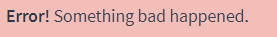 

#### 动态组件

不同组件之间动态切换时，比如多标签页面

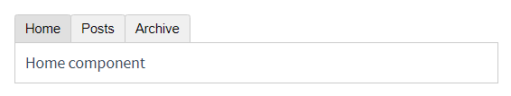 

使用`<component>` 元素特殊的`is`  attribute 绑定对应**组件对象**

```html
<!-- 组件会在 `currentTabComponent` 改变时改变 -->
<component v-bind:is="currentTabComponent"></component>
```

当然这个component组件对象也可以是已注册的组件名字

**拓展：动态异步组件**


