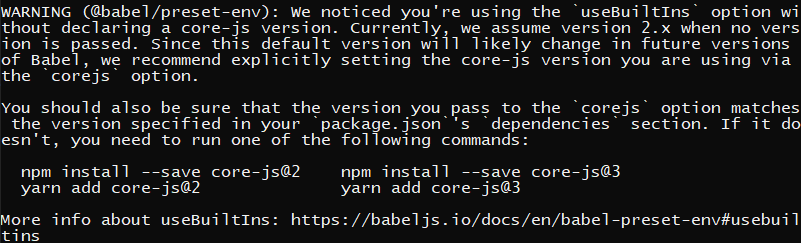
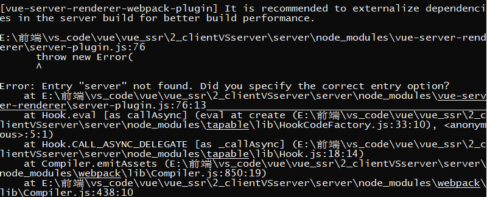

## 前言

前端工程化离不开打包构建工具，vue项目开发，有官方的脚手架工具VueCLI帮助我们集成了webpack相关模块，十分方便

但是，学习vue-ssr时，我们不得不动手自己配置打包构建程序。

下面是我的踩坑日志！

<!--more-->

**版本声明**

除了vue，vue-server-render是2.x版本其他都是最新！

抱歉的是：`-D` `--save`用的乱了点，不想改了

```json
"dependencies": {
  "@babel/polyfill": "^7.12.1",
  "core-js": "^3.13.0",
  "express": "^4.17.1",
  "vue": "^2.6.12",
  "vue-server-renderer": "^2.6.12"
},
"devDependencies": {
  "@babel/cli": "^7.14.3",
  "@babel/core": "^7.14.3",
  "@babel/preset-env": "^7.14.2",
  "babel-loader": "^8.2.2",
  "clean-webpack-plugin": "^4.0.0-alpha.0",
  "css-loader": "^5.2.6",
  "html-webpack-plugin": "^5.3.1",
  "style-loader": "^2.0.0",
  "vue-loader": "^15.9.7",
  "vue-style-loader": "^4.1.3",
  "vue-template-compiler": "^2.6.12",
  "webpack": "^5.37.1",
  "webpack-cli": "^4.7.0",
  "webpack-dev-server": "^3.11.2"
}
```

### 客户端渲染示例

#### **app.js**

生成Vue根实例，并挂载到DOM上

```js
import Vue from 'vue';
import App from './src/App.vue';

var app = new Vue({
  el: '#app',
  render: (h) => h(App),
});

```

#### **Vue组件**

##### App.vue

```vue
<template>
  <div>
    <h1>App.vue</h1>
    <p>minyue</p>
    <hr />
    <Foo></Foo>
    <Bar></Bar>
  </div>
</template>

<script>
import Foo from "./components/Foo.vue";
import Bar from "./components/Bar.vue";
export default {
  components: {
    Foo,
    Bar,
  },
};
</script>

<style>
h1 {
  color: red;
}
</style>
```

##### 子组件Bar.vue

```vue
<template>
  <div class="bar">
    <h1>Barbar</h1>
    <p>Component</p>
  </div>
</template>
<style>
.bar {
  background: blue;
}
</style>
```

##### 子组件Foo.vue

```vue
<template>
  <div class="foo">
    <h1>Foo</h1>
    <p>Component</p>
  </div>
</template>
<style>
.foo {
  background: yellow;
}
</style>
```

#### webpack编译模板

**index.html**

```html
<!DOCTYPE html>
<html lang="en">
  <head>
    <meta charset="UTF-8" />
    <meta name="viewport" content="width=device-width, initial-scale=1.0" />
    <meta http-equiv="X-UA-Compatible" content="ie=edge" />
    <title>Vue SSR with webpack</title>
  </head>

  <body>
    <div id="app"></div>
  </body>
</html>
```

#### 安装相关库和插件

- webpack `npm install -D webpack webpack-cli`
- webpack 本地服务器插件 `npm install -D webpack-dev-server`
- html 生成插件，它会将生成的 js 和 css 文件插入到 html 中 `npm install -D html-webpack-plugin`
- vue 插件 `npm install -D vue-loader vue-template-compiler`

**注意：**一起安装注意版本

- css 插件 `npm install -D css-loader style-loader vue-style-loader`
- 图片插件 `npm install -D file-loader url-loader`
- babel 插件 `npm install -D @babel/core @babel/cli @babel/preset-env babel-loader`, `npm install @babel/polyfill`

**注意：**会有警告



需要确定core-js版本，在`.babelrc`文件中完成babel配置

```.babelrc
{
    "presets": [
      [
        "@babel/preset-env",
        {
          "useBuiltIns": "usage",
          "corejs": 3
        }
      ]
    ]
  }
```

[官网说明很详细](https://www.babeljs.cn/docs/babel-preset-env)

#### 配置webpack.config.js

```js
const HtmlWebpackPlugin = require('html-webpack-plugin');
const VueLoaderPlugin = require('vue-loader/lib/plugin');
const {
  CleanWebpackPlugin,
} = require('clean-webpack-plugin/dist/clean-webpack-plugin');
const webpack = require('webpack');

const path = require('path');

module.exports = {
  mode: 'development',
  devtool: 'eval-cheap-module-source-map',
  entry: {
    main: './app.js',
  },
  output: {
    path: path.resolve(__dirname, 'dist'),
    filename: '[name]_[hash:6].js',
  },
  module: {
    rules: [
      {
        test: /\.vue$/,
        loader: 'vue-loader',
      },
      {
        // `*.vue` 文件中的 `<style>` 块以及普通的`*.css`
        test: /\.css$/,
        use: ['vue-style-loader', 'css-loader'],
      },
      {
        test: /\.js$/,
        exclude: /node_modules/, // 不编译node_modules下的文件
        loader: 'babel-loader',
      },
    ],
  },
  devServer: {
    contentBase: './dist', // html所在路径
    // compress: true, // 是否压缩
    // port: 3000, // 端口
    hot: true, // 热部署
    open: true, // 打包完成后自动打开网页
  },
  //webpack5 Dev-server有点问题，需要加对象web
  target: 'web',
  plugins: [
    new HtmlWebpackPlugin({
      template: './src/index.html', // 模板html
    }),
    new VueLoaderPlugin(),
    new CleanWebpackPlugin({
      path: './dist',
    }),
    // new webpack.NamedModulesPlugin(),
    new webpack.HotModuleReplacementPlugin(),
  ],
  //解析路径
  //   resolve: {
  //     alias: {
  //       vue: 'vue/dist/vue.js',
  //     },
  //   },
};
```

**注意：**

**1.hotmodule模块：**

webpack5变更

1. 可以直接使用指令`npx webpack serve`

2. 添加对应插件，配置指令`"serve": "webpack server",`

```js
devServer: {
  contentBase: './dist', // html所在路径
  // compress: true, // 是否压缩
  // port: 3000, // 端口
  hot: true, // 热部署
  open: true, // 打包完成后自动打开网页
},
//webpack5 Dev-server有点问题，需要加对象web
target: 'web',
plugins: [new webpack.HotModuleReplacementPlugin(),
],
```

```js
// 别忘了引入webpack
const webpack = require('webpack');
```

**2.vue-loader**

```js
// 注意引入路径
const VueLoaderPlugin = require('vue-loader/lib/plugin');
```

```js
module: {
    rules: [
      {
        test: /\.vue$/,
        loader: 'vue-loader',
      },
      {
        // `*.vue` 文件中的 `<style>` 块以及普通的`*.css`
        test: /\.css$/,
        use: ['vue-style-loader', 'css-loader'],
      },
      {
        test: /\.js$/,
        exclude: /node_modules/, // 不编译node_modules下的文件
        loader: 'babel-loader',
      },
    ],
  },
plugins: [
	new VueLoaderPlugin(),
],
```

**3.clean-webpack-plugin**

一个非官方插件，很实用，注意参数是对象，引入路径

```js
new CleanWebpackPlugin({
	path: './dist',
}),
```

```js
const {
  CleanWebpackPlugin,
} = require('clean-webpack-plugin/dist/clean-webpack-plugin');
```

### 青春版-服务端渲染示例

#### app.js

作为一个工厂函数：返回一个Vue实例

```js
import Vue from 'vue';
import App from './App.vue';

export function createApp() {
  const app = new Vue({
    render: (h) => h(App),
  });
  return { app };
}
```

#### entry-client.js

作为客户端渲染的入口文件，实现Vue实例的DOM挂载

```js
import { createApp } from './app.js';

const { app } = createApp();

app.$mount('#app');
```

#### entry-server.js

服务端渲染的入口文件，导出一个可接受参数的函数返回一个Vue实例

```js
import { createApp } from './app.js';

export default (context) => {
  const { app } = createApp();
  return app;
};

```

#### index.ssr.html

服务端渲染模板

```html
<!DOCTYPE html>
<html lang="en">
  <head>
    <meta charset="UTF-8" />
    <meta name="viewport" content="width=device-width, initial-scale=1.0" />
    <meta http-equiv="X-UA-Compatible" content="ie=edge" />
    <title>服务端渲染</title>
  </head>
  <body>
    <!--vue-ssr-outlet-->
  </body>
</html>

```

#### webpack配置文件

这里功能抽离，分为base，client和server

##### webpack.base.config.js

```js
const VueLoaderPlugin = require('vue-loader/lib/plugin');
const path = require('path');

module.exports = {
  mode: 'development',

  // 模块解析说明 不用写后缀 .js  .vue
  resolve: {
    extensions: ['.js', '.vue'],
  },

  output: {
    path: path.resolve(__dirname, '../dist'),
    // 统一输出文件名合并打包文件
    filename: '[name].bundle.js',
  },
  module: {
    rules: [
      {
        test: /\.vue$/,
        loader: 'vue-loader',
      },
      {
        // `*.vue` 文件中的 `<style>` 块以及普通的`*.css`
        test: /\.css$/,
        use: ['vue-style-loader', 'css-loader'],
      },
      {
        test: /\.js$/,
        exclude: /node_modules/, // 不编译node_modules下的文件
        loader: 'babel-loader',
      },
    ],
  },
  plugins: [new VueLoaderPlugin()],
};

```

##### webpack.client.config.js

```html
const HtmlWebpackPlugin = require('html-webpack-plugin');
const { merge } = require('webpack-merge');
const base = require('./webpack.base.config');

const path = require('path');

module.exports = merge(base, {
  //路径都是项目根路径为基准  只有output是当前配置文件的相对位置
  entry: {
    client: './src/entry-client',
  },

  plugins: [
    new HtmlWebpackPlugin({
      template: './src/index.html', // 模板html
    }),
  ],
});

```

##### webpack.server.config.js

```js
const { merge } = require('webpack-merge');
const base = require('./webpack.base.config');
const VueSSRServerPlugin = require('vue-server-renderer/server-plugin');

const path = require('path');

module.exports = merge(base, {
  // 这允许 webpack 以 Node 适用方式(Node-appropriate fashion)处理动态导入(dynamic import)，
  // 并且还会在编译 Vue 组件时，
  // 告知 `vue-loader` 输送面向服务器代码(server-oriented code)。
  target: 'node',
  //路径都是项目根路径为基准  只有output是当前配置文件的相对位置
  entry: {
    server: './src/entry-server',
  },
  // 此处告知 server bundle 使用 Node 风格导出模块(Node-style exports)
  output: {
    libraryTarget: 'commonjs2',
  },
  // 插件官网说明https://github.com/jantimon/html-webpack-plugin#configuration
  plugins: [new VueSSRServerPlugin()],
});

```

这里参考[官网配置](https://ssr.vuejs.org/zh/guide/build-config.html#%E6%9C%8D%E5%8A%A1%E5%99%A8%E9%85%8D%E7%BD%AE-server-config)

**注意：**

1. 对于`VueSSRServerPlugin`对webpack5有一些兼容问题

   >
   >
   >找到 /node_modules/vue-server-renderer/server-plugin.js
   >
   >- 问题1： [vue-server-renderer-webpack-plugin] webpack config `output.libraryTarget` should be “commonjs2”
   >
   >```js
   >-  if (compiler.options.output && compiler.options.output.libraryTarget !== 'commonjs2') {
   >+  if (compiler.options.output && compiler.options.output.library.type !== 'commonjs2') {
   >```
   >
   >- 问题2：Error: Entry "server" not found. Did you specify the correct entry option?
   >
   >```js
   >- var entryAssets = entryInfo.assets.filter(isJS);
   >+ var entryAssets = entryInfo.assets.filter(file => isJS(file.name));
   >
   >if (entryAssets.length > 1) {
   >  throw new Error(
   >    "Server-side bundle should have one single entry file. " +
   >    "Avoid using CommonsChunkPlugin in the server config."
   >  )
   >}
   >
   >var entry = entryAssets[0];
   >- if (!entry || typeof entry !== 'string') {
   >+ if (!entry || typeof entry.name !== 'string') {
   >  throw new Error(
   >    ("Entry \"" + entryName + "\" not found. Did you specify the correct entry option?")
   >  )
   >}
   >
   >var bundle = {
   >+ entry: entry.name,
   >  files: {},
   >  maps: {}
   >};
   >```

#### server.js

客户端：使用express提供的静态资源加载中间件

服务端：使用`vue-server-renderer`

```js
const express = require('express');
const path = require('path');
const fs = require('fs');

// client端;
const clientApp = express();
clientApp.use(express.static('dist'));

clientApp.listen(3000, () => {
  console.log('浏览器端渲染地址： http://localhost:3000');
});

// server端
const serverApp = express();
const template = fs.readFileSync('./src/index.ssr.html', 'utf-8');
const bundle = require('./dist/vue-ssr-server-bundle.json');
const renderer = require('vue-server-renderer').createBundleRenderer(bundle, {
  template,
});
console.log(template, renderer);
serverApp.get('*', (req, res) => {
  renderer.renderToString((err, html) => {
    console.log(html);
    if (err) {
      console.log(err);
      res.status(500).end('Internal Server Error');
      return;
    }
    res.end(html);
  });
});
serverApp.listen(3001, () => {
  console.log('服务端端渲染地址： http://localhost:3001');
});

```

**注意：**

[createBundleRenderer的使用](https://ssr.vuejs.org/zh/api/#createbundlerenderer)

- 第一个参数`bundle`
  - 绝对路径，指向一个已经构建好的 bundle 文件（`.js` 或 `.json`）。必须以 `/` 开头才会被识别为文件路径。
  - 用require模块化引入的bundle 对象。
- 第二个参数：相关选项

[express.static(root, [options])](https://www.expressjs.com.cn/starter/static-files.html)

- 第一个参数："虚假路径"
- 第二个参数设定对应的静态文件路径，以启动节点进程目录为基准


