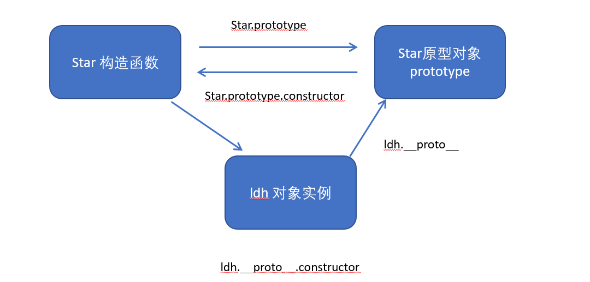

[学习ssh大佬的文章](https://juejin.cn/user/2330620350708823) 

# HTML

<!--more-->

https://rainylog.com/post/ife-note-1/

### 1.语义化

- 语义化标签，易修改易维护，无障碍阅读支持，利于SEO

  >SEO:搜索引擎优化（技术：语义化H5;撰稿：使用访问者词汇，图文并茂；声望：其他站点的链接）

- 结构语义化

  >他们不对内容有什么本质的影响，只是页面结构规范
  >
  >

- 头部`<header>` 

  >用法一：标注内容的标题
  >
  >用法二：页面的页眉

- 导航栏`<nav>`

  >两种用法
  >
  >```
  ><!-- 案例一 -->  一组只是链接的附加内容
  ><nav>
  >  <!-- 此处是链接 -->
  >  <aside></aside>
  >  <aside></aside>
  ></nav>
  >```
  >
  >```
  ><!-- 案例二 -->  附加内容中除了链接还有其他模块
  ><aside>
  >  <nav>
  >    <!-- 此处是链接 -->
  >  </nav>
  >  <section></section>
  >  <div></div>
  ></aside>
  >```

- 附注`<aside>`

  >它不仅仅是侧栏，也表示周围和主要文本没有密切关系的内容，说明附加内容，解释说明，相关链接等
  >
  >- 通常为广告区域，搜索，分享链接
  >- 其中的`<section>`规定一个带有标题的区域（与主题内容并列显示的小块区域，独立内容（如：表单），文章分类区块）

- 页脚`<footer>`

  >常包含版权信息，法律限制等之类的文本或链接。
  >
  >```
  >// 含有其他内容时
  >
  ><div>
  >  <aside>
  >  <!-- 其它内容 -->
  >  </aside>
  >  
  >  <footer>
  >    <!-- 法律、版权、来源、联系信息等 -->
  >  </footer>
  ></div>
  >```

- 主要内容`<main>`

  >标识主体内容，通常是`<body>`的子标签，可以帮助屏幕阅读工具识别页面主要部分

- 文章`<article>`

  >应该包含完整的标题，文庄署名，发布时间，正文
  >
  >- 文章中包含插图时，使用新的 语义化标签`<figure>`
  >
  >```
  ><article>
  >  <h1>标题</h1>
  >  <p>
  >    <!-- 内容 -->
  >  </p>
  >  <figure>
  >    
  >    <figcaption>这是一个插图</figcaption>
  >  </figure>
  ></article>
  >```
  >
  >``的`alt`属性可以略去
  >
  >（`<figcaption>`应该被放置在`<figure>`的第一个或最后一个）

# CSS基础面试题

### 1.50道CSS基础题

https://segmentfault.com/a/1190000013325778

1. 标准css盒子模型，低版本IE盒子模型区别

   - box-sizing
   - JS获取盒子模型对应宽高（dom.style.width内联样式;window.getComputedStyle(dom.width实际样式大小;dom.getBoundingClientRect().width通过视口距离实际大小)
   - 父子边距重叠(父元素设置BFC)兄弟元素重叠(给下面的套个BFC父盒子；下面的设置inline-box)

2. css选择器有哪些？那些属性可以继承？优先级？

   

3. 如何居中div？居中一个浮动元素？居中一个**绝对定位元素**？

4. display有哪些值？

5. position的值？

6. CSS3新特性？

7. Flexbox？

8. CSS三角？

9. 常见兼容性问题（默认内外边距？Chrome中文文本>=12px？[超链接失效？love hate](https://cloud.tencent.com/developer/article/1444600)

10. 为什么要初始化CSS样式？

11. absolute的containing block计算方式？

12. 不同浏览器下，visibility属性的collapse属性值的区别？（hidden，visible）

13. display：none和visibility：hidden区别？

14. position，display，overflow，float属性重叠会？

15. 对BFC规范的理解（块级格式化上下文block formatting context）？[BFC](https://blog.csdn.net/sinat_36422236/article/details/88763187)

16. 浮动？清除浮动？

17. 上下外边距重合？

18. 设置元素浮动后，元素的display值是？

19. 移动端布局使用过媒体查询嘛？[媒体查询](https://www.jianshu.com/p/2dfa5bab1ef1)

20. [css预处理器](https://www.jianshu.com/p/da1e1ceeae1a)less，sass

21. [css优化提高性能的方法？](https://www.jianshu.com/p/4e673bf24a3b)

22. 浏览器是怎样解析CSS选择器的?

23. 在网页中一个使用奇数还是偶数的字体？

24. margin和padding分别适合在什么场景？

25. 元素竖向的百分比设定是相对于容器的高度嘛？

26. [全屏滚动](https://github.com/haizlin/fe-interview/issues/182)

27. [响应式设计](https://www.w3cschool.cn/frontend_notebook/frontend_notebook-hl3u27a4.html)

28. [视差滚动效果](https://www.cnblogs.com/coco1s/p/9453938.html)

29. ::before和:after中单引号和双引号的区别？[伪元素](https://www.php.cn/css-tutorial-412795.html)

30. 对line-height理解？文本垂直居中（多行，单行）

31. 怎么让Chrome支持小于12px字号？

32. 让一碗面字体变清晰，变细css怎么做？（win，ios）

33. 如果要手动写动画，最好的时间间隔是多少？60hz

34. li与li之间看不见的空白间隙是怎么产生的？如何解决？` letter-spacing: -3px;`

35. 有一个高度自适应的div，里面有两个div，一个高度为100px，希望另一个填满剩余高度？`子绝父相`

36. png，jpg，gif图片格式解释？webp格式？

37. CSS Sprites精灵图？

### 2.Flex 布局

[Flex](https://www.ruanyifeng.com/blog/2015/07/flex-grammar.html)

- 传统布局基于盒子模型，`display属性`， `position属性`， `float属性`
- Flex布局就是弹性布局，用来为盒子模型提供最大的灵活性

### 3.什么是BFC

可以参考[BFC-三元](http://47.98.159.95/my_blog/blogs/css/008.html#_3-bfc%E6%B8%B2%E6%9F%93%E8%A7%84%E5%88%99)

>定义：浮动元素和绝对定位元素，非块级盒子的块级容器（比如：inline-blocks，table-cells，和table-captions），以及overflow值不为“visiable”的块级盒子，都会创建新的BFC

> 渲染规则：
>
> - 垂直方向外边距重叠
>
>   避免外边距塌陷
>
> -  BFC区域不会和浮动元素的box重叠
>
>   防止浮动导致父元素高度坍塌
>
> - BFC是一个独立容器，不受外面元素影响
>
> - 计算BFC高度时，浮动元素也参与计算

# JS基础

### 1.讲一讲JS数据类型

最新ES标准规定8种[数据类型](https://developer.mozilla.org/en-US/docs/Web/JavaScript/Data_structures)

- 6 种原始类型，有`typeof`运算符检查

  - Boolean 	 `typeof instance === "boolean"`
  - Undefined  `typeof instance === "undefined"`
  - Number      `typeof instance === "number"`
  - BigInt          `typeof instance === "bigint"`
  - String          `typeof instance === "string"`
  - Symbol       `typeof instance === "symbol"`

- 结构类型

  - object         `typeof instance === "object"`

    >[`Object`](https://developer.mozilla.org/en-US/docs/Web/JavaScript/Reference/Global_Objects/Object)[`Array`](https://developer.mozilla.org/en-US/docs/Web/JavaScript/Reference/Global_Objects/Array)[`Map`](https://developer.mozilla.org/en-US/docs/Web/JavaScript/Reference/Global_Objects/Map)[`Set`](https://developer.mozilla.org/en-US/docs/Web/JavaScript/Reference/Global_Objects/Set)[`WeakMap`](https://developer.mozilla.org/en-US/docs/Web/JavaScript/Reference/Global_Objects/WeakMap)[`WeakSet`](https://developer.mozilla.org/en-US/docs/Web/JavaScript/Reference/Global_Objects/WeakSet)[`Date`](https://developer.mozilla.org/en-US/docs/Web/JavaScript/Reference/Global_Objects/Date)

  - function     `typeof instance === "function"`

- 结构根基元

  - null              `typeof instance === "object"`

### 2.讲一讲Map和Set

[Map和Set](https://zh.javascript.info/map-set)

1. Map的key相对普通对象来说更加灵活，普通对象的key只能以基础数据类型作为key值，并且所有传入的key值都会被转化为string类型，而Map的key可以是各种数据类型

   >Map使用`SameValueZero` 算法来比较键是否相等（和“===”差不多），只是NaN被看做等于NaN(也可以被作为键值)

2. Set

   >特殊的类型集合，“值的集合”，不重复
   >
   >- 重复使用同一个值调用 `set.add(value)` 并不会发生什么改变

### 3.WeakMap和Map之间的区别？

[WeakMap](https://zh.javascript.info/weakmap-weakset)

1. `WeakMap` 的键必须是对象，不能是原始值
2. key值是**弱引用**，在 weakMap 中使用一个对象作为键，并且没有其他对这个对象的引用 —— 该对象将会被从内存（和map）中自动清除。
3. 不能迭代，并且无法获取所有当前内容。

使用场景：用户数据的存储（删除用户，回收内存）；缓存数据

### 4.原型链



- 用于：继承(call,原型链，组合继承)，instanceof
- in检查对象属性（原型链上有也true），`obj.hasOwnProperty()`，`Object.getPrototypeOf/Object.setPrototypeOf`

### 5.this?

- **this是在执行上下文创建时确定的一个在执行过程中不可更改的变量。**

1. 严格模式和非严格模式不一样window/undefined
2. 函数独立调用时window/undefined；对象方法，；构造函数（new：创建一个临时对象，绑定原型，属性赋值，将临时对象return）；箭头函数；

优先级: new > call、apply、bind > 对象.方法 > 直接调用。

- **闭包**：产生原因，作用域（两种：全局作用域和函数作用域）；表现形式：返回一个函数。刚刚已经举例，作为函数参数传递（回调函数，最直接的表现）；引到es6的let块级作用域。

### 6.深拷贝和浅拷贝

- 浅拷贝    一般指把对象的第一层拷贝到一个新对象中

>实现方式
>
>1. Object.assign()  可以把可枚举属性拷贝给目标对象
>2. 函数库lodash的.clone方法
>3. ...展开运算符
>4. Array.prototype.concat()     字符串连接函数,返回新字符串
>5. Array.prototype.slice()      提取字符串函数

- 深拷贝   

>1. JSON.parse(JSON.stringify())  可以处理数组和对象，但不能处理函数和正则（正则变成空对象，函数变成null）
>2. 函数库lodash的_.cloneDeep()  
>3. jquery中的`$.extend(deepCopy, target, object1, [objectN])`  返回合并后的新对象
>4. [手写递归算法](https://segmentfault.com/a/1190000020255831)   --遍历对象直到里面都是基本数据类型，然后再去复制，就是深拷贝

### 7.事件冒泡和事件捕获

- 如何设置两者

1. 事件冒泡：`event.target`,停止：
2. 事件捕获：

 `element.addEventListener(event, function, useCapture)`第三个参数

>event : 必须，不要on前缀 "click" ，react中`onClick`,
>
>function : 必须，事件对象会作为第一个参数传入e.target
>
>useCapture：布尔值，决定是捕获阶段，还是冒泡阶段（默认false）

- 应用：**事件代理**

>**事件冒泡机制，点击了 li 后会冒泡到 ul ，此时就会触发绑定在 ul 上的点击事件，再利用 target 找到事件实际发生的元素，就可以达到预期的效果。**

- 如何阻止事件冒泡？

`event.stopPropagation()`,(当前元素的其他行为还会触发)`event.stopImmediatePropagation()` 其他处理程序不再执行，不要在没有需要的情况下停止冒泡！替代方法：自定义事件；数据在一个处理程序中被存event对象中，可以在另一个处理程序中使用。

- 如何阻止默认事件？

```js
if(e && e.preventDefault) {
  //非IE浏览器
  e.preventDefault();
} else {
  //IE浏览器(IE11以下)
  window.event.returnValue = false;
}
//return false;   //或者不写上面的判断直接写这句
```


# 框架篇

1. **框架的优势：**

   组件化---天然分层---生态---开发效率

   - MVC（view层，Model层，**Control层**（逻辑集中，与View层一一对应，何谈复用））
   - MVP（Model 层和 View 层都必须通过 **Presenter 层**来传递信息，MV复用性好）
   - MVVM(View和ViewModel 是进行绑定的，改变ViewModel 就会直接作用到View视图上)(数据绑定方式：发布-订阅模式（`vm. set( ' property', value)`），数据劫持(通过`
     Object.defineProperty()`来劫持各个属性的setter,getter)，脏值检查(通过 `setInterval()` 定时轮询检测数据变动),angular.js,指定事件触发)

2. **虚拟DOM优势**：跨平台（虚拟DOM本质上是JavaScript对象,而DOM与平台强相关）；保证性能下限

3. **生命周期**：挂载阶段、更新阶段、卸载阶段

   

4. **setState**到底是异步还是同步?

   - 在合成事件（onClick等）和钩子函数中是“异步”的（也是批量更新，原理）
   - 原生事件和`setTimeout` 中都是同步

5. **React 复用组件逻辑**

   - Mixins：还是使用createClass时遗留的产物（不支持es6，`Mixins` 引入了隐式的依赖关系，会导致名称冲突）
   
   - HOC：一个纯函数，接受一个组件作为参数，返回一个新的组件（`connect` 是一个返回高阶组件的高阶函数）注意：不要在render中使用，需复制静态方法，refs不被传递（被`React.forwardRef((props,ref)=>{})`解决）
   
   - render props:嵌套过深！
   
   - HOOKS：简洁: React Hooks解决了HOC和Render Props的嵌套问题；解耦: React Hooks可以更方便地把 UI 和状态分离；解决了类组件的几大问题:this 指向容易错误，分割在不同声明周期中的逻辑和维护代码复用成本高；
   
     React.memo并不能完全替代shouldComponentUpdate（因为拿不到 state change，只针对 props change）
   
6. **fiber算法**：**单线程调度算法**，`reconcilation` 算法实际上是递归，想要中断递归是很困难的，React 16 开始使用了循环来代替之前的递归（将递归diff，拆分为小任务，老生代垃圾回收！），时间分片思想（异步渲染模式）

7. **redux**：类flux架构，状态管理（单一数据源，状态只读，改变由纯函数进行）

   

8. **react-redux**：Provider+connect

9. **中间件**：

   1. thunk 中间件

      >dispatch一个action
      >action可以是一个函数 并接收一个dispath函数
      >可以在action的函数中进行异步操作
      >接受到数据后再dispatch一个action 此action必须是一个对象包含type和数据
      >reducer拦截到action的type和数据返回新的state

   2. saga 中间件

      >dispatch一个action
      >action只能是对象 并且type必须是reducer没有的
      >sagas.js拦截此type并执行另一个函数进行异步操作
      >接受到数据后再dispatch一个action 并且type必须是reducer存在的
      >reducer拦截到action的type和数据返回新的state

   3. 原生

      >在componentDidMount生命周期函数里 执行异步操作 接受到数据后dispatch一个action
      >此action必须是一个对象包含type和数据
      >reducer拦截到action的type和数据返回新的state

10. **react-router**：

   - 实现原理：依赖 history 库，通过路由匹配，决定应该展示什么样的组件。保证视图和 URL 的同步（hash，h5API，memory）

   - link和a的区别：（link不会重新渲染页面；link最终会被渲染为a；link的to，query，hash会组合为href；内部实现上使用脚本拦截了**浏览器的默认行为**，然后调用了history.pushState 方法）

   - 路由有几种模式：

     1. HashRouter（URL中的哈希部分保证页面和url同步，window.location.hash`和`hashchange无法记录历史回退）
     2. BrowseRouter（利用h5的history API，pushState`和`popState）
     3. MemoryRouter：不存储history，所有路由过程保存在内存里，不能进行前进后退
     4. NativeRouter：经常配合ReactNative使用，多用于移动端
     5. StaticRouter：设置静态路由，需要和后台服务器配合设置

   - **switch作用**：排他性路由，采用 `<Switch>`，只有**一个路由**会被渲染，并且总是渲染第一个匹配到的组件，更好进行路由匹配

   - **重定向**：采用 Redirect 进行重定向

   - **history中push和replace**：一个路由栈，push会新增一条记录，replace替换当前（项目中props.history.push(`/singers/${id}`);） 

     获取history对象（import { useHistory } from "react-router-dom";或者let history = this.props.history;）

11. **react有什么坑点？**

   - JSX做表达式判断时候，需要强转为boolean类型

     ```react
     render() {
       const b = 0;
       return (
         <div>
           {b && <div>test</div>}
         </div>
       );
     }
     ```

     如果不使用 !!b 进行强转数据类型，会在页面里面输出 0。

   - 遍历子节点的时候，不要用 index 作为组件的 key 进行传入

   - 尽量不要在 componentWillReviceProps 里使用 setState，如果一定要使用，那么需要判断结束条件，不然会出现无限重渲染，导致页面崩溃。(实际不是componentWillReviceProps会无限重渲染，而是componentDidUpdate)

   - 给组件添加ref时候，尽量不要使用匿名函数，因为当组件更新的时候，匿名函数会被当做新的prop处理，让ref属性接受到新函数的时候，react内部会先清空ref，也就是会以null为回调参数先执行一次ref这个props，然后在以该组件的实例执行一次ref，所以用匿名函数做ref的时候，有的时候去ref赋值后的属性会取到null。

   

   


### 1.React

**有没有用过React Hooks？**

- 常见的API有哪些？都有什么作用？
- 如何使用HOOKS在依赖改变时重新发送请求？
- 写过自定义HOOK吗？解决了那些问题？
- 讲讲React Hooks的闭包陷阱，怎么解决？

# 工具

### 1.webpack基础知识

1. **介绍webpack**：`JavaScript` 应用程序的静态模块打包器，当 `webpack` 处理应用程序时，会递归构建一个依赖关系图，其中包含应用程序需要的每个模块，然后将这些模块打包成一个或多个 `bundle`。
2. **核心概念**：
   - entry: 入口
   - output: 输出
   - loader: 模块转换器，用于把模块原内容按照需求转换成新内容
   - 插件(plugins): 扩展插件

```js
module.exports = {
  entry: {
    main: "./src/index.js",
  },
  output: {
    //打包js文件的输出src前缀,这里是根路径
    publicPath: "/",
    filename: "[name].js",
    path: path.resolve(__dirname, "dist"),
  },
  mode: "development",

  //开启web服务器并实时重新加载。dist目录放在内存中
  devServer: {
    contentBase: "./dist",
    open: true,
    hot: true,
  },

  //webpack5 Dev-server有点问题，需要加对象web
  target: "web",
  //打包文件和源文件映射source-map
  // cheap：性能好，无需精确列；
  // module：不只映射当前文件
  // inline：不生成.map文件，而行内集成
  devtool: "eval-cheap-module-source-map",

  module: {
    rules: [
      {
        test: /\.m?js$/,
        exclude: /node_modules/,
        use: {
          loader: "babel-loader",
          options: {
            presets: [
              [
                "@babel/preset-env",
                {
                  targets: {
                    edge: "17",
                    firefox: "60",
                    chrome: "67",
                    safari: "11.1",
                  },
                  useBuiltIns: "usage",
                  //只对需要的语法进行补充
                },
              ],
            ],
            //库文件编写，防止全局污染时使用
            plugins: [
              [
                "@babel/plugin-transform-runtime",
                {
                  absoluteRuntime: false,
                  corejs: 2,
                  helpers: true,
                  regenerator: true,
                  version: "7.0.0-beta.0",
                },
              ],
            ],
          },
        },
      },
      {
        test: /\.(jpg|png|gif)$/,
        use: {
          loader: "url-loader",
          options: {
            name: "[name].[ext]",
            outputPath: "images/",
            limit: 204800,
          },
        },
      },
      {
        test: /\.css$/,
        use: ["style-loader", "css-loader"],
      },
      {
        test: /\.scss$/,
        use: [
          "style-loader",
          { loader: "css-loader", options: { importLoaders: 2 } },
          "sass-loader",
          "postcss-loader",
        ],
      },
    ],
  },
  plugins: [
    new HtmlWebpackPlugin({
      template: "./src/index.html",
    }),
    new CleanWebpackPlugin({
      cleanAfterEveryBuildPatterns: ["dist"],
    }),
    new webpack.HotModuleReplacementPlugin(),
  ],
};

// 修改了默认配置文件名时
// npx webpack --config webpackconfig.js

// entry后接字符串是对象main的简写;
// entry: {
//   main: "./src/index.js"
// }

// module.rules就是配置除js文件外的打包文件手段
// {
//   test: /\.jpg$/,
//   use: {
//     loader: "file-loader",
//   },
// },

// 如果想自定义打包文件名称/位置
// 添加options.name属性
// options: {
//   name: "[name].[ext]",
//   outputPath: "images/",
// },
// 这里[name] [ext] [hash]都是占位符
// 在dist目录下新建images文件存放打包的图片

// 和fiile - loader类似的url - loader工具
// 帮我们吧小图片直接base64编码在js文件中
// 添加一个配置项： limit: 20480,   也就是20kb

// css文件 / scss文件打包
// css：
// 首先css - loader整合css到一个文件
// 然后style - loader将这个css挂载到页面的head部分
// scss:
// 安装node - Sass sass - loader
// 先由sass-loader解析.scss文件为css
```


# 性能优化

### 1.讲一讲web各个阶段的性能优化？

[React 16 加载性能优化指南](https://mp.weixin.qq.com/s/XSvhOF_N0VbuOKStwi0IYw)

### 2.webpack代码分割怎么做？

[webpack的代码分割（路由懒加载同理）](https://juejin.im/post/5e796ec1e51d45271e2a9af9)

**细看**

https://github.com/xieranmaya/blog/issues/3)


