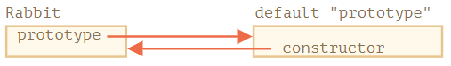
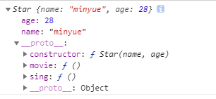

### 1.原型

- 首先说一下什么是原型？

> 这一概念来自：实例对象中的`__proto__`属性
>
> - 这一属性就是对象的原型（值可以是对象或null）
> - 指向构造函数的原型对象`prototype`
> - 并且有且只有一个


- 访问器（accessor）属性是一个例外，因为分配（assignment）操作是由 setter 函数处理的。因此，写入此类属性实际上与调用函数相同。

```js
// admin.fullName 能够正常运行：
let user = {
  name: "Min",
  surname: "Yue",

  set fullName(value) {
    [this.name, this.surname] = value.split(" ");
  },

  get fullName() {
    return `${this.name} ${this.surname}`;
  }
};

let admin = {
  __proto__: user,
  isAdmin: true
};

alert(admin.fullName); // Min Yue

// setter triggers!
admin.fullName = "He Chengmin"; 
```

- 值得思考，这里`this` 指向问题（当然指向admin）永远是函数名 `.` 前面的


- `for...in`会迭代继承的属性
- `Object.keys`,`Object.values` 都会忽略继承属性

<!--more-->

#### 思考题

//两只小鼠共用了一个胃？

```js
let hamster = {
  stomach: [],

  eat(food) {
    this.stomach.push(food);
  }
};

let speedy = {
  __proto__: hamster
};

let lazy = {
  __proto__: hamster
};

// 这只仓鼠找到了食物
speedy.eat("apple");
alert( speedy.stomach ); // apple

// 这只仓鼠也找到了食物，为什么？请修复它。
alert( lazy.stomach ); // apple
```

- 解决方案

```js
// (1):简单的赋值 this.stomach=? 而不是this.stomach.push(food);
// this.stomach.push() 需要找到 stomach 属性，然后对其调用 push。它在 this（=speedy）中查找 stomach，但并没有找到。然后它顺着原型链，在 hamster 中找到 stomach。
// this.stomach= 不会执行对 stomach 的查找。该值会被直接写入 this 对象。

// (2):确保每个小鼠都有自己的胃
let speedy = {
  __proto__: hamster,
  stomach: []
};
let lazy = {
  __proto__: hamster,
  stomach: []
};
```

### 2.F.prototype

- 构造函数原型对象

- 如果 `F.prototype` 是一个对象，那么 `new` 操作符会使用它为新对象设置 `[[Prototype]]`。

  > 注意：`F.prototype` **仅用在** `new F` **时**调用，它为新对象的 `[[Prototype]]` 赋值。（原型对象改变（F.prototype = <another object>）后，不影响前面对象的原型，影响新对象的原型）

- 当然每个函数都有对应的 `"prototype"` 属性

  > 默认的 `"prototype"` 是一个只有属性 `constructor` 的对象，属性 `constructor` 指向函数自身。
  >
  > ```js
  > function Rabbit() {}
  > 
  > /* default prototype
  > Rabbit.prototype = { constructor: Rabbit };
  > */
  > ```

  

  > 我们也可以使用 `constructor` 属性来创建一个新对象
  >
  > ```js
  > function Rabbit(name) {
  >   this.name = name;
  >   alert(name);
  > }
  > 
  > let rabbit = new Rabbit("White Rabbit");
  > 
  > let rabbit2 = new rabbit.constructor("Black Rabbit");
  > ```
  >
  > - 当我们有一个对象，但不知道它使用了哪个构造器（例如它来自第三方库），并且我们需要创建另一个类似的对象时，用这种方法就很方便。
  > - 为了确保正确的 `"constructor"`，我们可以选择添加/删除属性到默认 `"prototype"`，而不是将其整个覆盖
  >
  > ```js
  > function Rabbit() {}
  > 
  > // 不要将 Rabbit.prototype 整个覆盖
  > // 可以向其中添加内容
  > Rabbit.prototype.jumps = true
  > // 默认的 Rabbit.prototype.constructor 被保留了下来
  > 
  > Rabbit.prototype = {
  >   jumps: true,
  >   constructor: Rabbit
  > };
  > 
  > // 这样的 constructor 也是正确的，因为我们手动添加了它
  > ```

### 3.原生的原型

- `"prototype"` 属性在 JavaScript 自身的核心部分中被广泛地应用。所有的内置构造函数都用到了它。

- 像 `Array`、`Date`、`Function` 及其他，都在 prototype 上挂载了方法。

  > 例如：当我们创建一个数组 `[1, 2, 3]`，在内部会默认使用 `new Array()` 构造器。因此 `Array.prototype` 变成了这个数组的 prototype，并为这个数组提供数组的操作方法。这样内存的存储效率是很高的。


#### 基本数据类型

- 字符串、数字和布尔值上。
- 它们并不是对象。但是如果我们试图访问它们的属性，那么临时包装器对象将会通过内建的构造器 `String`、`Number` 和 `Boolean` 被创建。它们提供给我们操作字符串、数字和布尔值的方法然后消失。
- 这些对象的方法也驻留在它们的 prototype 中，可以通过 `String.prototype`、`Number.prototype` 和 `Boolean.prototype` 进行获取。

**！！！！**对于**值** `null` **和** `undefined` **没有对象包装器**

#### 更改原生原型

- 原生的原型是可以被修改的。

  例如，我们向 `String.prototype` 中添加一个方法，这个方法将对所有的字符串都是可用的：

  ```js
  String.prototype.show = function() {
    alert(this);
  };
  
  "BOOM!".show(); // BOOM!
  ```

- 通常是一个很不好的想法。

**在现代编程中，只有一种情况下允许修改原生原型。那就是 polyfilling。**

- Polyfilling 是一个术语，表示某个方法在 JavaScript 规范中已存在，但是特定的 JavaScript 引擎尚不支持该方法，那么我们可以通过手动实现它，并用以填充内建原型。

```js
if (!String.prototype.repeat) { // 如果这儿没有这个方法
  // 那就在 prototype 中添加它

  String.prototype.repeat = function(n) {
    // 重复传入的字符串 n 次

    // 实际上，实现代码比这个要复杂一些（完整的方法可以在规范中找到）
    // 但即使是不够完美的 polyfill 也常常被认为是足够好的
    return new Array(n + 1).join(this);
  };
}

alert( "La".repeat(3) ); // LaLaLa
```

#### 从原型中借用

- 我们从一个对象获取一个方法，并将其复制到另一个对象。一些原生原型的方法通常会被借用。

```js
//例如：如果我们要创建类数组对象，则可能需要向其中复制一些 Array 方法。
let obj = {
  0: "Hello",
  1: "world!",
  length: 2,
};

obj.join = Array.prototype.join;

alert( obj.join(',') ); // Hello,world!
```


### 4.原型链

- 可以看出对象有原型，构造函数有原型对象！
- 对象的原型指向，上级构造函数的原型对象
- 向上查找，直到顶级`Object.prototype.__proto__`指向null


- 案例分析

```js
<script>
    function Star(name, age) {
    this.name = name;
    this.age = age;
}
Star.prototype = {
    constructor: Star, //手动设置指回原来的构造函数
    sing: function() {
        console.log("i can sing");
    },
    movie: function() {
        console.log("i can show");
    }
}
    var xly = new Star("minyue", 28);
    xly.sex = "women";
	console.log(xly); 
    console.log(xly.toString()); 		//[Object, Object]
</script>
```



- 可以看到对象xly的结构如上图所示！

- toString()是Object.prototype中的函数

  > 而且只有这里的toString()函数可以处理复杂数据类型Object，与普通array的toString()函数功能不同
  >
  > - 这里的功能是返回xly元素的数据类型，[Object, Object]表示对象
  >
  >   [Object, Array]表示数组

#### 查找机制

任何对象都有原型对象,也就是prototype属性,任何原型对象也是一个对象,该对象就有__proto__属性,这样一层一层往上找,就形成了一条链,我们称此为原型链;

```html
当访问一个对象的属性（包括方法）时，首先查找这个对象自身有没有该属性。
如果没有就查找它的原型（也就是 __proto__指向的 prototype 原型对象）。
如果还没有就查找原型对象的原型（Object的原型对象）。
依此类推一直找到 Object 为止（null）。
__proto__对象原型的意义就在于为对象成员查找机制提供一个方向，或者说一条路线。
```


