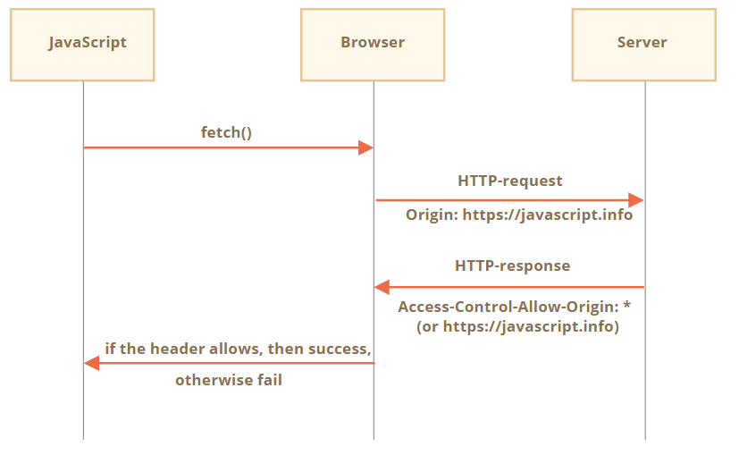
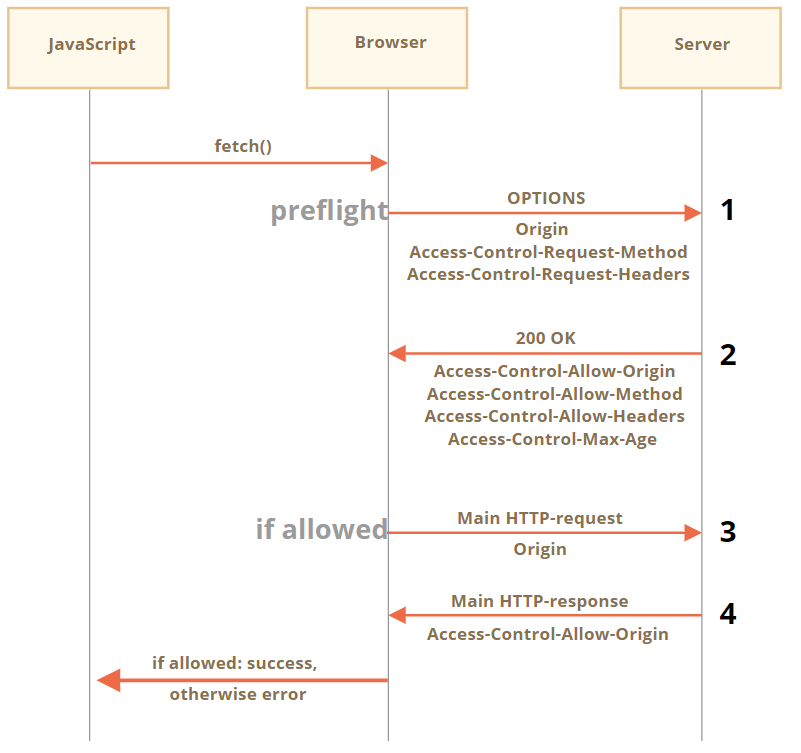

## 同源策略

使用fetch请求另一个网站时，请求可能会失败

```js
//example
try {
  await fetch('http://example.com');
} catch(err) {
  alert(err); // fetch 失败
}
```

> 核心概念  源：协议/域/端口
>
> 同源策略：
>
> - 限制Cookie，loaclStorage，indexedDB读取
> - DOM无法获取
> - AJAX请求无效（可以发送，但浏览器会拒绝接受响应）

那么怎么才能绕开同源协议呢？

<!--more-->

## CSRF攻击

(Cross-site request forgery), 即跨站请求伪造；黑客诱导用户点击链接，打开黑客的网站，然后黑客利用用户**目前的登录状态**发起跨站请求。

- 受害者登录a.com，并保留了登录凭证（Cookie）。
- 攻击者引诱受害者访问了b.com。
- b.com 向 a.com 发送了一个请求：a.com/act=xx。浏览器会默认携带a.com的Cookie。
- a.com接收到请求后，对请求进行验证，并确认是受害者的凭证，误以为是受害者自己发送的请求。
- a.com以受害者的名义执行了act=xx。
- 攻击完成，攻击者在受害者不知情的情况下，冒充受害者，让a.com执行了自己定义的操作。

> b.com怎么发送跨域请求呢？
>
> - script/iframe/img等标签却是支持跨域的
>
> ```html
> //实例1：银行转账
> <iframe src="http://a.com/app/transferFunds?amount=1500&destinationAccount=... >
> //实例2：路由器
>  
> ```

#### **防护策略**

- 针对不明外域的访问
  - 同源检测
  - Samesite Cookie
- 提交时要求附有本域才能获得的信息
  - CSRF Token
  - 双重Cookie验证

#### 同源检测

如何判断请求是来自外域呢？

HTTP协议中，每一个异步请求都会携带两个Header，用来标记来源域名

- Origin Header
- Referer Header

这两个header在浏览器发起请求时，多时情况自动带上，并且前端不能自定义内容，服务器可以解析这两个Header中的域名，确定来源域。

##### 使用Origin Header确定来源域名

在部分与CSRF有关的请求中，请求的Header中会携带Origin字段。字段内包含请求的协议+域名（不包含path及query）

如果Origin存在就使用Origin中的字段确认来源域名

Origin不存在的特殊情况

- IE11同源策略：不会在跨站CORS请求上添加Origin标头，Referer头将仍然是唯一的标识。（**Trust Zones**，**Port**）
- 302重定向：浏览器肯定不希望将Origin泄露到新的服务器上。

##### 使用Referer Header确定来源域名

在HTTP头中有一个字段叫Referer，记录了该HTTP请求的来源页面地址。

当然Referer值由浏览器提供，不同浏览器标准不一，安全性依赖于第三方（浏览器），理论上是不安全的，部分情况攻击者还可以隐藏，甚至修改自己的请求的referer。

新版Referer Policy规定五种Referer策略（no-Referrer，no-Referrer-when-downgrade，**(same or strict) origin**，(strict) origin-when-crossorigin，unsafe-url）

需要把策略设置为same-origin：对于同源的会发送Referer，值为Host不带path；跨域的不携带。

设置Referer策略有三种方法

1. 在CSP中设定
2. 页面头部增加meta标签
3. a标签增加refererpolicy属性

另外有些情况referer不可信：

1. IE6,7使用IE6、7下使用window.location.href=url进行界面的跳转，会丢失Referer。
2. IE6、7下使用window.open，也会缺失Referer。
3. HTTPS页面跳转到HTTP页面，所有浏览器Referer都丢失

##### **无法确认来源域名**

1. 两者都不存在，建议直接阻止
2. CSRF Token二次检查

##### 如何阻止外域请求

通过Header的验证，我们可以知道发起请求的来源域名，这些来源域名可能是网站本域，或者子域名，或者有授权的第三方域名，又或者来自不可信的未知域名。

凭借域名可信度就可以完全判断嘛？

当然不可以，对于搜索引擎搜索出来的第三方页面请求。就可能被当做CSRF攻击，所以需要过滤掉页面请求，但这也成为了攻击者的空子。

```
GET https://example.com/addComment?comment=XXX&dest=orderId
```

很多网站经常把主文档GET请求挂上参数来实现产品功能，但是这样做对于自身来说是存在安全风险的

当然大多数CSRF攻击都是来自第三方域名，但不排除本域，攻击者有权限在本域发出评论（链接，图片统称UGC）同源策略无法防护。

综上所述：同源验证是一个相对简单的防范方法，能够防范绝大多数的CSRF攻击。但这并不是万无一失的，对于安全性要求较高，或者有较多用户输入内容的网站，我们就要对关键的接口做额外的防护措施。

#### CSRF Token

针对攻击者无法获取Cookie中的信息，只是利用而已，想到我们可以要求所有用户请求都携带一个CSRF攻击者无法获取到的Token。服务器校验Token就可以实现防护。

##### 三个步骤

1. 将CSRF Token输出到页面中

   首先，用户打开页面的时候，**服务器**需要给这个用户生成一个Token，该Token通过加密算法对数据进行加密，一般Token都包括随机字符串和时间戳的组合；安全起见Token肯定不能存放在Cookie中，而应该存在服务器**Session中**。之后在每次页面加载时，使用JS遍历整个DOM树，对于DOM中所有的a和form标签后加入Token；对于动态生成的HTML代码需要程序员手动添加Token。

2. 页面提交的请求携带这个Token

   对于GET请求，Token将附在请求地址之后，这样URL 就变成 http://url?csrftoken=tokenvalue而对于 POST 请求来说，要在 form 的最后加上：

   ```html
   <input type=”hidden” name=”csrftoken” value=”tokenvalue”/>
   ```

   这样，就把Token以参数的形式加入请求了

3. 服务器验证Token是否正确

   当用户从客户端得到了Token，再次提交给服务器的时候，服务器需要判断Token的有效性，验证过程是先解密Token，对比加密字符串以及时间戳，如果加密**字符串一致且时间未过期**，那么这个Token就是有效的。

安全性有加强，但这种方法比较麻烦就是将Token以参数形式加入请求。

##### 分布式校验

在大型网站中，使用Session存储CSRF Token会带来很大的压力。

用户发起的HTTP请求通常要经过像Ngnix之类的负载均衡器之后，再路由到具体的服务器上，由于Session默认存储在单机服务器内存中，因此在分布式环境下同一个用户发送的多次HTTP请求可能会先后落到不同的服务器上，导致后面发起的HTTP请求无法拿到之前的HTTP请求存储在服务器中的Session数据，从而使得Session机制在分布式环境下失效，因此在分布式集群中CSRF Token需要存储在**Redis之类的公共存储空间**。

由于使用Session存储，读取和验证CSRF Token会引起比较大的复杂度和性能问题，目前很多网站采用Encrypted Token Pattern方式；计算出来，而不是读取存储。通常是使用UserID、时间戳和随机数，通过加密的方法生成

>验证码和密码其实也可以起到CSRF Token的作用哦，而且更安全。
>
>这就是为什么很多银行等网站会要求已经登录的用户在转账时再次输入密码

#### 双重Cookie验证

会话中存储CSRF Token比较繁琐，而且不能在通用的拦截上统一处理所有的接口

另一种防御措施是使用双重提交Cookie。利用CSRF攻击不能获取到用户Cookie的特点，我们可以**要求Ajax和表单请求携带一个Cookie中的值**

流程：

- 在用户访问网站页面时，向请求域名注入一个Cookie，内容为随机字符串（例如`csrfcookie=v8g9e4ksfhw`）。
- 在前端向后端发起请求时，取出Cookie，并添加到URL的参数中（接上例`POST https://www.a.com/comment?csrfcookie=v8g9e4ksfhw`）。
- 后端接口验证Cookie中的字段与URL参数中的字段是否一致，不一致则拒绝。

**用双重Cookie防御CSRF的优点：**

- 无需使用Session，适用面更广，易于实施。
- Token储存于客户端中，不会给服务器带来压力。
- 相对于Token，实施成本更低，可以在前后端统一拦截校验，而不需要一个个接口和页面添加。

**缺点：**

- Cookie中增加了额外的字段。
- 如果有其他漏洞（例如XSS），攻击者可以注入Cookie，那么该防御方式失效。
- 难以做到子域名的隔离。
- 为了确保Cookie传输安全，采用这种防御方式的最好确保用整站HTTPS的方式，如果还没切HTTPS的使用这种方式也会有风险。

#### Samesite Cookie属性

为了从源头上解决这个问题，Google起草了一份草案来改进HTTP协议，那就是为**Set-Cookie响应头新增Samesite属性**，它用来标明这个 Cookie是个“同站 Cookie”，同站Cookie只能作为第一方Cookie，不能作为第三方Cookie，

`SameSite`可以设置为三个值，`Strict`、`Lax`和`None`。

**a.** 在`Strict`模式下，浏览器完全禁止第三方请求携带Cookie。比如请求`sanyuan.com`网站只能在`sanyuan.com`域名当中请求才能携带 Cookie，在其他网站请求都不能。

**b.** 在`Lax`模式，就宽松一点了，但是只能在 `get 方法提交表单`况或者`a 标签发送 get 请求`的情况下可以携带 Cookie，其他情况均不能。

**c.** 在`None`模式下，也就是默认模式，请求会自动携带上 Cookie

## 跨域请求

#### 1. JSONP

script` 可以具有任何域的 `src`例如 <script src="http://another.com/…">`

**实例：动态获取天气数据**

假设在我们的网站，需要以这种方式从 `http://another.com` 网站获取数据，例如天气：

1. 首先，我们先声明一个全局函数来接收数据，例如 `gotWeather`。

   ```js
   // 1. 声明处理天气数据的函数
   function gotWeather({ temperature, humidity }) {
     alert(`temperature: ${temperature}, humidity: ${humidity}`);
   }
   ```

2. 然后我们创建一个特性（attribute）为 `src="http://another.com/weather.json?callback=gotWeather"` 的 `<script>` 标签，使用我们的函数名作为它的 `callback` URL-参数。

   ```js
   let script = document.createElement('script');
   script.src = `http://another.com/weather.json?callback=gotWeather`;
   document.body.append(script);
   ```

3. 远程服务器 `another.com` 动态生成一个脚本，该脚本调用 `gotWeather(...)`，发送它想让我们接收的数据。

   ```js
   // 我们期望来自服务器的回答看起来像这样：
   gotWeather({
     temperature: 25,
     humidity: 78
   });
   ```

4. 当远程脚本加载并执行时，`gotWeather` 函数将运行，并且因为它是我们的函数，我们就有了需要的数据。


#### 2. 跨域资源共享（CORS）

有两种类型的跨源请求：

1. 简单的请求
2. 所有其他请求

##### 简单请求

一个 简单的请求是指满足以下两个条件的请求：

1. 简单的方法：GET，POST 或 HEAD

2. 简单的 header

   —— 仅允许自定义下列 header：

   - `Accept`，
   - `Accept-Language`，
   - `Content-Language`，
   - `Content-Type` 的值为 `application/x-www-form-urlencoded`，`multipart/form-data` 或 `text/plain`。

##### 用于简单请求的CORS

如果一个请求是跨源的，浏览器始终会向其添加 `Origin` header

例如，如果我们从 `https://javascript.info/page` 请求 `https://anywhere.com/request`，请求的 header 将会如下：

```http
GET /request
Host: anywhere.com
Origin: https://javascript.info
...
```

正如你所见，`Origin` 包含了确切的源（domain/protocol/port），没有路径。

服务器可以检查 `Origin`，如果同意接受这样的请求，就会在响应中添加一个特殊的 header `Access-Control-Allow-Origin`。该 header 包含了允许的源（在我们的示例中是 `https://javascript.info`），或者一个星号 `*`。然后响应成功，否则报错。



响应示例

```http
200 OK
Content-Type:text/html; charset=UTF-8
Access-Control-Allow-Origin: https://javascript.info
```

对于跨源请求，默认情况下，JavaScript 只能访问“简单” response header：

- `Cache-Control`
- `Content-Language`
- `Content-Type`
- `Expires`
- `Last-Modified`
- `Pragma`

访问任何其他 response header 都将导致 error。

要授予 JavaScript 对任何其他 response header 的访问权限，服务器必须发送 `Access-Control-Expose-Headers` header。它包含一个以逗号分隔的应该被设置为可访问的非简单 header 名称列表。

例如：

```http
200 OK
Content-Type:text/html; charset=UTF-8
Content-Length: 12345
API-Key: 2c9de507f2c54aa1
Access-Control-Allow-Origin: https://javascript.info
Access-Control-Expose-Headers: Content-Length,API-Key
```

有了这种 `Access-Control-Expose-Headers` header，此脚本就被允许读取响应的 `Content-Length` 和 `API-Key` header。

##### 非简单请求

我们可以使用任何 HTTP 方法：不仅仅是 `GET/POST`，也可以是 `PATCH`，`DELETE` 及其他。

它发送这类请求前，会先发送“预检（preflight）”请求来请求许可。



###### Step 1 预检请求（preflight request）

在发送我们的请求前，浏览器会自己发送如下所示的预检请求：

```http
OPTIONS /service.json
Host: site.com
Origin: https://javascript.info
Access-Control-Request-Method: PATCH
Access-Control-Request-Headers: Content-Type,API-Key
```

- 方法：`OPTIONS`。
- 路径 —— 与主请求完全相同：`/service.json`。
- 特殊跨源头：
  - `Origin` —— 来源。
  - `Access-Control-Request-Method` —— 请求方法。
  - `Access-Control-Request-Headers` —— 以逗号分隔的“非简单” header 列表。

###### Step 2 预检响应（preflight response）

服务应响应状态 200 和 header：

- `Access-Control-Allow-Origin: https://javascript.info`
- `Access-Control-Allow-Methods: PATCH`
- `Access-Control-Allow-Headers: Content-Type,API-Key`。

这将允许后续通信，否则会触发错误。

如果服务器将来期望其他方法和 header，则可以通过将这些方法和 header 添加到列表中来预先允许它们。

例如，此响应还允许 `PUT`、`DELETE` 以及其他 header：

```http
200 OK
Access-Control-Allow-Origin: https://javascript.info
Access-Control-Allow-Methods: PUT,PATCH,DELETE
Access-Control-Allow-Headers: API-Key,Content-Type,If-Modified-Since,Cache-Control
Access-Control-Max-Age: 86400
```

现在，浏览器可以看到 `PATCH` 在 `Access-Control-Allow-Methods` 中，`Content-Type,API-Key` 在列表 `Access-Control-Allow-Headers` 中，因此它将发送主请求。

如果 `Access-Control-Max-Age` 带有一个表示秒的数字，则在给定的时间内，预检权限会被缓存。上面的响应将被缓存 86400 秒，也就是一天。在此时间范围内，后续请求将不会触发预检。假设它们符合缓存的配额，则将直接发送它们。

###### Step 3 实际请求（actual request）

预检成功后，浏览器现在发出主请求。这里的算法与简单请求的算法相同。

主请求具有 `Origin` header（因为它是跨源的）：

```http
PATCH /service.json
Host: site.com
Content-Type: application/json
API-Key: secret
Origin: https://javascript.info
```

###### Step 4 实际响应（actual response）

服务器不应该忘记在主响应中添加 `Access-Control-Allow-Origin`。成功的预检并不能免除此要求：

```http
Access-Control-Allow-Origin: https://javascript.info
```

然后，JavaScript 可以读取主服务器响应了。


