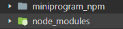
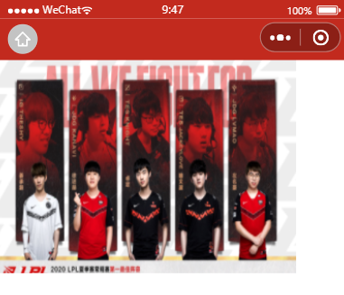
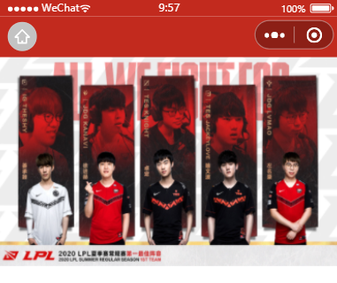

**前言**

小程序基础开发学习笔记

<!--more-->

#### 1.移动端适配

- 为什么推荐使用**rpx**？

> 因为px是绝对单位，对于移动端而言，不同机型有不同的**Dpr**。比如iphone6机型上面Dpr=2  （屏宽750rpx=375px,一个物理像素是0.5px）

#### 2.image组件

- 不设置宽高，为什么图片宽高比变化了？

>微信对image设置有默认宽高
>
>- image组件默认宽度320px、高度240px

#### 3.容器标签

- 使用`<view>容器标签类似div</view>`
- 多盒子水平居中？

>容器盒子：主轴方向纵向+垂直轴对齐center
>
>```css
>.container {
>  display: flex;
>  flex-direction: column;
>  align-items: center;
>}
>```

- 页面默认根容器`<page></page>`

> 可以设置整个页面的全局样式，比如页面背景颜色。。。

#### 4.flex布局--基于容器的布局

- 小程序最重要的样式布局手段！

#### 5.button组件

- 小程序中button组件默认样式包含居中等很多不方便布局控制的样式，建议使用view模拟按钮


#### 6.lin-ui组件库

第三方**自定义组件**

使用npm包需要先构建！---真正应用的是`miniprogram
_npm`

> `工具`-->`构建npm`

 

#### 7.自定义组件

非常重要！

- 每一个页面要是用的自定义组件，都需要先在json文件中声明

```json
{
  "usingComponents": {
    "l-avatar": "/miniprogram_npm/lin-ui/avatar/index"
  }
}
```

- 使用lin-UI的自定义组件--示例

```html
<l-avatar placement="bottom" shape="square" size="200" open-data="{{['userAvatarUrl','userNickName']}}" />
```

**坑点**：首次使用时，基础组件库默认版本很低，一些新的api不支持，使用lin-UI会报错（什么什么方法找不到之类）；工具里面调高基础组件库版本就行了。

>1. placement:图片在上，文字在下
>2. size:图片大小rpx默认单位
>   - 视觉上比image标签的200rpx大（因为是全填充了！！！）
>3. open-data:对用户信息的应用声明

#### 8.顶部导航设置

- 项目整体设置---`app.json`

  ```json
  "window": {
      "navigationBarBackgroundColor": "#C22A1E"
   }
  ```

- 具体页面配置---不用写window！！！

  ```json
  {
    "usingComponents": {
      "l-avatar": "/miniprogram_npm/lin-ui/avatar/index"
    },
    "navigationBarBackgroundColor": "#b3d4db"
  }
  ```

#### 9.滑块容器--swiper

滑块视图**容器**。其中只可放置swiper-item组件

```html
<swiper>
  <swiper-item>content</swiper-item>
  <swiper-item>content</swiper-item>
  <swiper-item>content</swiper-item>
</swiper>
```

**swiper-item**

内部就是一个插槽，可以放image等组件

```html
<swiper-item>
  <image src="/images/bestplayers.png" ></image>
</swiper-item>
```

- **对于固定宽高swiper怎么设置？**

1.只在swiper中设置样式

```html
<swiper style="width:100%; height:460rpx">
  <swiper-item>
    <image src="/images/bestplayers.png" ></image>
  </swiper-item>
</swiper>
```

 

为什么会这样？

还是那个原因，**image有默认宽高样式**！！！

也可以排除对swiper-item添加样式的原因（就近原则啦！）

2.swiper和image都添加样式

```html
<swiper style="width:100%; height:460rpx">
  <swiper-item>
    <image style="width:100%; height:460rpx" src="/images/bestplayers.png" ></image>
  </swiper-item>
</swiper>
```

 

ok啦！

- 设置小圆点+自动轮播

```html
<swiper indicator-dots="true" autoplay="true">
  <swiper-item>
    <image src="/images/bestplayers.png" ></image>
  </swiper-item>
  <swiper-item>
    <image src="/images/lpl.png" ></image>
  </swiper-item>
  <swiper-item>
    <image src="/images/jumpfly.png" ></image>
  </swiper-item>
</swiper>
```

>indicator-dots="true"   是否显示小圆点    vertical表示纵置，默认下方横置
>
>autoplay="true"			是否自动播放

**坑点：**属性里面"false"解析是按照es语法解析---字符串"false"解析为true（boolean）

正确使用：`indicator-dots="{{false}}"`   使用**模板语法解析**！！！

建议：小程序中书写boolean变量属性----习惯性加上`{{}}`

true逻辑简写：直接写属性不写属性值表示true逻辑！

#### 10.小程序--数据绑定

- 单向数据绑定有两种方式

1. data对象中初始化数据

```js
/**
* 页面的初始数据
*/
data: {
	a: '2020'
},
```

2. 生命周期函数中`this.setData`

```js
/**
   * 生命周期函数--监听页面加载
   */
onLoad: function (options) {
  this.setData({
    a: "2020"
  })
},
```

>1. data中没有的数据项页面加载之后默认添加至data中
>2. 已存在的数据项，进行修改

#### 11.小程序--生命周期函数


```js
{
  //生命周期函数--监听页面加载
  onLoad: function (options) {
    //页面加载前调用
  },
  //生命周期函数--监听页面初次渲染完成
  onReady: function () {
		//页面
  },
  //生命周期函数--监听页面显示
  onShow: function () {
		//页面首次展示;每次切前台触发
  },
  //生命周期函数--监听页面隐藏
  onHide: function () {
		//切后台，触发
  },
  //生命周期函数--监听页面卸载
  onUnload: function () {
		//页面销毁前触发
  }
}
```

