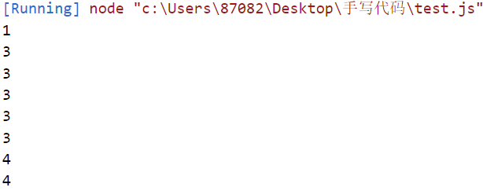
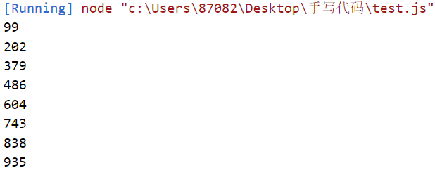
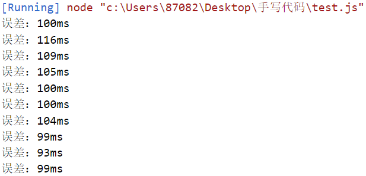

### 前言


了解过js调度的应该都明白，js中定时器不是精确的延时，这个延时受到服务端传送延时，前端渲染和其他事件阻塞的影响。那么，我们应该怎样实现相对精确的计时呢？

<!--more -->

#### 先来看一下倒计时演示

```js
var start = Date.now();
var count = 0;

//定时器测试
setInterval(function () {
  count++;
  console.log(Date.now() - (start + count * 1000));
}, 1000);
```



> 道理来说，每一次输出应该都是0；但是实际输出就反映了，我们说到的定时器不精确的问题。
>
> 结论：由于代码执行占用时间和其他事件阻塞原因，导致有些事件执行延迟了几ms，但影响很微

- **增加一段阻塞代码**

```js
var start = Date.now();
var count = 0;

//占用线程事件
setInterval(function () {
  var j = 0;
  while (j++ < 100000000);
}, 0);

//定时器测试
setInterval(function () {
  count++;
  console.log(Date.now() - (start + count * 1000));
}, 1000);
```



> 结论：由于加了很占线程的阻塞事件，导致定时器事件每次执行延迟越来越严重。

#### 解决思路

考虑，正常思路，没有阻塞事件，下面设置好的定时器应该每隔1s执行一次

```js
setInterval(function() {}, 1000);
```

如果出现阻塞事件定时器，隔1000+ms才执行一次，要想精确实现，必须**获取阻塞时间**

```js
setInterval(function () {
  let j = 0;
  while (j++ < 100000000) {}
}, 1);
let interval = 1000,
  ms = 50000, //从服务器和活动开始时间计算出的时间差，这里测试用50000ms
  count = 0,
  startTime = Date.now();
if (ms >= 0) {
  var timeCounter = setTimeout(countDownStart, interval);
}
```

>setInterval是一段阻塞代码。然后，我们分别定义了interval作为定时器的执行时间

```js
function countDownStart() {
  count++;
  let offset = Date.now() - (startTime + count * interval);
  let nextTime = interval - offset;
  if (nextTime < 0) {
    nextTime = 0;
  }
  ms -= interval;
  console.log("误差：" + offset + "ms");
  if (ms < 0) {
    clearTimeout(timeCounter);
  } else {
    timeCounter = setTimeout(countDownStart, nextTime);
  }
}
```

>offset用来记录阻塞导致延误的时间是多少
>
>nextTime代表offset和interval的差距，根据nextTime修改定时器timeCounter的执行时间
>
>- 如果上一次执行过程中因为阻塞延误了100ms，那么下一次就提前100ms启动定时器
>- 如果nextTime<0，即延误超过1s，那么将即刻启动定时器



- 做100%精确的倒计时很难，但做到相对比较准确是可以的。

- 在倒计时功能开发中，有几点总结：

1. 要了解好js单线程工作原理；

2. 清楚了解服务器系统时间传送到前端的流程；

3. 了解前端渲染和线程阻塞造成的时间误差


