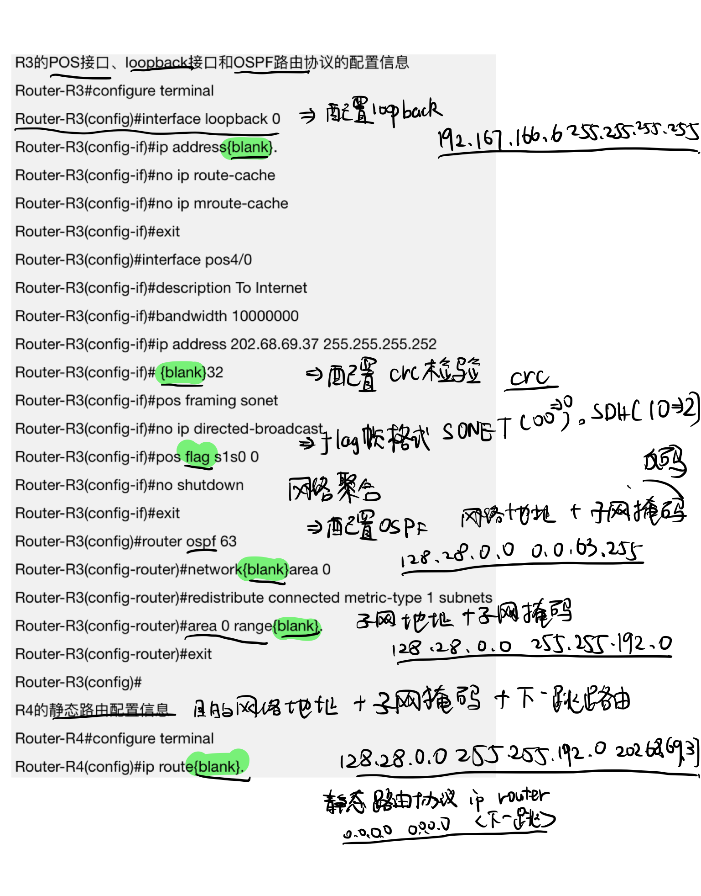
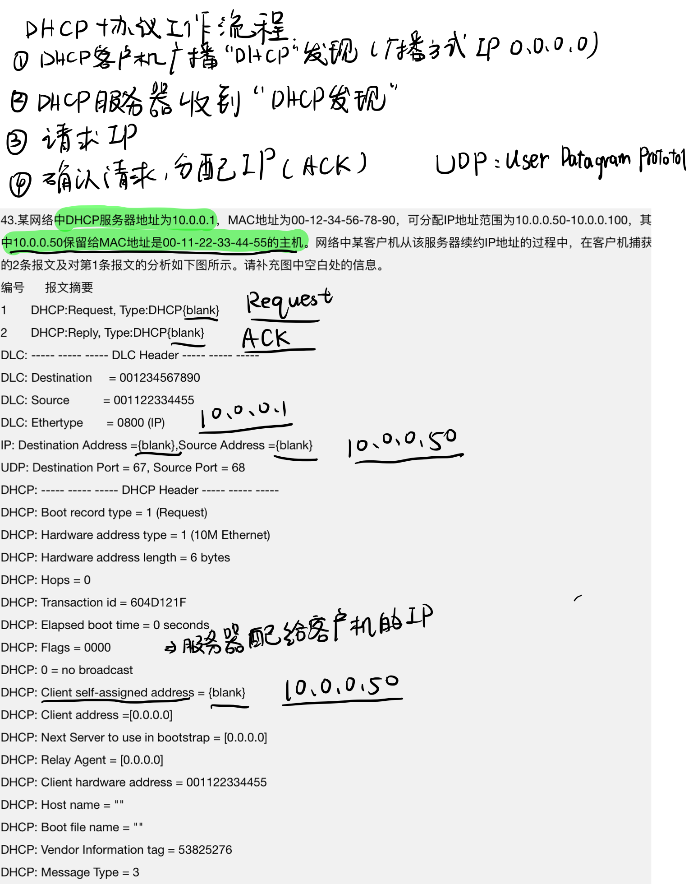
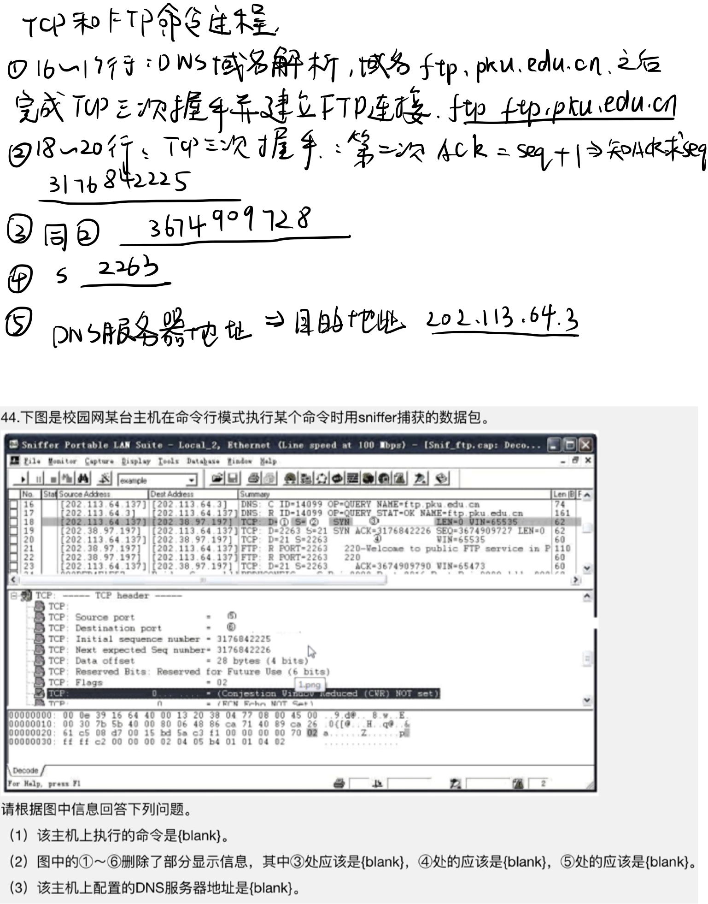
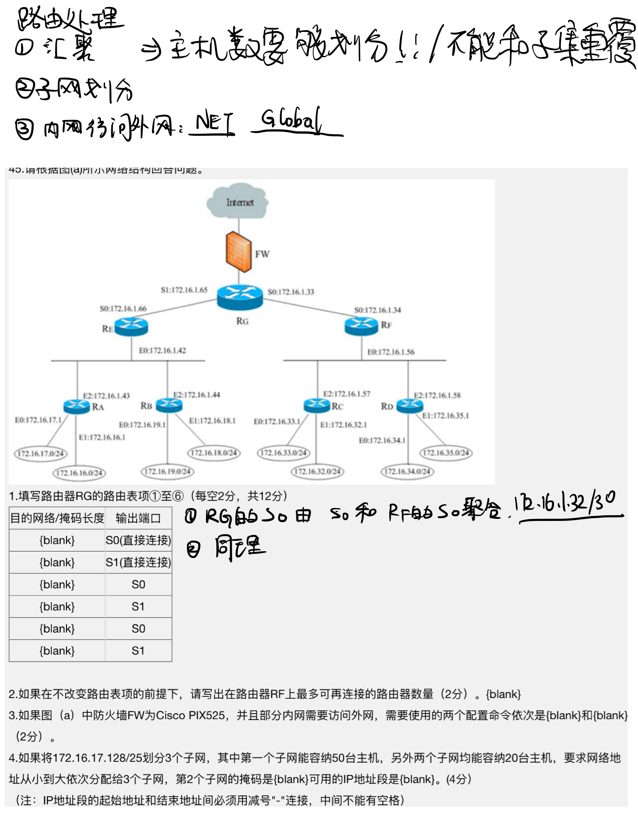

### 写在前面

>不会还有人在为计算机三级熬夜刷题吧？
>
>刚刚8点场考完的童鞋告诉你，只需要一晚（前提学过计网）
>
>1. 选择题边刷边总结（下面是我百度加手打的，选择题宝典！！！）
>2. 大题做一个就行（真离谱，清一色的题，变都不变）
>
>祝大家好运：)

<!--more-->

#### 选择题：

1. ##### 光纤通信标准：

   ##### OC-3（STM-1）：155.52Mbps；OC-12:622.08Mbps

2. 求交换机总带宽；求上联端口带宽（全双工要乘以2，**上联一般是下联的1/20**）

3. 系统可用性和停机时间（99.99%--53分钟）

4. 写地址块的子网掩码（看斜线后面的数字）（/11--255.224.0.0）

5. ##### 网络地址转换（NAT转换表）

   （**SA**：内部本地地址--内部全局地址）（**DA**：外部本地地址--外部全局地址）不仅可以解决IP地址不足的问题，还可以避免外部攻击（专有网络中的专有IP想要访问因特网的问题）

6. ##### IP地址聚合

   （无类域间路由CIDR，超网技术）ip表示为：网络前缀+主机号

   ```
   //计算聚合后的地址数：可用主机数
   例：200.16.23.0/20 其中前20位为网络前缀，后12位是主机号。
   ```

7. 路由表更新（RIP路由协议，距离向量算法，IGP内部网关协议，动态路由）

8. ##### IPV6简化表示：

   双冒号代表连续的0，且只有一个（0510就是510），128位为8段！！！；不能把一个位段中的有效0压缩

9. ##### 数据包

   - 目的地址和传递下一个mac地址（目的地址不看中间流程，看数据接收方ip，mac地址看下一个传送点）
   - 数据包的源IP地址（数据起始发送的IP）和源MAC地址（上一个转发节点MAC地址）

10. ##### 三种备份

    ```
    备份速度从快到慢：增量备份>差异备份>完全备份；
    恢复速度（占用空间）（恢复数据使用最少备份数）：反过来
    增量备份和差异备份区别（后者只是和前一次全备份作比较而言的）
    ```

11. ##### 弹性分组环RPR：优化协议，用于城域网和广域网

    - 每一个节点都使用**SRP**公平算法
    - 与FDDI环一样使用**双环**结构
    - **传统FDDI环**，源节点到目的节点发送数据（数据帧由**源节点在环中回收**）
    - **RPR环**，源节点到目的节点发送数据（数据帧由**目的节点在环中回收**）
    - RPR环采用自愈环设计思路，可以在**50ms**内隔离节点和光纤段
    - 两个RPR节点的裸光纤**最大长度100公里**
    - RPR**外环顺**时针，**内环逆**时针，**都**可以用于传输分组和控制分组

12. ##### 无线接入技术（W开头，Ad hoc特殊）

13. ##### 城域网（MAN）：

    - 核心层（提供高带宽的业务承载和传输，提供访问Internet所需的路由服务）
    - 汇聚层：会接接入层的用户流量，进行数据处理，转发到核心交换层或在本地进行路由处理
    - 接入层

    城域网QoS技术：**RSVP**(资源预留)，DIFFSERV(区分服务)，MPLS(多协议标签交换)

14. ##### 接入技术特征：

    - **ADSL**使用一对铜双绞线，非对称技术，上行速度64kbps-640kbps，下行速度500-6Mbps；
    - 采用ADSL可以通过PSTN接入internet
    - Cable Modom（电缆调制解调器）利用**频分复用**将信道分为上行和下行
      - 将计算机与有限电视同轴线连接
    - 光纤传输距离可**100KM**以上

15. ##### 服务器技术

    - 热插拔：不切断电源的情况下，更换硬盘等
    - 集群技术：如果一台计算机出现故障，不会影响正常服务，但会影响性能
    - 磁盘性能：存储容量+I/O速度
    - 服务器总体性能：CPU数量，CPU主频，系统内存，网络速度

16. ##### 综合布线

    - 双绞线扭绞：减少电磁辐射干扰
    - **嵌入式安装插座**：用来连接双绞线
    - **多介质插座**：连接铜缆和光纤
    - 新建筑群通常采用嵌入式（暗装）信息插座；老建筑（明装）
    - **建筑群子系统**：架空布线，直埋，巷道布线，地下管道布线等（双绞线，光缆，电器保护设备）

17. ##### **BGP协议**（边界网关协议）：

    两个自治系统之间使用的协议

    - 交换路由节点不小于自治系统数
    - BGP发言人使用**TCP**和其他自治系统发言人通信
    - BGP发言人通过**update**而不会死noticfication分组通知
    - 两个BGP发言人需要**周期性**的交换keepalive确认相邻关系

18. ##### RIP协议（基于距离向量的路由选择协议，内部）

    - 路由器周期性的向外发送路由刷新报文（V,D）

19. ##### OSPF（内部网关协议）

    - 一个区域内有**32位**标识符，区域内路由器**不超过200**
    - 通过划分区域提高路由更新收敛速度
    - **链路状态度量**：费用，距离，延时，带宽
    - 采用**洪泛**交换链路状态信息

20. ##### ICMP：控制报文协议

    - 报文类别：0（Echo应答）3（目标不可达）5（重定向）**11（超时）**13（时间戳请求）

21. ##### 集线器，交换机，路由器

    CSMA/CD主要适用以太网。 着眼冲突检测
    CSMA/CA主要适用无线局域网。着眼冲突避免

    | 设备   | 工作层     | 功能                                                         |
    | ------ | ---------- | ------------------------------------------------------------ |
    | 集线器 | 物理层     | 依据MAC地址，数据转发没针对性，**广播**！                    |
    | 交换机 | 数据链路层 | 依据MAC地址链接局域网中的电脑（独享带宽）；MAC和交换机端口对应关系的交换表 |
    | 路由器 | 网络层     | 依据IP地址链接不同网络（共享带宽）                           |

    **透明网桥**：用在两个**MAC层**协议相同的网段之间的互联

    **交换机：三种交换模式**

    - 快速转发直通式，交换机介绍到帧前14字节就立即转发数据帧
    - 碎片丢弃式：缓存每个帧的前64字节，检查冲突过滤碎片
    - 存储转发式：转发前将整个帧读取到内存中

    交换机：四种交换结构

    - 软件执行交换结构：早期使用，结构灵活，**速度慢**，端口多，性能低
    - 矩阵交换结构：
    - 总线交换结构
    - 共享存储器交换结构

    路由器：

    - 高性能路由器（交换式结构），传统路由器（共享背板结构）
    - 吞吐量：路由器的包转发能力（端口吞吐量，整机吞吐量）
    - 包转发能力：端口数量，端口速率，包长度，包类型有关
    - 丢包率：路由器超负荷工作能力的指标之一
    - **Loopback环**回接口：由网络管理员分配一个IP作为路由器的管理地址，**掩码255.255.255.255**

22. ##### IEEE 802.11：

    - 三个物理层（两个扩频技术，一个红外传播规范）
    - 无线标准定义传输速度：1mbps和2mbps可使用FHSS跳频和DSSS自序扩频；定义在**2.4GHz**的ISM波段
    - 为解决“隐藏节点”问题：在MAC层引入新的RTS/CTS选项

    - 802.11b最大容量33Mbps，速度提高到11Mbps
      - 点对点模式：无线网卡对无线网卡；最多256台；
      - 基本模式：无线和有线并存；最多1024台
    - 802.11a（工作在5GHZ频段，最大容量432Mbps）和802.11g提速到54Mbps
    - 802.11d是当前流行的STP（生成树协议）标准

23. ##### 蓝牙

    - **同步信道速率64kbps，跳频速率1600次/s**
    - 工作在2.402~2.48GHz的ISM频段
    - 发射功率100mw时，最大传输距离100米；**20dbm覆盖200米**

24. ##### DNS服务器

    - 端口号53的请求访问是DNS请求
    - 根DNS不需要管理员手动配置
    - 层次：根，顶级域，权威
    - 缺省下，win2003没有预装DNS

25. ##### DHCP服务器：动态主机配置，局域网

    - 已经获得IP的DHCP客户执行**ipconfig/release**指令，释放已获得的地址租约（IP Adress和Subnet Mask都为0.0.0.0）
    - 频繁改变位置并使用DHCP获取IP地址的DNS客户端：使用动态更新，减少手动管理

26. ##### WWW服务器

    - 网站性能选项：带宽限制选项限制该网站的可使用带宽；限制客户端使用微调框
    - 建立web站点时，必须有一个主目录，也可以是虚拟的子目录
    - 设置了默认页面后，访问时才会直接打开default页面；没有设置默认页面，需要提供首页内容的文件名
    - 网站标识必须在网站选项卡中设置
    - 使用IIS建立web站点：网站选项（**网站标识**，连接，启用日志）

27. ##### Serv-U FTP服务器

    - **初始状态下**：没有密码，可以直接进入
    - FTP缺省端口号21，但有时也会被影响不能使用21，而更改别的端口
    - **创建新域时**：添加用户时，用户名为“anonymous”的用户被系统自动判定为匿名用；输入域名可以是合格域名或其他任何描述
    - 配置服务器IP地址时：**空则代表服务器的所有IP地址**（服务器使用多个地址时：服务器IP应该为空）
    - 用户不能再FTP服务器中自行注册新用户（**匿名用户由管理员加**）
    - 使用**匿名用户登录时**：密码需要是电子邮箱作为登录密码

28. Wmail服务器

    - 支持基于web方式的访问和管理，需要**先安装IIS**
    - 在域名设置中可以修改域的参数，包括增删
    - 系统设置中：修改邮件服务器的系统参数，（SMTP，邮件过滤，更改管理员密码）
    - 快速向导设置：设置是否允许自行注册新用户
    - 建立邮件路由，需要在DNS服务器中建立邮件服务器主机记录和邮件交换记录

29. ##### 可信计算机评估标准

    四类七个级别，可信度由低到高

    - D：**最小保护**，只有物理层面的保护
    - C1：**自主保护**，用户登录需要身份验证
    - C2：自主保护，具有审计和验证
    - B1：强制安全保护，强制访问控制，可以对主体客体安全标识进行管理
    - B2：结构保护：给所有计算机对象加一个安全标签，管理
    - B3：具备硬件支持的安全域分离措施
    - A1：对安全模型作形式化的证明

30. ##### 入侵防护系统

    （H,N,A host，net，application）

    - HIPS：基于主机的入侵系统，**受保护的主机**
    - NIPS基于网络，布置在**网络出口**
    - AIP基于应用，服务器**前端**

31. ##### 网络攻击

    - DDos：利用已经攻占的多个系统向目标攻击，被害设备面对大量请求无法正常处理而拒绝
    - SYN Flooding攻击：利用TCP三次握手过程，使被害主机处于灰化请求中，直至连接超时停止响应
    - SQL注入攻击：利用系统漏洞（**防御系统难以阻断**）
    - Land攻击：向某设备发送数据包，并将数据包的源IP地址和目的地址都设置为攻击目标地址
    - 基于网络的防护系统防火墙不能阻隔Cookie的篡改和DNS欺骗
    - Tear droop，Smurf攻击可以被路由器阻止

32. ##### 无线局域网设备

    - 无线接入点AP：集合无线或有线终端
    - 无线路由器：无线路由功能和NAT功能的AP，可以用来建立小的无线局域网
    - 无线网桥：用于连接几个不同的网段，实现较远距离的而无线通信（构建和维护MAC地址表）
    - 无线网卡：实现点对点通信，终端节点

33. ##### VLAN：虚拟局域网

    以交换式网络为基础，解决局域网的冲突域，广播域，带宽问题

    - 建立VLAN命令格式：`vlan<vlan_ID>name<vlan_name>`

    - 端口分配：`switchport access vlan<vlan_num>`

    - 管理IP地址：

      ```
      Switch-6500>(enable)set interface sc0<ip_addr>
      <ip_mark><ip_addr>(broadcast address)
      ```

    - 配置缺省路由：`Switch-6500>(enable)Set ip route 0.0.0.0` 

    - 建立ID999，不给定VLAN名，系统自定分配缺省VLAN名`VLAN00XXX`也就是00999.

    - vty配置模式：

      ```
      Route(config)# line vty 0 15
      Router(config-line)#
      ```

    - ppp模式：接口配置模式有异步和同步两种配置指令

    - 标准访问控制列表（1-99；1300-1999）

    - 扩展访问列表（100-199；2000-2699）

    - 禁止使用deny指令

    - `Router<config>`应该在`Router<config-if>`前面

    - 用于Ethernet的VLAN：ID 1-1000

    - VLAN1-1005是标准范围；1025-4096扩展范围

    - IEEE802.1Q，VLANid 用12bits表示

    - VLANname用32字符

34. ##### Cisco路由器

    - system为管理站团队字;traps发送自险信息；informs发送通知

    - SNMP有三个版本：V1是最基本的，几乎所有网络设备和计算机操作系统都支持

    - 管理站使用UDP缺省162端口接受通知

    - Cisco Aironet 1100接入点

      - 第一次配置无线接入点一般采用本地配置，默认IP10.0.0.1
      - 采用无线连接配置接入点，不配置SSID或SSID配置为tsunami
      - pc的浏览器中输入接入点IP地址和密码后，出现接入点汇总状态页面

    - **存储**器

      - Flash：闪存，用于存储当前使用操作系统映像文件和一些微代码
      - NVRAM:非易失性随机存储，用于存储启动配置文件或备份配置文件
      - RAM：随机存储，断电gg，存储路由表，ARP等，临时存储
      - ROM：只读内存，永久保存路由器开机诊断程序，引导操作系统软件的存储器

    - **配置DHCP服务**

      ```
      1.配置IP地址池（pool）名称（也就是网络地址）
      ip dhcp pool
      2.配置IP地址池的子网地址和子网掩码   
      network
      3.配置不参与动态分配的地址空间
      ip dhcp excluded-address
      4.缺省网关（默认网关），域名，域名服务器的IP
      default-router 
      dns-server
      5.有效时间
      lease 天 时 分
      ```

    - 进行**SNMP配置**：`snmp trap link-status`

    - **查看路由表**:`show ip route`

    - 删除

35. ##### Catalyst 3500交换机

    - 显示交换表：`show mac-address-table`（目的地址，地址类型，VLAN，目的MAC地址）

    - 端口配置指令

      ```
      1.进入多扣配置模式 interface 端口名
      2.设置缺省路由    set ip route 
      2.配置端口通信模式 duplex auto（自适应）/full（全双工）/half
      3.配置传输速率    speed 速率（单位Mbps）
      4.关闭/开始端口   shutdown/no shutdown
      ```

36. ##### 防火墙

    - 访问模式：非特权模式，特权模式，配置模式，**监听模式**（可以进行操作系统映像更新，口令恢复）
    - 安全级别：
      - inside，内部接口：安全级别100
      - outside，外部接口：安全级别0
      - DMZ中间接口：安全级别50

37. ##### STP生成树结构

    - BPDU有两种结构，分别配置BPDU（<35字节），拓扑变化通知BPDU（<4字节)
    - Bridge ID值最小的成为根网桥，根交换机
    - BPDU每2s更新一次
    - Bridge ID由2字节优先级值和交换机MAC地址组成，优先级增质量4096
    - 

38. ##### windows命令

    - **ipconfig**：显示当前TCP/IP网络配置
      - ipconfig/all检查DHCP客户机是否已经获取IP地址，默认网关等
      - ipconfig/release地址租约释放
    - **nbtstat**：显示本机与远程计算机的基于TCP/IPde NeTBIOS的统计及连接信息
      - nbtstat-r：列出通过广播和WINS解析的名称
      - nbtstat-s：列出灰化及目的的IP地址
    - pathping：报文发送到进过地的所有路由器，并根据每一条返回的报文统计
    - route：显示或修改本地IP路由表条目
    - net view：显示域列表，计算机列表
    - **netstat**：显示TCP连接活动，监听
    - pathping：结合ping和tracert

39. ##### 光以太网解决方案：

    - 根据终端用户的实际应用分配带宽
    - 具有保护用户和网络资源安全的认证与授权功能
    - 提供计费功能
    - 支持以太网和防火墙
    - 能够支持MPLS（多协议标签交换）,提供分等级的Qos（服务质量，一种解决网络延迟和阻塞）网络服务

40. ##### 网络版防病毒系统

    - 管理控制台可以安装在服务器端/客户端
    - 可以采用**脚本登录安装**--快速自动安装方法之一

41. ##### 光纤同轴电缆混合网HFC：

    - 一个双向传输系统
    - 为有线电视提供接入Internet的方式

42. ##### 网络入侵检测系统

    - 模式匹配
    - 统计意义上的非正常现象检测
    - 事件相关性以及频率或阈值

43. ##### 集中式入侵检测系统

    - 最大的问题就是**单点失效**问题（一坨老鼠屎。。。）集中式太难了，对等式好一点

44. ##### 邮件系统：

    - Outlook为邮件系统的客户端软件
    - IMAP用于管理邮件服务器的协议
    - 使用传输层协议TCP协议
    - SMTP协议发送邮件

#### 大题

##### 1.IP地址

- 地址类别：

  | A类                     | B类                       | C类                   |
  | ----------------------- | ------------------------- | --------------------- |
  | 1.0.0.0-127.255.255.255 | 128.0.0.0-191.255.255.255 | 192.0.0.0-223.255.255 |

- 网络地址：网络位不变，主机位为0

- 直接广播地址：网络位不变，主机位全0

- 主机号：网络位全部置零，主机位不变

- 子网中可以使用的第一个可用IP：网络地址+1

##### 2.路由器配置信息分析



##### 3.DHCP



##### 4.TCP



##### 5.路由



